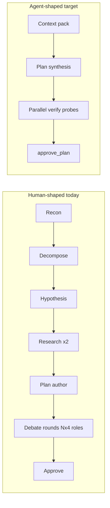
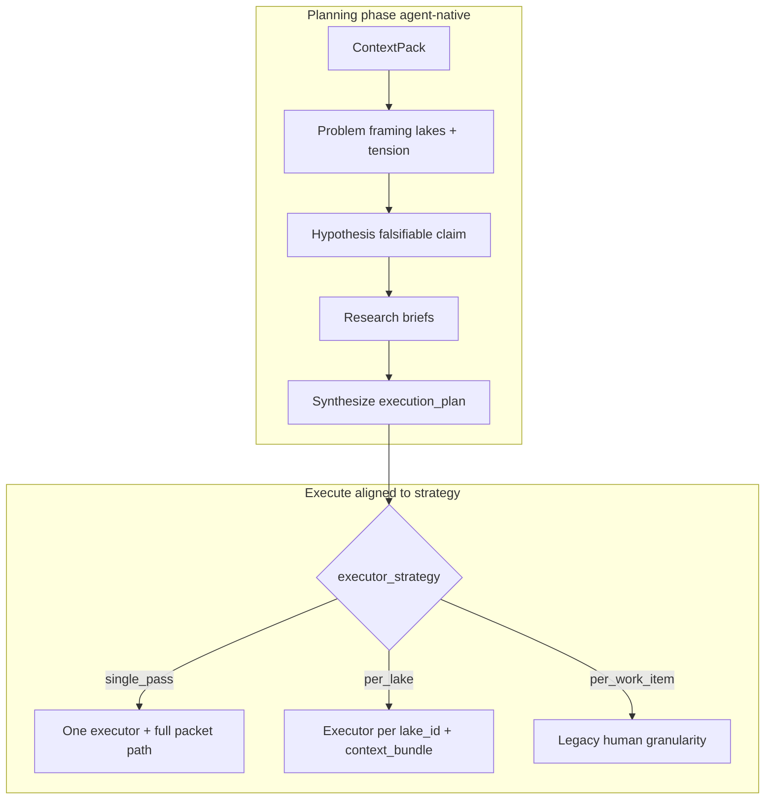
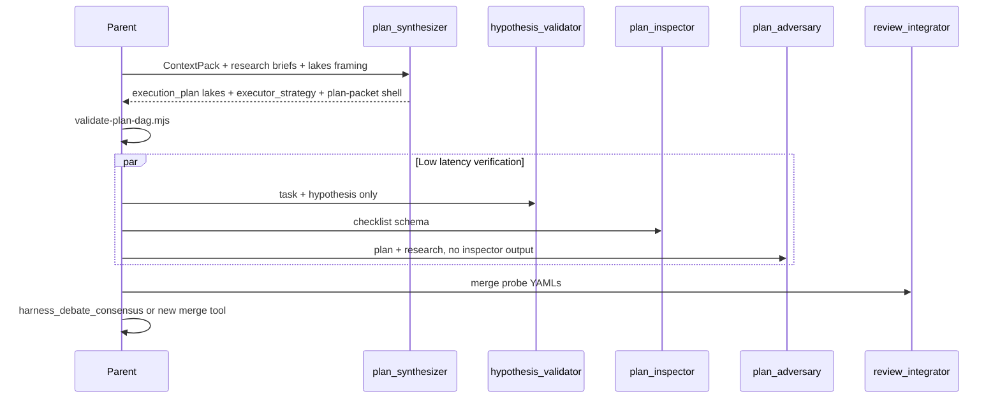
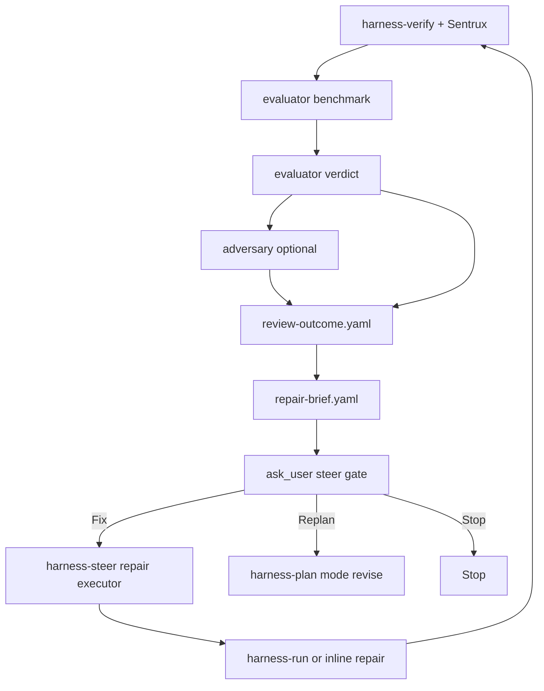
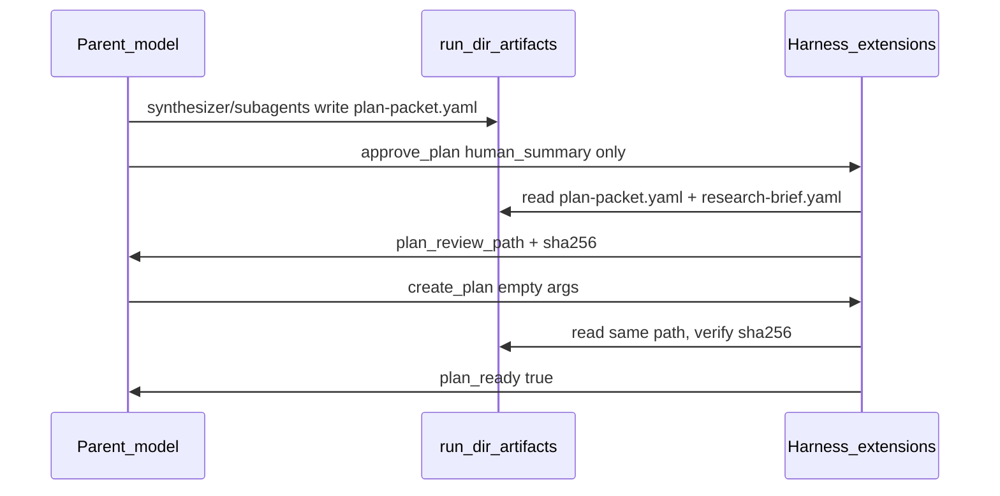

# Agent-native harness workflow redesign

## First principles (what agents actually need)

Human PM/engineering practices in the graph ([practice-map.md](.pi/harness/docs/practice-map.md), PMBOK process groups, Fagan inspection, Peopleware, Team Topologies) optimize for **attention limits, social coordination, and calendar boundaries**. Agents optimize for **context window, spawn cost, verifiable artifacts, and failure modes** (self-certification, grade inflation, scope drift).

| Human need | Agent equivalent | Design implication |
|------------|------------------|--------------------|
| Shared understanding before work | **Compiled context pack** (YAML + evidence refs) | One recon pass, many readers — not many re-scouts |
| Accountability / no self-review | **Generator–evaluator separation** + `submit_*` | Keep; non-negotiable |
| Quality gate before merge | **Deterministic scripts** + schema validation | Keep `validate-plan-dag.mjs`, `harness-verify.mjs`, Sentrux |
| Risk tailoring | **Profile flags** (`--risk`, `--quick`) | Keep; drive *depth*, not *meeting length* |
| Escalation on ambiguity | **`ask_user` / `human_required`** | Batch once; don’t sprinkle across phases |
| Resume after interrupt | **Disk truth** (`run-context.yaml`, artifacts) | Already strong; lean into phase fields |
| Human-sized task breakdown | **Lake-sized outcomes** with bundled context | Agents with a full context pack can deliver a vertical slice in one focused run; micro-tasks exist for coordination overhead, not capability |

### Boiling lakes vs human WBS (planning phase)

Traditional PM ([practice-map](.pi/harness/docs/practice-map.md) PMBOK WBS, Kerzner CPM) splits work into **small problems humans can finish in a sprint** — because humans have limited working memory, interrupt context, and serial attention. That produces many `work_items`, thin `wbs_dictionary` lines, and schedule metadata tuned for staffing.

**Agent-native planning (Garry Tan “boiling lakes”):** With the right **context pack** ([`planning-context.yaml`](.pi/prompts/harness-plan.md), research briefs, graphify evidence), an executor can **boil one lake at a time** — a coherent outcome (feature slice, subsystem change, or end-to-end fix) with explicit verification — instead of hopping across dozens of ticket-sized steps. The plan should optimize for **outcome granularity and context completeness**, not **ticket count**.

| Human WBS habit | Agent cost | Lake-sized alternative |
|-----------------|------------|-------------------------|
| 8–12+ `work_items` for med risk ([`validate-plan-dag.mjs`](.pi/scripts/validate-plan-dag.mjs) mins) | Executor spawn treats each item as a mental boundary; parent re-explains context per item | **3–6 lakes** for med; each lake maps 1+ acceptance checks with `context_bundle_path` |
| “Do backend / do frontend” deliverables | Vague; executor re-discovers architecture | Lake = **vertical slice** with `files[]`, `done_criteria`, and pointers to evidence |
| `wbs_dictionary` one-liners per ticket | Ceremony; low signal for subprocess | **`lake_brief`** per lake: goal, constraints, evidence_refs, out-of-scope (skip dictionary for `low`) |
| Critical path over micro-tasks | Misleading when one agent runs the whole plan | **`critical_path_lake_ids`** + optional `executor_strategy` |
| Decompose → hypothesis → author as three WBS passes | Triple decomposition of the same problem | **Problem framing** (tensions + lakes) → **single synthesis** of `execution_plan` for low/med |

**What stays from PM (still valuable for agents):** acyclic `depends_on`, file-overlap DAG rules, acceptance_check traceability, risk register for `high`, deterministic DAG validation — these are **correctness**, not human calendar math.

The harness already encodes several agent-native patterns (ADR 0032, 0037, 0039, 0040): subprocess isolation, `HarnessSpawnContext`, `harness_artifact_ready`, no parent parsing of verdict JSON. The redesign targets what is still **meeting-shaped** inside those commands, and **payload-shaped** tool calls that re-serialize disk artifacts into the model context.

### Disk is source of truth; tool args are pointers

Today several parent/subagent tools require **embedding full documents** in the tool call even when the same bytes already live under `.pi/harness/runs/<run_id>/`. That duplicates tokens in every turn that touches approval or merges, and trains the model to “carry” large structs.

| Tool (today) | Fat parameter | Why it wastes context |
|--------------|---------------|------------------------|
| [`approve_plan`](.pi/extensions/harness-plan-approval.ts) | `plan_packet` (+ optional `research_brief`) | Full `PlanPacket` + research sections re-sent; tool already reads run dir for readiness/debate gates and writes `plan-review.md` from disk paths |
| [`create_plan`](.pi/extensions/harness-plan-approval.ts) | `plan_packet` (again) | Same packet passed twice; [`executeCreatePlan`](.pi/extensions/lib/plan-approval/create-plan.ts) already resolves `plan_packet_path` from run context |
| [`write_harness_yaml`](.pi/extensions/harness-run-context.ts) | `content` (full YAML/JSON string) | Parent pastes subagent output into chat to write file |
| [`submit_*`](.pi/extensions/harness-subagent-submit.ts) | `document` (full record) | Subagent duplicates artifact in tool arg before write |
| [`harness_debate_submit_round`](.pi/extensions/harness-debate-tools.ts) | `integrator_draft` (full round object) | Integrator synthesis re-serialized after lane YAML already on disk |
| Spawn `task` strings (prompts) | “+ decomposition/hypothesis summary”, acceptance_checks inline | [`HarnessSpawnContext`](.pi/harness/specs/harness-spawn-context.schema.json) already has `plan_packet_path` + `artifact_paths`; summaries duplicate file reads |

**Invariant (new):** Orchestrator and subagent tools take **paths, modes, and short summaries**; extensions **read, validate, and render** from disk. Tool results return **path + status + hash**, not full documents (unless user-facing approval UI needs a rendered view — built server-side).



---

## What to keep (with concrete reasons)

These map to real agent failure modes, not human ritual.

1. **Three commands** ([your choice]) — Separates prompt/skill context (plan vs execute vs verify), limits token load per turn, matches user mental model. `run-context.yaml` already has `phase: plan | execute | evaluate | adversary | merge`; commands remain thin entry points.

2. **Artifact contracts** (`submit_*`, `harness_artifact_ready`) — Machines can gate; prose cannot. Reason: eliminates parent JSON parsing and “agent said it passed” (ADR 0037).

3. **Sequential decompose → hypothesis** (ADR 0040) — Reason: hypothesis without decomposition reproduces **detached claims**; graphify corpus + ADR 0034 blind validation both target grade inflation. **Do not** re-parallelize these two.

4. **Phase 3.5 implementation + stack artifacts** — Reason: external prior art is not in the repo; skipping it causes plan hallucination. Parallel **lanes** (implementation ∥ stack) stay agent-optimal.

5. **`validate-plan-dag.mjs` hard stop** — Reason: LLMs break `depends_on` and file conflicts; graph validity is cheap to verify deterministically.

6. **Single executor, no self-certify** ([harness-run.md](.pi/prompts/harness-run.md)) — Reason: same model in parent + executor = **merged generator and judge**; post-run review becomes theater.

7. ~~**Fail-fast benchmark in review**~~ — **Removed** (contradicted steer loop). Was ADR 0039 cost control; superseded by always-complete review → `repair-brief`. Use **tiered adversary** on steer attempts 2+ instead (see adversarial review).

8. **Sentrux baseline at run + gate at review** — Reason: fitness functions are **machine-observable structural actuals**; fits agents better than narrative “architecture review.”

9. **Planning-context dedup** (ADR 0041) — Reason: duplicate `graphify query` in decompose burns context and wall-clock with no new information.

10. **Blind hypothesis check** — Reason: independent verification reduces **sycophantic agreement** between planner and critic (corpus: generator–evaluator, DARWIN-style validation). Keep the *invariant*, not necessarily the *five-agent meeting schedule*.

11. **Iterate until acceptance (steer loop)** — Reason: agents can fix implementation gaps when given **repair briefs** from review; forcing full replan duplicates planning context and breaks UX. **One** `approve_plan`; many steer cycles.

---

## Redesigns by command (internals only)

### `/harness-plan` — from “Planning PM + meetings” to “context → lakes → synthesis → verification”

**Current shape:** ~10+ sequential subagent spawns (decompose, hypothesis, researchers, author, then 1 agent per debate turn × roles × focuses) plus parent as “chair” ([harness-plan.md](.pi/prompts/harness-plan.md) Phase 5 state machines). Planning agents ([`decompose.md`](.pi/agents/harness/planning/decompose.md), [`execution-plan-author.md`](.pi/agents/harness/planning/execution-plan-author.md)) explicitly optimize for **PM-grade WBS** and “deliverable-sized items (not ‘do backend’)” — still human ticket scale.

| # | Change | Concrete reason |
|---|--------|-----------------|
| P1 | **Reframe Phase 1 output as `ContextPack`** (alias/evolve `planning-context.yaml`) with explicit `evidence_refs`, `coverage`, `open_questions`, `fork_candidates` | Agents need **one read model** for downstream work; “scout trio” and PM narration are human org charts ([practice-map](.pi/harness/docs/practice-map.md) anti-pattern: redundant thinkers). **This is the fuel for boiling lakes** — a lake without context is just a big vague task. |
| P1b | **Add `context_bundles/` under run dir** — optional per-lake YAML (`artifacts/context-bundles/<lake_id>.yaml`) listing paths, graphify refs, research excerpts pointers | **Reason:** Executor loads **one bundle per lake** instead of re-ingesting the whole plan packet; keeps spawn args path-only and matches agent attention profile. |
| P2 | **Merge Phases 2a+2b+4b into one `plan-synthesizer`** for `low`/`med` (no material fork); **high** keeps sequential framing → hypothesis only | **Reason:** Lake definition + hypothesis + `execution_plan` are one reasoning episode when context pack is warm. Splitting into WBS author + schedule author recreates human staffing lines. |
| P2b | **Reframe Phase 2a from “WBS decompose” to “problem framing”** — output emphasizes `core_tension`, `lakes[]` (outcome, scope boundary, verification intent), not a task tree | **Reason:** [`decompose.md`](.pi/agents/harness/planning/decompose.md) DeepMind-style sections are good for **problem structure**; bad when compressed into 15 micro-tasks. Lakes = falsifiable outcomes; tasks = optional internal checklist inside a lake. |
| P2c | **`execution_plan` uses lake-first schema** (extend [`plan-execution-plan.schema.json`](.pi/harness/specs/plan-execution-plan.schema.json)): `lakes[]` + `work_items[]` where each work_item has `lake_id`, `context_bundle_path`, rich `description` (target 150–400 tokens of spec, not one line) | **Reason:** DAG validator still runs on `work_items`, but **count mins drop** while **description/context mins rise** (see P7). One lake may be a **single** `work_item` for low risk. |
| P2d | **`executor_strategy` on PlanPacket** (`single_pass` \| `per_lake` \| `per_work_item`) — default `single_pass` for low, `per_lake` for med/high | **Reason:** Human teams always `per_work_item`; agents with full context often complete **the whole approved plan in one executor spawn** (current [`harness-run`](.pi/prompts/harness-run.md)). Strategy makes that explicit instead of pretending 8 tickets = 8 agent sessions. |
| P3 | **Batch `ask_user` at a single `fork-resolution` gate** (after Phase 3.5, before synthesis/verification) | **Reason:** Humans batch decisions in a meeting; agents today trigger user waits at Phase 4, debate blockers, approve_plan — **context fragmentation for the user and session**. One structured fork list → one `ask_user`. |
| P4 | **Replace “meeting metaphor” debate with `plan-verify` parallel probes** (see below) | **Reason:** “One subagent per batch = one role speaking” ([practice-map](.pi/harness/docs/practice-map.md) rule 5) serializes work that has **no social constraint**. Fagan 4-round threaded inspection optimizes human attention, not token/latency. |
| P5 | **Risk profiles = verification depth, not round count** | `fast`: 1 consolidated verify pass + blind hypothesis check. `standard`: parallel inspector + adversary on disjoint prompts, then integrator. `full`: add schedule/WBS-focused probe + sprint-contract auditor. **Reason:** PMBOK tailoring ([Phase 4d](.pi/prompts/harness-plan.md)) is about *risk*, not *number of calendar meetings*. |
| P6 | **Drop PM persona prose; use phase state + gates in prompts** | **Reason:** “You are the planning PM” does not improve tool use; `harness_artifact_ready` paths and schemas do. Reduces prompt tokens for real instructions. |
| P7 | **Retune [`validate-plan-dag.mjs`](.pi/scripts/validate-plan-dag.mjs) mins** — fewer items, richer items (example targets: low 2–3 lakes / 2–4 work_items; med 3–5 lakes / 4–6 work_items; high 4–7 lakes / 6–9 work_items); require `context_bundle_path` or inline `context_refs` when description &lt; N chars | **Reason:** Current mins (med **8** work_items) **force** ticket-granularity plans that underestimate agent throughput. Validation should block **under-specified lakes**, not **under-counted tickets**. |
| P8 | **Review Gate checks lake boil-ability, not WBS completeness** — inspector rubric: each lake has verification, disjoint files or explicit deps, context bundle resolvable | **Reason:** Fagan/PMBOK “schedule” focus is human staffing; agents need **can an executor boil this lake in one sitting with the bundle?** |

**Lake sizing rubric (for prompts + `planning-rubrics.md`):**

- **One lake** — Single acceptance theme, shared file neighborhood, one verify command at end (ideal for low risk / small features).
- **Multi-lake** — Independent outcomes (e.g. “add API” ∥ “migrate schema” only if file-disjoint or explicit dependency); each lake ships verifiable value.
- **Split lake** — When file overlap without dependency, or verification too large for one context window, or blast radius &gt; N files (risk-tailored cap in prompt).
- **Do not split** — Purely procedural steps (“write tests”, “update imports”) — fold into parent lake `done_criteria`.



**Proposed plan-verify flow (replaces Phase 5 chair loop):**



- **Parallel inspector ∥ adversary:** Reason: adversary must not see inspector scores (anchoring); both may read the same plan artifacts. Humans run these in sequence for floor time; agents don’t need that.
- **Keep blind validator as separate spawn:** Reason: preserves ADR 0034 / R1 independence without simulating a “round.”
- **Integrator last:** Reason: single writer for `recommended_packet_patches` avoids conflicting parent edits (recorder role stays; **chair role goes away**).

**Extension work:** [`harness-debate-tools.ts`](.pi/extensions/harness-debate-tools.ts) and [`plan-messenger.ts`](.pi/extensions/lib/plan-messenger.ts) assume serial rounds. Add a `review_gate_mode: parallel_probes` (or extend `consolidated`) that:
- Accepts `submit_*` from multiple lanes without `harness_debate_advance_thread` between each speak-turn
- Still enforces `harness_debate_focus_coverage` over required focuses via merged YAML

**Agents to deprecate gradually (not delete day one):** narrow `plan-evaluator` / `plan-adversary` prompts to probe mode; fold `execution-plan-author` into synthesizer for low/med via agent routing in [`harness-spawn-topology.ts`](.pi/extensions/lib/harness-spawn-topology.ts).

---

### `/harness-run` — from “jelled team” to “bounded generator with observation hooks”

| # | Change | Concrete reason |
|---|--------|-----------------|
| R1 | **Rename practices in prompt: “baseline snapshot” not “EVM baseline”** | EVM is a human reporting metaphor; executor doesn’t earn value. Sentrux `gate --save` is a **diff baseline** — accurate for agents. |
| R2 | **Executor emits incremental `handoff` checkpoints** (optional `executor-progress.yaml` per **lake_id**, not per micro-task) | **Reason:** Progress telemetry should match **boiling lakes**; per-ticket checkpoints recreate human standups. |
| R3 | **Honor `executor_strategy` from PlanPacket** — default **one spawn** with `plan_packet_path` + `critical_path_lake_ids`; `per_lake` only when plan says so | **Reason:** Forcing one spawn per work_item assumes human parallelism. **`per_lake`** is the agent parallel unit when needed. |
| R3b | **Spawn context: `lake_id` + `context_bundle_path`**, not a pasted work-item list | **Reason:** Path-first + lake context; executor reads bundle from disk ([path-first section](#path-first-tool-optimization-cross-cutting)). |
| R4 | **Post-run Sentrux: parent only** (already true) — document as **observation bus**, not “monitoring controlling process group” | Reduces persona; same behavior. |
| R5 | **`next_command` always `/harness-review`** when execute finishes or stops with `blocked` / `scope_drift` / partial work — **not** `/harness-plan` from run | **Reason:** Review produces **actionable remediation** ([`eval-verdict.yaml`](.pi/prompts/harness-review.md), adversary, benchmark log). Sending users to replan before review wastes the measurement pass and forces manual prompts. |
| R6 | **Remove “on scope_drift stop and replan” as the default run ending** — classify drift in review → steer router | **Reason:** Today [`harness-run.md`](.pi/prompts/harness-run.md) and [`nextStepAfterOutcome`](.pi/lib/harness-run-context.ts) jump to `/harness-plan` on `scope_drift`/`blocked` — bad UX. |

**Steer loop** (new cross-cutting flow) replaces “re-run `/harness-plan` with a new prompt” for most implementation failures.

---

### `/harness-review` — always complete; feed the steer loop

Current: deterministic shell → benchmark evaluator → **hard stop on benchmark fail** (skips verdict + adversary) → user told `/harness-plan` ([`harness-review.md`](.pi/prompts/harness-review.md) Phase 2b, [`nextStepAfterOutcome`](.pi/lib/harness-run-context.ts)).

**Decision: run the full review pipeline even when execute did not succeed**, except user abort or missing run artifacts.

| Why always review | Concrete reason |
|-------------------|-----------------|
| Benchmark on partial work | Still records **which acceptance checks failed**, test output paths, Sentrux actuals — exactly what repair needs |
| Verdict policy pass | Classifies **`implementation_gap` vs `plan_gap`** — steers repair vs plan revise without user re-authoring task |
| Adversary on failed runs | Finds security/scope issues in the **diff that exists**; cheap vs a blind re-plan |
| Skip early stop | Today’s stop **hides** adversary signal and forces manual `/harness-plan` — the UX pain you reported |

| When to shorten review | Concrete reason |
|------------------------|-----------------|
| `--quick` | Deterministic + benchmark + verdict only (no adversary/tie-breaker) — still **no** stop before verdict |
| Execute produced **no file changes** and `blocked` immediately | Optional `review-lite` (shell + benchmark only) — rare |

| # | Change | Concrete reason |
|---|--------|-----------------|
| V1 | **Phase 1 stays parent-only** (harness-verify, Sentrux, tests) | Unchanged. |
| V2 | **Remove benchmark fail-fast stop** — continue to verdict (+ adversary per profile) | **Reason:** Fail-fast optimizes for “don’t merge broken PRs,” not “tell the agent how to fix.” Steer loop needs full `review-outcome.yaml`. |
| V2b | **After benchmark pass, run `adversary` ∥ `verdict`** (unchanged from prior plan) | Parallelism when independent. |
| V3 | **Tie-breaker only on `block_merge` + disagreement** | Unchanged. |
| V4 | **`--quick` = deterministic + benchmark + verdict** (document clearly) | Still completes through verdict for routing. |
| V5 | **`review-outcome.yaml`** — status, failed_checks, `remediation_class`, `recommended_next` | Machine routing for widget + steer ([`harness-run-context.ts`](.pi/lib/harness-run-context.ts)). |
| V6 | **Parent synthesizes `artifacts/repair-brief.yaml`** from review artifacts (path pointers, not pasted bodies) | **Reason:** Single repair contract for executor `mode: repair` — replaces user retyping task in `/harness-plan`. |
| V7 | **End review with `ask_user` steer gate** (harness-decisions) when outcome ≠ pass | One structured prompt; no freeform re-plan command |



---

## Steer loop — seamless fix iteration (UX)

**Problem today:** [`nextStepAfterOutcome`](.pi/lib/harness-run-context.ts) returns `/harness-plan` on `blocked` or `scope_drift`. [`harness-run.md`](.pi/prompts/harness-run.md) tells the user to replan. That forces a **new manual task prompt** even when the approved plan is still valid and only implementation/tests failed — contradicting “iterate until good” intent in [`harness-auto`](.pi/prompts/harness-auto.md) strict gates and [`self-healing-rules.json`](.pi/harness/evolution/self-healing-rules.json) (suggestions only, no automation).

**Target UX:**

1. `/harness-plan` once (baseline approved).
2. `/harness-run` → **always** `/harness-review` (same session).
3. If not green: show short summary + **one** `ask_user` — *“Fix implementation and re-verify?”* `[Steer (auto-fix)] [Revise plan] [Stop]`
4. On **Steer**: parent runs **`/harness-steer`** (new thin orchestrator) — executor `mode: repair` reading `repair-brief.yaml` + `plan_packet_path` — **no full replan**, no repeated `approve_plan` unless plan changes.
5. Loop: **steer → review** until `review-outcome.status: pass` or `HARNESS_STEER_MAX_ATTEMPTS` (default 3) or user stops.
6. `/harness-auto` embeds this loop by default (locked strict gates until pass).

### Remediation routing (review → next action)

| `remediation_class` (in `review-outcome.yaml`) | Source signals | Next step | Why not full replan |
|-----------------------------------------------|----------------|-----------|---------------------|
| `implementation_gap` | Tests/lint fail, incomplete lake, benchmark fail, adversary non-block | **`/harness-steer`** | Plan + acceptance still valid; fix code against same packet |
| `plan_gap` | `scope_drift`, acceptance structurally impossible, missing lakes | **`/harness-plan` `mode: revise`** with `repair-brief.yaml` + prior packet path | Plan wrong; executor cannot fix |
| `rollback` | Severe regression, integrity flags | **`/harness-incident`** + rollback refs from handoff | Safety |
| `pass` | Eval + policy pass | **`/harness-policy-status`** | Done |

**Critical judgment:** Running review on failed execute is **high value** for `implementation_gap` (majority of “run didn’t satisfy” cases). It is **essential** to avoid misrouting `scope_drift` to replan when the issue is partial implementation vs wrong scope.

### `/harness-steer` (new command — thin orchestrator)

Keeps three core commands for users; steer is the **fourth operational command** (or invokable only via `next_command` + auto).

| Step | Actor | Artifact |
|------|-------|----------|
| 0 | Parent | Read `review-outcome.yaml`, `repair-brief.yaml`, `plan_packet_path`; increment `steer-state.yaml` (`attempt`, `max_attempts`) |
| 1 | Parent | `ask_user` if not pre-authorized in this session (`steer_approved: true` on run context optional for “don’t ask again this run”) |
| 2 | `harness/executor` | `HarnessSpawnContext.mode: repair`, `repair_brief_path`, `lake_id` if per-lake strategy |
| 3 | Parent | Sentrux check (optional), update `executor-progress.yaml` |
| 4 | Parent | `next_command: /harness-review` — **always re-verify** |

**Executor repair mode** ([`executor.md`](.pi/agents/harness/executor.md) amend):

- Read `artifacts/repair-brief.yaml` (failed checks, file hints, adversary bullets, **paths only**).
- **Do not** widen scope beyond approved `plan-packet.yaml`.
- Emit handoff with `execution_status: completed | blocked` and `repair_attempt: N`.

**Plan revise (not greenfield plan):**

- `/harness-plan` with existing `plan_id`, `mode: revise`, spawn context includes `repair_brief_path` — **not** a quoted user task re-entry.
- Re-approve only if packet structure changes (`approve_plan` path-only after merge).

### `repair-brief.yaml` (schema sketch)

```yaml
schema_version: "1.0.0"
run_id: "…"
steer_attempt: 2
remediation_class: implementation_gap
source_artifacts:
  eval_verdict: artifacts/eval-verdict.yaml
  adversary_report: artifacts/adversary-report.yaml
  executor_handoff: handoff/executor-summary.yaml
  benchmark_log: artifacts/benchmark-log.yaml
failed_acceptance_check_ids: […]
priority_lake_ids: […]
fix_directives:   # short bullets, not full plan replay
  - "…"
constraints:
  - "Do not change public API per plan out_of_scope"
```

Parent builds this with a **small** `harness_synthesize_repair_brief` tool (reads YAML from disk, writes brief) — model passes **paths**, not bodies.

### Session / widget UX

- [`harness-live-widget`](.pi/extensions/harness-live-widget.ts): show `Steer 2/3`, last failed checks, single **Continue steer** when user pre-approved.
- [`next_recommended_command`](.pi/lib/harness-run-context.ts) on `run-context.yaml`: `/harness-steer` | `/harness-plan` (revise) | `/harness-review` | `/harness-policy-status` — never bare `/harness-plan "<task>"` for implementation gaps.
- [`harness-run-context` extension](.pi/extensions/harness-run-context.ts): update completion message — “Execute finished (blocked). Next: /harness-review” not replan.

### Policy / constitution alignment

- Amends **ADR 0001** flow mentally: `plan → execute → evaluate → adversary → (steer)* → merge` — steer is **sub-cycle of execute**. **Policy phase must flip to `execute`** before executor repair spawn (mutating bash blocked in `evaluate`); `last_completed_step: steer` on run-context. Parent may stay in review orchestration while policy phase is `execute` for steer executor only.
- **Generator–evaluator preserved:** executor repairs; review re-judges; no executor self-certify.
- **No auto-merge:** steer loop ends at pass → policy-status / PR gates unchanged ([`harness-governor`](.agents/skills/harness-governor/SKILL.md)).

### Anti-patterns (steer-specific)

| Don’t | Do instead |
|-------|------------|
| Stop review on benchmark fail | Complete verdict (+ adversary) → `review-outcome` |
| Tell user “run /harness-plan” with new quoted task on test failure | `/harness-steer` with `repair-brief` |
| Re-call `approve_plan` every steer attempt | Approve once; repair against same packet |
| Unlimited steer loops | `HARNESS_STEER_MAX_ATTEMPTS` + budget telemetry |

---

### Cross-cutting: practice-map and skills

Update [practice-map.md](.pi/harness/docs/practice-map.md) with an **“Agent translation”** column:

| Human practice | Agent translation |
|----------------|-------------------|
| Meeting / chair | Parent as **scheduler + gate checker** only |
| Fagan inspection rounds | **Schema-bound probes** + merge |
| Two-pizza cap per batch | **Token/spawn budget** per phase (existing `harness-spawn-budget.ts`) |
| RACI roles | **Disjoint prompt contexts**, not serial speakers |
| WBS decomposition | **Lake-first `execution_plan`** (few outcomes, bundled context) |
| Sprint / story points | **`executor_strategy` + lake done_criteria** |
| Critical path | **`critical_path_lake_ids`** (work_items optional detail) |
| Replan on every failure | **Steer loop** (repair) vs **plan revise** (plan_gap) |

Revise skills: [harness-plan](.cursor/skills/harness-plan/SKILL.md), [harness-orchestration](.cursor/skills/harness-orchestration/SKILL.md), [harness-review](.cursor/skills/harness-review/SKILL.md), new **harness-steer** skill to describe spawn **graphs** and **steer loop**, not **org charts**.

---

## Path-first tool optimization (cross-cutting)

Concrete API changes (keep backward compatibility one release via optional fat fields).

### Parent tools

| Tool | New shape | Concrete reason |
|------|-----------|-----------------|
| **`approve_plan`** | `approve_plan({ human_summary?: string })` — load `plan_packet` from `runCtx.plan_packet_path` (draft must exist via prior `write_harness_yaml` / synthesizer). Load `research_brief` from `research-brief.yaml`. | **Reason:** Approval UI ([`buildPlanApprovalMarkdown`](.pi/extensions/lib/plan-approval/dialog.js)) can read files; model should not re-emit 500–5k line `execution_plan` in the tool arg. Readiness/debate gates already use disk ([`validatePlanApprovalReadiness`](.pi/extensions/lib/plan-approval-readiness.ts)). |
| **`create_plan`** | `create_plan()` or `create_plan({ plan_packet_path?: string })` — default active run canonical path; verify approval session marker + optional **content hash** of file at approve time. | **Reason:** Second full packet copy is pure waste; [`executeCreatePlan`](.pi/extensions/lib/plan-approval/create-plan.ts) only needs validated bytes on disk. |
| **`write_harness_yaml`** | Prefer **`merge_harness_yaml({ path, patch })`** for parent merges (e.g. merge `implementation:` into `research-brief.yaml` from `artifacts/implementation-research.yaml`). Keep full `content` for small artifacts only; add **size guard** (reject &gt; N KB with “write via subagent submit, then merge from path”). | **Reason:** Parent should reference `artifacts/implementation-research.yaml` not paste it. |
| **`harness_artifact_ready`** | Already path-only — **canonical pattern** for gates. | No change; document as the default gate style. |

### Subagent `submit_*` tools

| Tool | New shape | Concrete reason |
|------|-----------|-----------------|
| **`submit_*`** | `submit_*({ source_path: "artifacts/.draft/<name>.yaml" })` **or** `{ document }` (deprecated). Subagent writes draft with normal `write` to run dir, then submit reads + validates + promotes to canonical path. | **Reason:** Tool call carries a path string (~50 tokens) vs full schema (~500–3000+ tokens). Validation unchanged ([`executeSubmitPipeline`](.pi/extensions/lib/harness-subagent-submit-pipeline.ts)). |
| **Debate integrator** | `submit_review_round_draft` → disk; `harness_debate_submit_round({ round_index, integrator_path })` reads YAML. | **Reason:** Same as above; messenger gate already loads lane YAML from disk ([`loadValidationTurnYaml`](.pi/extensions/harness-debate-tools.ts)). |

### Spawn / prompt rules

| Rule | Concrete reason |
|------|-----------------|
| **`HarnessSpawnContext` only** in `subagent` task: `run_id`, `mode`, `plan_packet_path`, `artifact_paths: { decomposition: "artifacts/decomposition.yaml", ... }` | Schema already supports [`artifact_paths`](.pi/harness/specs/harness-spawn-context.schema.json); agents read files in subprocess. |
| **Ban** embedding `acceptance_checks`, full hypothesis, or research bodies in task text | **Reason:** Duplicates `plan_packet_path` / artifact paths; inflates parent context before spawn. |
| **Evaluator/adversary** task: `mode` + paths to `benchmark-log.yaml`, `sentrux-signal.yaml`, `handoff/executor-summary.yaml` — not inline check lists | **Reason:** Benchmark mode reads plan from `plan_packet_path` inside subprocess ([`evaluator.md`](.pi/agents/harness/evaluator.md)). |

### Tool result slimming

| Behavior | Concrete reason |
|----------|-----------------|
| `approve_plan` / `create_plan` return `{ plan_path, plan_id, plan_review_path, sha256 }` | **Reason:** Model only needs confirmation + next step, not echo of packet. |
| `submit_*` return `{ path, schema, sha256 }` | **Reason:** Parent uses `harness_artifact_ready({ paths })` — already path-based. |
| `write_harness_yaml` / merge return `{ path, bytes }` | **Reason:** Avoid repeating written YAML in tool result text. |

### Safety (why not “empty” approve)

- **Draft must exist on disk** before `approve_plan` — same as today’s implicit requirement, made explicit.
- **Hash at approval** stored in session (`plan_packet_sha256`) so `create_plan` fails if file changed after user clicked Approve (prevents stale-pointer bugs).
- **Validation unchanged** — `validatePlanPacket`, DAG script, debate gate still run server-side reading files.



### Prompt updates (harness-plan Phase 6 today)

Replace:

```text
approve_plan({ plan_packet, human_summary, research_brief })
create_plan({ plan_packet })
```

With:

```text
approve_plan({ human_summary?: "..." })   # reads plan-packet.yaml + research-brief.yaml
create_plan()                             # after Approve; reads approved file by path
```

[`harness-plan.md`](.pi/prompts/harness-plan.md) lines 278–279 are the primary doc fix.

---

## Anti-patterns to avoid in redesign

| Don’t | Reason |
|-------|--------|
| Parallel decompose ∥ hypothesis | Breaks falsifiable planning chain (ADR 0040) |
| Let executor self-certify or run review | Generator–evaluator collapse |
| Remove DAG validation | Models routinely emit invalid graphs |
| Give adversary inspector/verdict scores before it runs | Anchoring / theater red team |
| One mega-agent for plan+execute+review | Context pollution and no separation of duties |
| Auto-merge without `approve_plan` | Human trust boundary for scope commitment |
| Pass full `plan_packet` / research bodies in tool args when paths exist | Duplicates disk truth; burns context on every approval and submit |
| Return full YAML in tool result text | Re-injects artifact into conversation history |
| Plan 8+ micro work_items to satisfy DAG mins | Forces human ticket thinking; use lake mins + rich descriptions instead |
| Default `per_work_item` executor sequencing | Undershoots agent throughput when context pack is complete |
| Benchmark fail → skip review → manual replan | Loses remediation signal; steer loop cannot run |
| `nextStepAfterOutcome` → `/harness-plan` on blocked | Wrong default for implementation gaps |

---

## Implementation phases (suggested)

**Phase A0b — Steer loop (UX; blocked on policy-gate first)**  
- **Prerequisite:** evaluate-phase artifact writes + steer `execute` phase transition ([adversarial review](#adversarial-review-issues-and-mitigations) B1–B3).  
- ADR **0044** steer loop + remediation routing.  
- Schemas: `review-outcome.yaml`, `repair-brief.yaml`, `steer-state.yaml`; extend `harness-spawn-context` with `mode: repair`, `repair_brief_path`.  
- Change [`nextStepAfterOutcome`](.pi/lib/harness-run-context.ts), [`harness-run.md`](.pi/prompts/harness-run.md), [`harness-review.md`](.pi/prompts/harness-review.md) (remove benchmark fail-fast; tiered adversary).  
- New [`.pi/prompts/harness-steer.md`](.pi/prompts/harness-steer.md) + executor repair section.  
- Optional `harness_synthesize_repair_brief` tool (path-in, brief-out).  
- [`harness-auto.md`](.pi/prompts/harness-auto.md): plan → run → review → steer loop until pass.  
- Widget + `harness-run-context` completion strings.

**Phase A0 — Path-first tools (high leverage, can ship before debate refactor)**  
- ADR **0043** path-first harness tool contracts.  
- Change [`ApprovePlanParamsSchema`](.pi/extensions/lib/plan-approval/schema.ts): `plan_packet` optional; default read from `getLatestRunContext().plan_packet_path`.  
- Change `create_plan` to zero-arg / path-only; approval hash in [`appendPlanApprovalIfNew`](.pi/lib/harness-run-context.ts).  
- Add `merge_harness_yaml` (or extend `write_harness_yaml` with `source_path` + `merge`).  
- Extend [`SUBMIT_TOOL_SPECS`](.pi/extensions/lib/harness-subagent-submit-registry.ts) with `source_path` variant.  
- Update prompts/skills + [`harness-plan-approval`](.pi/extensions/harness-plan-approval.ts) `PROMPT_SNIPPET` / guidelines.  
- Tests: [`harness-verify.test.mjs`](test/harness-verify.test.mjs) or new `test/harness-tool-payload.test.mjs` — approve/create without inline packet.

**Phase A — Documentation + prompts (low risk)**  
- Rewrite [harness-plan.md](.pi/prompts/harness-plan.md), [harness-run.md](.pi/prompts/harness-run.md), [harness-review.md](.pi/prompts/harness-review.md) with agent-native framing; add `plan-synthesizer` routing rules by `--risk`.  
- Update practice-map + ADR 0040 amendment (agent translation column).  
- Add eval: extend [smoke-harness-plan.mjs](.pi/harness/evals/smoke/smoke-harness-plan.mjs) for low-risk single-synth path.

**Phase B — Debate extension: parallel probes**  
- Extend [`plan-debate-gate.ts`](.pi/extensions/lib/plan-debate-gate.ts) / debate tools for parallel `submit_*` completion before consensus.  
- Keep threaded mode for `full` profile until parity proven.

**Phase C — Review parallelism**  
- Precheck in [`harness-subagent-precheck.ts`](.pi/extensions/lib/harness-subagent-precheck.ts): allow `tasks: [evaluator verdict, adversary]` in one batch when `mode` disjoint.  
- Add `review-outcome.yaml` schema + writer in parent.

**Phase D — Boiling lakes schema + agents**  
- Extend `plan-execution-plan.schema.json` + decomposition brief with `lakes[]`, `context_bundle_path`, `executor_strategy`.  
- Retune `validate-plan-dag.mjs` mins and lake-quality checks.  
- New `harness/planning/plan-synthesizer.md`; reframe `decompose` → problem framing; `execution-plan-author` only for `high` or when synthesizer declines.  
- Update `planning-rubrics.md` lake boil-ability checks; executor + harness-run honor `executor_strategy`.  
- Optional: generator for `artifacts/context-bundles/<lake_id>.yaml` from ContextPack + research paths.

**Phase E — Optional agents (executor telemetry)**  
- Executor progress artifact keyed by `lake_id` (schema in `.pi/harness/specs/`).

---

## Success metrics

- **Plan wall-clock:** median subagent spawns per plan drop (target: low/med ≤4 vs today ~8–15).  
- **Review wall-clock:** adversary+verdict parallel vs sequential on smoke runs.  
- **Quality guardrails:** no regression on `validate-plan-dag`, `harness-verify`, or blind-hypothesis requirement in `fast` profile.  
- **Token efficiency:** smaller plan prompt + fewer redundant graphify passes (measure via PostHog harness events if enabled).  
- **Tool arg bytes:** median `approve_plan` + `create_plan` argument size → **&lt;500 chars** (path/summary only); median `submit_*` arg size reduced when `source_path` used.  
- **Turn context:** no full `execution_plan` in tool-call history for approval turns (grep session transcripts in smoke eval).  
- **Plan granularity:** med-risk plans median **≤5** `work_items` and **≤4** `lakes` with 100% lakes having resolvable `context_bundle_path` or equivalent refs.  
- **Execute alignment:** ≥80% low/med smoke runs use `executor_strategy: single_pass` and one executor spawn.  
- **Steer UX:** 0 manual `/harness-plan "<new task>"` steps in smoke scenarios where benchmark fails but plan is valid; repair resolves within max attempts ≥70% of fixtures.  
- **Review completeness:** 100% of post-run smoke paths produce `review-outcome.yaml` even when `execution_status != completed`.

---

## Key files

| Area | Files |
|------|--------|
| Prompts | `.pi/prompts/harness-plan.md`, `harness-run.md`, `harness-review.md` |
| Practice / ADR | `.pi/harness/docs/practice-map.md`, new ADR `0042-agent-native-orchestration.md` |
| Debate | `.pi/extensions/harness-debate-tools.ts`, `lib/plan-debate-gate.ts` |
| Spawn policy | `.pi/extensions/lib/harness-spawn-topology.ts`, `harness-subagent-precheck.ts` |
| Run state | `.pi/lib/harness-run-context.ts`, `specs/harness-run-context.schema.json` |
| Path-first tools | `.pi/extensions/harness-plan-approval.ts`, `lib/plan-approval/schema.ts`, `harness-run-context.ts`, `harness-subagent-submit.ts`, `harness-debate-tools.ts` |
| Steer loop | `.pi/prompts/harness-steer.md`, `specs/review-outcome.schema.json`, `specs/repair-brief.schema.json`, `lib/harness-run-context.ts` (`nextStepAfterOutcome`) |
| Skills | `.cursor/skills/harness-*.md`, `.agents/skills/harness-*.md` |

---

## Adversarial review (issues and mitigations)

Structured pass against the current codebase ([`policy-gate.ts`](.pi/extensions/policy-gate.ts), [`harness-run-context.ts`](.pi/lib/harness-run-context.ts), ADR 0039). Severity: **blocker** = must design before ship; **high** = likely user pain; **medium** = cost/edge cases.

### Blockers

| ID | Issue | Evidence | Mitigation |
|----|--------|----------|------------|
| B1 | **Parent cannot write review/steer artifacts in `evaluate` phase** | [`isPlanPhaseAllowedMutation`](.pi/lib/harness-run-context.ts): scoped `artifacts/*.yaml` writes allowed in `plan` \| `execute` \| `merge` only — **not** `evaluate`/`adversary`. Plan has parent write `benchmark-log`, `review-outcome`, `repair-brief` during `/harness-review`. | Extend allowlist for `artifacts/review-outcome.yaml`, `repair-brief.yaml`, `steer-state.yaml`, `benchmark-log.yaml` in **evaluate/adversary**; or add **`harness_write_run_artifact`** tool exempt from phase check. |
| B2 | **“Phase stays evaluate during steer” vs executor mutations** | [`policy-gate`](.pi/extensions/policy-gate.ts): mutating bash blocked outside `execute`/`merge`. | `/harness-steer` sets **policy phase → `execute`** before executor spawn (`to === "execute"` already always allowed). |
| B3 | **`HarnessSpawnContext.mode` has no `repair`** | [`harness-spawn-context.schema.json`](.pi/harness/specs/harness-spawn-context.schema.json). | Add `repair` to schema + [`inferHarnessPhase`](.pi/lib/harness-run-context.ts); document in spawn policy. |

### High severity

| ID | Issue | Why it hurts | Mitigation |
|----|--------|--------------|------------|
| H1 | **`eval-verdict.yaml` written twice** | Benchmark + verdict both use `submit_eval_verdict` on same file. | Single spawn with `modes: [benchmark, verdict]` **or** `eval-benchmark.yaml` + deterministic merge into `eval-verdict.yaml`. |
| H2 | **Sentrux baseline fixed at first `/harness-run`** | Steer mutates tree; gate compares to pre-steer baseline → false “degraded” every steer. | Refresh baseline after each steer **or** gate on **new** violations only vs prior `sentrux-signal.yaml`. |
| H3 | **`implementation_gap` vs `scope_drift`** | Executor and review disagree on replan vs repair. | **`review-outcome` wins** for routing; if both disagree, default **`plan_gap`**. ADR 0044. |
| H4 | **Steer loop cost explosion** | 3× (full review + adversary + executor) on `harness-auto`. | **Tiered review:** attempt 1 full; 2+ lite (benchmark + verdict) unless prior `block_merge`. `HARNESS_STEER_MAX_ATTEMPTS`. |
| H5 | **Plan revise without re-approve** | Path-only `create_plan` once; packet changes on `plan_gap` revise. | Re-**`approve_plan`** when `execution_plan` or acceptance_checks change; hash gate. |
| H6 | **`handoff/` not scoped for parent writes** | [`isPlanRunScopedRelativePath`](.pi/lib/harness-run-context.ts) — OK via subprocess `submit_*` only. | Repair must not require parent to write `handoff/`. |

### Medium severity (edge cases)

| ID | Issue | Edge case | Mitigation |
|----|--------|-----------|------------|
| M1 | **Missing executor handoff** | Run crashes before submit. | Review-lite + `remediation_class: inconclusive`; steer = retry execute. |
| M2 | **No file changes + `blocked`** | Instant block. | Skip adversary; steer = re-run execute. |
| M3 | **Cross-session steer** | `--claim` run. | Persist `steer_approved` on **`run-context.yaml`**, not session-only. |
| M4 | **Parallel plan-verify vs debate gate** | Gate expects messenger rounds. | `parallel_probes` writes consolidated round; feature-flag until gate migration. |
| M5 | **Lake `single_pass` partial failure** | Lake 2 fails only. | `repair-brief.priority_lake_ids`; optional `per_lake` on steer only. |
| M6 | **`submit_*` `source_path` + read-only planners** | Planners cannot `write` drafts. | Draft via `submit_*` or `artifacts/.draft/` allowlist for planning agents. |
| M7 | **Drift monitor vs steer** | Mid-steer replan prompt. | Suppress drift interactive prompt when `steer-state.active`. |
| M8 | **Approval hash vs integrator patches** | Approve then patch packet. | Integrator patches **before** `approve_plan`; hash at approval time. |

### Internal contradictions (resolved in this doc)

| Item | Resolution |
|------|------------|
| “What to keep” #7 fail-fast vs steer “always review” | **#7 struck**; tiered adversary instead. |
| P2 merges decompose+hypothesis vs keep #3 sequential | **Compatible** if synthesizer **still emits** `decomposition.yaml` + `hypothesis.yaml` for blind validator. |
| P2 vs #3 wording | Amend ADR 0040: sequential **invariant** (hypothesis grounded in decomposition) ≠ three **spawn** passes for low/med. |

### Recommended implementation order (revised)

1. **B1 + B2 + B3** (policy-gate + schema).  
2. **A0b steer** with H1, H2, H4 baked in.  
3. **A0 path-first**.  
4. Lakes + parallel debate (`HARNESS_PLAN_VERIFY_MODE=parallel_probes`).

### Open product choice

- **Option A:** Full review after every steer (max signal; max cost).  
- **Option B (recommended):** Full review after initial run + steer 1; steers 2+ lite unless prior `block_merge` or user forces full.

### Verdict

Direction is sound (path-first, lakes, steer, always-review). **Do not ship steer before B1–B3.** Treat H1, H2, H4 as steer MVP, not follow-ups.
