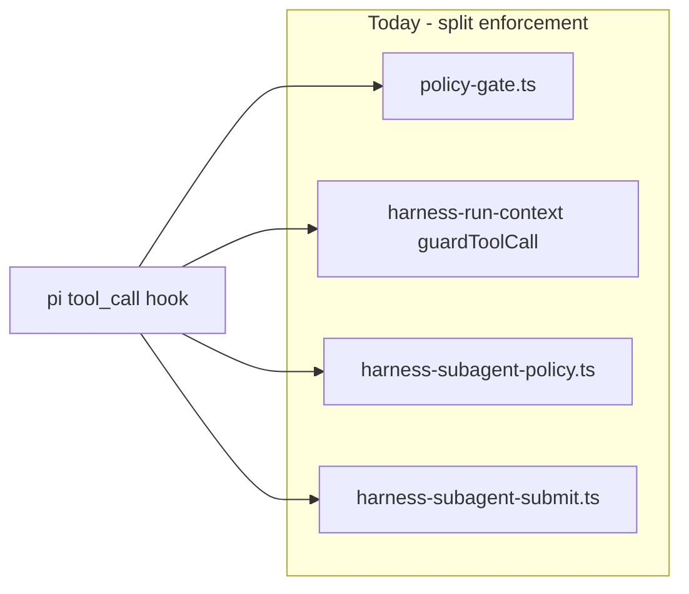
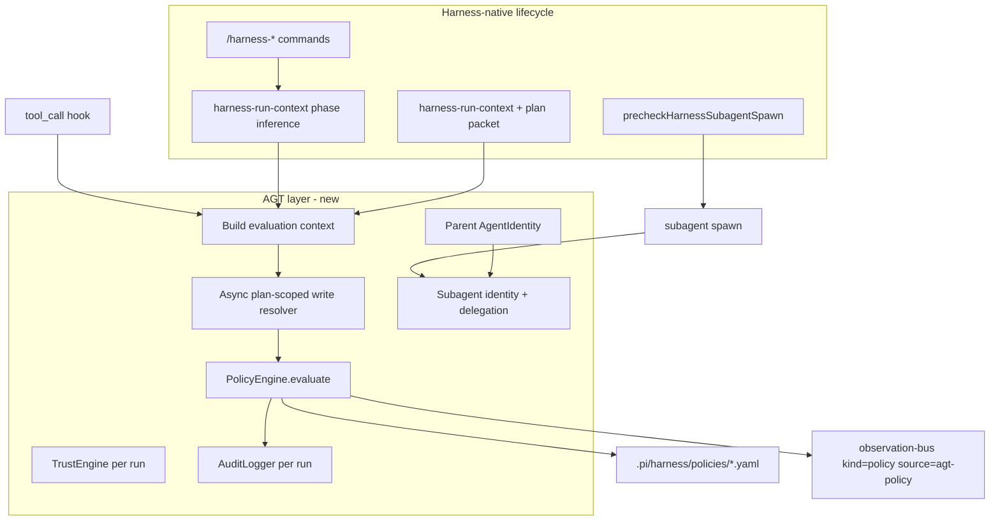

# AGT-backed policy-gate rewrite for ultimate-pi harness

## Goal

Use [Microsoft Agent Governance Toolkit (AGT)](https://github.com/microsoft/agent-governance-toolkit) as the **single enforcement engine** for tool-call governance in the Pi harness:

- **Rewrite** `[.pi/extensions/policy-gate.ts](.pi/extensions/policy-gate.ts)` so allow/deny is driven by AGT `PolicyEngine`, not hand-written `if` chains.
- Add **identity + delegation + trust** for `harness/`* subagents at spawn time (no MCP gateway scope per your direction).
- **Retire** duplicated imperative rules in `[.pi/extensions/lib/harness-subagent-policy.ts](.pi/extensions/lib/harness-subagent-policy.ts)` and the policy portions of `[guardToolCall](.pi/extensions/harness-run-context.ts)` once parity is proven.

Harness constitution ([ADR 0001](.pi/harness/docs/adrs/0001-harness-constitution.md)) stays valid: governance remains **repo-owned Pi extensions**; AGT is the policy/identity implementation inside those extensions, not a fork of pi-mono.

## Current state (what we are replacing)

| Layer                                                                                   | Responsibility today                                                                                     |
| --------------------------------------------------------------------------------------- | -------------------------------------------------------------------------------------------------------- |
| `[policy-gate.ts](.pi/extensions/policy-gate.ts)`                                       | Phase machine, plan-before-mutate, bash/context-mode blocks, `harness-policy-state` entries              |
| `[harness-run-context.ts](.pi/extensions/harness-run-context.ts)`                       | `guardToolCall`: parent `submit_*` block, scoped YAML coercion, eval-phase write restrictions            |
| `[harness-subagent-policy.ts](.pi/extensions/lib/harness-subagent-policy.ts)`           | Role matrix (planner/evaluator/executor), bash deny patterns, `submit_*` allowlists                      |
| `[harness-subprocess-bootstrap.ts](.pi/extensions/lib/harness-subprocess-bootstrap.ts)` | Seeds `harness-policy-state` in subprocess from disk run context                                         |
| Spawn precheck                                                                          | `[harness-subagent-precheck.ts](.pi/extensions/lib/harness-subagent-precheck.ts)` — topology only (keep) |

**Out of scope for AGT rewrite** (remain harness extensions): Sentrux ([ADR 0006](.pi/harness/docs/adrs/0006-sentrux-dual-layer.md)), drift-monitor, review-integrity, test-diff-integrity, budget-guard (telemetry default per [ADR 0038](.pi/harness/docs/adrs/0038-budget-telemetry-only.md)), debate-orchestrator, eval/adversary promotion ([ADR 0003](.pi/harness/docs/adrs/0003-eval-promotion-gates.md), [ADR 0039](.pi/harness/docs/adrs/0039-harness-post-run-review-gate.md)).

## Target architecture

**Evaluation context** (passed into AGT on every `tool_call`) should be a stable, documented contract:

| Field                               | Source                                                                                  | Used for                         |
| ----------------------------------- | --------------------------------------------------------------------------------------- | -------------------------------- |
| `tool_name`                         | Pi event                                                                                | Base rule matching               |
| `harness_phase`                     | `harness-policy-state` / run context                                                    | plan vs execute vs evaluate      |
| `harness_agent_id`                  | `HARNESS_AGENT_ID` or `parent-orchestrator`                                             | Role policies                    |
| `harness_agent_kind`                | mapped from agent id                                                                    | planner / executor / …           |
| `plan_ready`, `aborted`             | policy state + run context                                                              | execute gates                    |
| `is_subprocess`                     | `PI_HARNESS_SUBPROCESS`                                                                 | submit_* parent vs child         |
| `bash_command`, `write_path`        | tool input                                                                              | bash/write rules                 |
| `plan_scoped_write_ok`              | **precomputed** async helper (today’s `isPlanPhaseAllowedMutation` / scoped YAML logic) | plan-phase artifact paths        |
| `trust_score`, `delegation_ceiling` | TrustEngine                                                                             | capability ceiling for subagents |
| `run_id`, `plan_id`                 | run context                                                                             | audit correlation                |

Complex filesystem checks stay in a small harness **context builder** (`.pi/lib/agt/build-evaluation-context.ts`); AGT rules consume the boolean/enum outputs—this matches AGT’s “evaluate before execution” model without forking the policy engine.

## Dependency choice

- **Runtime:** `[@microsoft/agent-governance-sdk](https://www.npmjs.com/package/@microsoft/agent-governance-sdk)` (TypeScript has PolicyEngine, AgentIdentity, TrustEngine, AuditLogger per [PACKAGE-FEATURE-MATRIX](https://github.com/microsoft/agent-governance-toolkit/blob/main/docs/PACKAGE-FEATURE-MATRIX.md)).
- **CI only (optional later):** Python `agt lint-policy` / `agt verify` via subprocess in `[harness-verify.mjs](.pi/scripts/harness-verify.mjs)` for OWASP evidence bundles—not required for your stated scope.
- **Pin** exact SDK version in `[package.json](package.json)`; document **Public Preview** breakage risk in new ADR.
- **No MCP** integration.

## Policy artifacts (source of truth)

New directory: `[.pi/harness/policies/](.pi/harness/policies/)`

| File                  | Contents                                                                                                                        |
| --------------------- | ------------------------------------------------------------------------------------------------------------------------------- |
| `defaults.yaml`       | Fail-closed default deny for mutating tools; explicit allows                                                                    |
| `phases.yaml`         | Phase × tool matrix (replaces `policy-gate` bash/write/ctx_execute blocks)                                                      |
| `roles.yaml`          | `harness/planning/*`, `harness/running/executor`, `harness/reviewing/*` capability sets (replaces `harness-subagent-policy.ts`) |
| `orchestrator.yaml`   | Parent-only tools: `approve_plan`, `create_plan`, block `submit_*`                                                              |
| `bash-denylists.yaml` | Planning scout patterns currently in `PLANNING_BASH_DENY_PATTERNS`                                                              |

Migrate rules **mechanically** first (1:1 from TS), then simplify. Use `agt lint-policy` in verify once policies exist.

**Submit tools:** Keep `[.pi/extensions/harness-subagent-submit.ts](.pi/extensions/harness-subagent-submit.ts)` for **schema validation + deterministic writes** (ADR 0037); AGT governs *whether* `submit_hypothesis_brief` may run, Ajv governs *payload shape*.

## Extension rewrite plan

### 1. New library module `.pi/lib/agt/`

| Module                        | Role                                                                                                                                                                       |
| ----------------------------- | -------------------------------------------------------------------------------------------------------------------------------------------------------------------------- |
| `policy-engine.ts`            | Load YAML set, singleton/cached `PolicyEngine`, fail-closed on load/eval errors                                                                                            |
| `build-evaluation-context.ts` | Assemble context from session entries + tool event; call existing harness helpers (`isPlanPhaseAllowedMutation`, `isMutatingBash`, `evaluateContextModeMutation` wrappers) |
| `identity-registry.ts`        | Per-run `AgentIdentity` for parent; map `harness_agent_id` → DID/credentials                                                                                               |
| `delegation.ts`               | On spawn: mint child identity, delegation chain capped by parent trust tier                                                                                                |
| `trust-run-store.ts`          | TrustEngine keyed by `run_id`; adjust score on deny/allow (configurable deltas)                                                                                            |
| `audit-run-sink.ts`           | Append AGT audit events under `.pi/harness/runs/<run_id>/agt-audit.jsonl`                                                                                                  |

### 2. Rewrite `policy-gate.ts` → AGT-backed gate

- Keep **Pi extension surface**: `before_agent_start` phase hints, `harness-policy-state` custom entries (phase transitions from slash commands stay here—AGT does not infer `/harness-plan` vs `/harness-run`).
- Replace `pi.on("tool_call")` body with:
  1. Build evaluation context
  2. `PolicyEngine.evaluate(context)` → allow / deny
  3. On deny: `harness-policy-violation` + observation-bus + trust penalty
  4. On allow: optional trust neutral/small positive for successful `submit_*`
- Preserve **fail-closed** semantics from current gate (deny when evaluator throws).
- Rename observation source to `agt-policy` (extend `[observation.schema.json](.pi/harness/specs/observation.schema.json)` `source` enum); keep emitting legacy `harness-policy-violation` for one release if needed for dashboards.

### 3. Subagent identity at spawn

Hook in `[harness-subagents-bridge.ts](.pi/extensions/lib/harness-subagents-bridge.ts)` after `precheckHarnessSubagentSpawn` passes:

1. Resolve parent identity for `run_id` (create root on first harness command if missing).
2. `createDelegation(childAgentId, capabilitiesFromRoleYaml, trustCeiling=parent.score)`.
3. Persist credentials under `.pi/harness/runs/<run_id>/agents/<agent_id>/` (gitignored): `identity.json`, `delegation.jwt` (or SDK export format).
4. Pass to subprocess via env (already have `HARNESS_AGENT_ID`, `HARNESS_RUN_ID`): add `HARNESS_AGENT_DID`, `HARNESS_DELEGATION_BUNDLE` (short-lived).

Update `[harness-subprocess-bootstrap.ts](.pi/extensions/lib/harness-subprocess-bootstrap.ts)` to load delegation + trust context into evaluation builder (not only `harness-policy-state`).

### 4. Consolidate duplicate hooks

| Step | Action                                                                                                                                      |
| ---- | ------------------------------------------------------------------------------------------------------------------------------------------- |
| A    | Move `guardToolCall` policy rules from `[harness-run-context.ts](.pi/extensions/harness-run-context.ts)` into YAML + shared context builder |
| B    | Delete or thin `[harness-subagent-policy.ts](.pi/extensions/lib/harness-subagent-policy.ts)` to re-export types only during migration       |
| C    | Single `tool_call` enforcement path: **only** AGT gate (register order: AGT gate after run-context bootstrap, before submit extension)      |

Keep in `harness-run-context`: run injection, plan approval parsing, scoped YAML **coercion** (behavioral, not security—or move coercion behind “allow” if it mutates paths).

### 5. ADR, docs, skills

- Add **[ADR 0046](.pi/harness/docs/adrs/)**: AGT policy engine + subagent identity (decision, consequences, migration, Public Preview pin).
- Update `[.pi/harness/README.md](.pi/harness/README.md)` governance section and [harness-governor skill](.agents/skills/harness-governor/SKILL.md) (promotion still uses Sentrux + eval; policy violations now cite AGT audit id).
- Update `[practice-map.md](.pi/harness/docs/practice-map.md)` one line: enforcement = AGT policy + harness phase machine.

### 6. Verification (parity before cutover)

Extend `[harness-verify.mjs](.pi/scripts/harness-verify.mjs)`:

- Golden matrix: ~40 cases exported from today’s TS rules (phase × agent × tool × sample bash path) → expected allow/deny.
- `node` script calls same `build-evaluation-context` + `PolicyEngine` as extension (no LLM).
- Optional: `npx agt lint-policy .pi/harness/policies` in CI when CLI available.

Feature flag for rollout: `HARNESS_AGT_POLICY=1` (default off one PR, then default on, then remove legacy branches).

## Mapping: harness phases vs AGT

| Harness concern                                             | Owner after rewrite                                                                                                |
| ----------------------------------------------------------- | ------------------------------------------------------------------------------------------------------------------ |
| `plan → execute → evaluate → adversary → merge` transitions | `policy-gate` session state + slash-command inference (`[harness-run-context.ts](.pi/lib/harness-run-context.ts)`) |
| Tool allow/deny                                             | AGT `PolicyEngine`                                                                                                 |
| Subagent least privilege                                    | AGT `roles.yaml` + delegation ceiling                                                                              |
| Subagent spawn topology                                     | `precheckHarnessSubagentSpawn` (unchanged)                                                                         |
| Architecture fitness                                        | Sentrux (unchanged)                                                                                                |
| Promotion / adversary / eval                                | `/harness-review` + schemas (unchanged)                                                                            |

## Risks and mitigations

| Risk                             | Mitigation                                                                                 |
| -------------------------------- | ------------------------------------------------------------------------------------------ |
| AGT Public Preview API churn     | Pin npm version; conformance tests in harness-verify                                       |
| Plan-scoped writes need async FS | Precompute `plan_scoped_write_ok` in context builder; document in ADR                      |
| Dual hooks during migration      | Feature flag + delete legacy paths in same epic’s final PR                                 |
| Identity secrets on disk         | Store under run dir (already gitignored); short-lived delegation tokens; document rotation |
| Performance per tool call        | AGT p50 ~0.01ms; context build dominates—cache policy engine + parsed YAML                 |

## Suggested implementation order

1. **ADR 0046** + policy YAML scaffold (mechanical port from `policy-gate.ts` + `harness-subagent-policy.ts`)
2. `**.pi/lib/agt/`** + unit-style verify script (no Pi hook yet)
3. **Rewrite `policy-gate.ts`** tool_call path behind `HARNESS_AGT_POLICY`
4. **Identity/delegation on spawn** + subprocess bootstrap
5. **Remove `guardToolCall` / subagent-policy duplication**; default flag on
6. **observation.schema** + harness-governor doc + `graphify update .`

## Success criteria

- All existing `policy-gate` / subagent-policy behaviors covered by golden tests (zero regressions in verify).
- Every harness subagent spawn produces a delegation-bound identity under the run record.
- Policy denials produce AGT audit entries linkable by `run_id` + `observation_id`.
- No new MCP dependencies; Sentrux and review gates unchanged.

