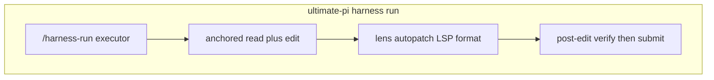
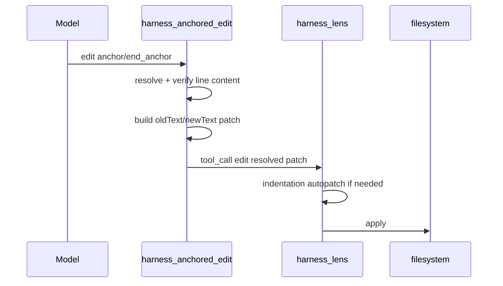

# Dirac-inspired harness improvements (final scope)

**Decision (user evaluation complete):** Adopt hash-anchored edits as the **default** harness edit path—replacing Pi `oldText`/`newText` `edit` and enriching `read` with anchors—not a parallel tool or opt-in experiment.

---

## What Dirac is vs what we are

| Layer | [Dirac](https://github.com/dirac-run/dirac) | ultimate-pi harness (after this work) |
|--------|---------------------------------------------|--------------------------------------|
| Edit precision | Hash-anchored lines + Myers reconcile | **Same model** via vendored subset + Pi `registerTool`; lens autopatch **after** resolve |
| Structural code | tree-sitter tool handlers | **`sg -p` via bash only** — no `replace_symbol` Pi tool ([ADR 0045](.pi/harness/docs/adrs/0045-harness-lens-minimal-contract.md)) |
| Orchestration | Single-agent loop | **Unchanged** — plan → run → review → steer (stronger than Dirac) |
| Context | ContextLoader / condense | **Unchanged** — graphify, ccc, VCC, lakes |

---

## Committed deliverables

### 1. Replace built-in `read` + `edit` with hash-anchored edits

**Scope:** Harness coding sessions—at minimum **`harness/running/executor`** (execute + steer `mode: repair`). Replace the default Pi tools globally when the harness extension pack is active (same surfaces that today get `read`/`edit`/`write`). Plan/review agents stay read-only; no `replace_symbol` or Dirac AST tools.

**Implementation:** [`.pi/extensions/harness-anchored-edit.ts`](.pi/extensions/harness-anchored-edit.ts) + [`.pi/lib/anchored-edit/`](.pi/lib/anchored-edit/) (Apache-2.0 vendored from Dirac: `AnchorStateManager`, `line-hashing`, resolve/apply — not full Cline).

| Tool | Behavior |
|------|----------|
| `read` | Line text + anchor prefix (`Word│line`); maintain per-session anchor state (Myers reconcile on re-read) |
| `edit` | Schema: `anchor` / `end_anchor` / `edit_type` (`insert` \| `replace`); verify provided line content matches file; batch multiple edits per file in one call |
| `write` | Unchanged (new files) |

**Default:** anchored edit **always on** when harness extensions load — no env toggle (see [first-class anchored edit plan](first-class_anchored_edit_ee5ee20b.plan.md)).

#### Edit pipeline (lens after anchors)

Rules:

- **Single `edit` tool name** — no `edit_anchored` alias.
- **No autopatch in vendored Dirac code** — lens owns indentation correction on resolved patches.
- **Extension order** — anchor resolve/transform before lens `tool_call` hook ([`.pi/settings.json`](.pi/settings.json)).

**ADR:** [`0051-hash-anchored-executor-edits.md`](.pi/harness/docs/adrs/0051-hash-anchored-executor-edits.md) — decision, attribution, scope, opt-out, lens composition.

---

### 2. Batching discipline policy (harness-wide where applicable)

Codify in [practice-map](.pi/harness/docs/practice-map.md) **Executing** + **Steer** sections and agent prompts—not a new subsystem.

| Rule | Where it applies |
|------|------------------|
| One **read** pass per file before editing that file; use latest anchored `read` output for edits | Executor, steer repair |
| **All edits for one file** in a single `edit` call (`edits[]`) | Executor, steer repair |
| **Independent files** may be edited in the same model turn when lakes/tasks are independent | Executor |
| Group work by **lake** / `context_bundle_path`; do not interleave unrelated files | Executor |
| Do not re-read a file unless anchors failed or file changed externally | Executor |

**Files:** [`executor.md`](.pi/agents/harness/running/executor.md), [`.pi/prompts/harness-run.md`](.pi/prompts/harness-run.md), [`.pi/prompts/harness-steer.md`](.pi/prompts/harness-steer.md) (steer inherits same edit rules).

---

### 3. Post-edit verification before handoff

**Requirement:** Executor must not call `submit_executor_handoff` until post-edit checks pass.

Checklist (in order):

1. **Plan `acceptance_checks`** — run commands/tests listed in `PlanPacket` for touched scope.
2. **Lens LSP blockers** — when executor has `extensions: true`, resolve or document errors from lens/LSP on changed files (no new `diagnostics_scan` tool; use existing lens behavior + explicit prompt gate).
3. **Scope** — `files_changed` ⊆ plan scope; otherwise `execution_status: scope_drift`.

Record summary in handoff `validation_summary` (existing schema). Parent `/harness-review` still owns Sentrux gate and adversary—executor does not self-certify quality.

**Files:** `executor.md`, practice-map `/harness-run` table, optional one-liner in [`harness-executor-handoff.schema.json`](.pi/harness/specs/) description field if needed for `validation_summary` shape.

---

### 4. Structural refactor playbook (no new tools)

**Policy (anti-overlap with Dirac AST handlers):**

1. **Locate** with `sg -p '…'` via `bash` (never `grep`/`find` for code).
2. **Read** anchored slices of implicated regions (not whole repo).
3. **Edit** minimally via hash-anchored `edit` (batch per file).
4. **Never** add `replace_symbol`, `rename_symbol`, `get_function`, or tree-sitter Pi tools — [ADR 0045](.pi/harness/docs/adrs/0045-harness-lens-minimal-contract.md) + `sg` only.

Add short **“Structural refactor”** subsection to `executor.md` and practice-map anti-patterns: “Do not request AST replace_symbol tools.”

**Policy:** Remove `grep` and `find` from [`agents.policy.yaml`](.pi/harness/agents.policy.yaml) `executor` tool list; keep `bash` for `sg` and test commands.

---

## Explicitly still NOT adding

| Item | Reason |
|------|--------|
| Dirac CLI / VS Code fork / Cline task loop | Wrong layer |
| `replace_symbol` and other AST Pi tools | Overlaps `sg` + ADR 0045 |
| Second compaction / ContextLoader | VCC + context-mode |
| Parallel `edit` + `edit_anchored` | Single edit surface |
| Phase B A/B gate | **User evaluation complete** — optional regression script later, not a ship blocker |
| MCP removal | Harness uses MCP intentionally |

---

## Implementation order

### Step 1 — Anchored read/edit (core)

- `.pi/lib/anchored-edit/` + `.pi/extensions/harness-anchored-edit.ts`
- Register wrapped `read` / `edit`; default on when harness extensions load
- ADR 0051 + `THIRD_PARTY_NOTICES` / license snippet for Dirac vendored files
- `harness-verify.mjs`: anchored-edit present; no duplicate autopatch in vendored tree

### Step 2 — Executor policies (prompts + policy)

- `executor.md`: anchor format, batching rules, post-edit verification checklist, structural refactor playbook
- `practice-map.md`: executing + steer rows for batching + pre-handoff verification
- `harness-run.md` / `harness-steer.md`: spawn context bundles + remind verification
- `agents.policy.yaml`: drop `grep`/`find` for executor

### Step 3 — Wire defaults

- Extension load order in `.pi/settings.json`
- Remove `HARNESS_ANCHORED_EDIT` from env template (always on; first-class refactor)
- Regenerate or hand-update policy hints if `generate-agents-policy-yaml.mjs` applies

### Step 4 — Housekeeping

- Renumber duplicate ADR 0045 entries
- Index ADR 0050 in `adrs/README.md`

---

## Success criteria

- Harness sessions always use hash-anchored `read`/`edit` (native apply; no `resolve-to-pi-edit`).
- Lens autopatch still runs on resolved edit patches.
- Executor prompt + practice-map document batching, pre-handoff verification, and `sg`→edit refactor playbook.
- No `replace_symbol` (or similar) Pi tools added.
- `node "$UP_PKG/.pi/scripts/harness-verify.mjs"` passes.

---

## Optional follow-up (not in initial scope)

- `.pi/scripts/harness-edit-benchmark.mjs` for regression tracking (no longer a adoption gate).
- Extend anchored read/edit to non-harness Pi sessions in consumer repos (only if needed beyond harness extension pack).
