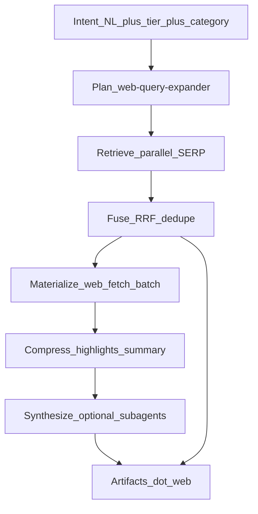

# Agentic Web Retrieval Stack (WRS) — Exa from first principles

## What an agent actually needs from “web”

Strip the product names. An LLM agent doing research or RAG needs **seven outcomes**, not “search API”:

| Outcome | Question it answers | Failure mode if missing |
|---------|---------------------|-------------------------|
| **O1 Discovery** | What URLs might matter for this intent? | Wrong or empty SERP |
| **O2 Recall** | Did we search under every *phrasing* and *facet* of the intent? | One Google-shaped blind spot |
| **O3 Precision** | Are the top URLs actually about the intent? | Noise in context |
| **O4 Evidence** | What short, quotable text supports claims? | 50k-token page dumps |
| **O5 Freshness** | Is this still true / current? | Stale docs, wrong year |
| **O6 Structure** | Can I get JSON fields, not prose? | Manual parsing |
| **O7 Synthesis** | One cited answer / report across sources? | Agent re-orchestrates every time |

**Exa sells all seven in one hosted pipeline.** Our job is to decompose Exa into these outcomes and implement each with the **smallest local primitive** (skills + subagents + extension + Python), without pretending we have their billion-page embedding index.

---

## Exa capabilities boiled down (mechanism → outcome → harness primitive)

### A. The Exa index (neural / semantic search)

| What Exa does | What it *achieves* for agents | Honest local equivalent |
|---------------|------------------------------|-------------------------|
| Embeds billions of pages; query embedding matches document embedding | **O1 + O3**: “Find pages about this *meaning*” even when keywords don’t match | **Not replicated at index scale** |
| Hybrid auto mode (neural + keyword) | Robustness when query is exact vs conceptual | **SearXNG metasearch** (many engines) + **multi-angle keywords** |
| Category indexes (company, people, paper, news) | **O3** for entity-shaped queries | **Angle templates** (`site:linkedin.com`, `site:arxiv.org`, news phrasing)—routing, not a vertical index |
| `findSimilar(url)` | **O2** from a seed: “more like this page” without re-stating intent | **`web_find_similar`**: fetch seed → extract title/H1/key phrases → 3 derivative queries → `search-deep` → rerank by text overlap with seed |
| Relevance scores (neural) | **O3** ordering signal | **RRF** across angle lists + optional **snippet-level rerank** (v2, env-gated local embeddings on title+description only—cheap, not Exa-scale) |

**First-principles takeaway:** Neural index is not magic—it is **precomputed recall + semantic ordering** so one query finds the right neighborhood of the web. We buy recall with **parallel angles + metasearch** and ordering with **fusion + optional light rerank**, not with crawling the internet into vectors.

---

### B. Search types (`instant` → `deep-reasoning`)

| Exa type | What it *achieves* | WRS `tier` |
|----------|-------------------|------------|
| `instant` / `fast` | **O1** under ~500ms; good enough for chat | `instant` — 1 query, 5 results, snippets only |
| `auto` | Pick latency/recall tradeoff | `standard` — 1 query, 10 results (today’s default) |
| `deep` / `deep-lite` | **O2 + O3**: query expansion, merge, optional synthesis | `deep` — expander → 4–5 angles → parallel SERP → RRF → top 10 |
| `deep-reasoning` | **O2 + O7**: more synthesis compute, structured output | `research` — deep + fetch top N + gap loop + answerer subagent |

**Implementation:** One knob `tier` on [`web_search`](.pi/extensions/harness-web-tools.ts), not separate products.

---

### C. Query expansion (`additionalQueries`, deep modes)

| What it achieves | WRS primitive |
|------------------|---------------|
| **O2** — different SERP clusters per phrasing | Subagent [`web-query-expander`](.pi/agents/harness/web-retrieval/web-query-expander.md) (primary; your choice) → `.web/angles.yaml` |
| Parallel execution + dedupe | Python [`multi_search.py`](.pi/scripts/harness_web/multi_search.py) + [`rank.py`](.pi/scripts/harness_web/rank.py) (RRF, k=60) |
| User-supplied angles | `web_search({ anglesFile })` bypasses expander |

---

### D. Filters (`includeDomains`, dates, `includeText`, geolocation, language)

| What it achieves | WRS primitive |
|------------------|---------------|
| **O3** — shrink candidate set | Encoded in each angle query (`site:`, `after:YYYY`, quoted phrases) + optional `filters` block in angles YAML |
| Language bias | Document in expander prompt; SearXNG language param when available |

---

### E. Contents API (`text`, `highlights`, `summary`, `subpages`, `livecrawl`)

| Exa feature | Outcome | WRS primitive |
|-------------|---------|---------------|
| `text` / markdown | **O4** full body for RAG | Existing [`web_fetch`](.pi/extensions/harness-web-tools.ts) scrape → `.web/page.md` |
| `highlights` | **O4** minimal cited spans | `web_fetch({ highlights: true, highlightQuery })` — paragraph overlap scoring in [`scrape.py`](.pi/scripts/harness_web/scrape.py) |
| `summary` | **O4** pre-digest | Subagent `web-summarizer` on excerpt (or parent LLM); output `.web/summary.md` |
| `subpages` | **O2** within-site discovery | `web_fetch` `mode: map` then selective fetches |
| `livecrawl` / `maxAgeHours` | **O5** freshness | Policy: `tier >= deep` → always scrape (no cache v1); `fetchPolicy: fresh|cache_ok` env default |
| Batch `/contents` | **O4** efficiency | New tool `web_contents({ urls[], mode })` → parallel scrape + manifest JSON |

---

### F. `/answer` and Research API

| What it achieves | WRS primitive |
|------------------|---------------|
| **O7** — search + LLM + citations in one call | **Not one HTTP call** — skill-orchestrated pipeline: `search-deep` → fetch top 3–5 → subagent [`web-answerer`](.pi/agents/harness/web-retrieval/web-answerer.md) → `.web/answer.md` with inline citations |
| Async multi-step research + `outputSchema` | Skill [`web-retrieval`](.agents/skills/web-retrieval/SKILL.md) `research` profile: expand → deep → fetch → [`web-gap-analyzer`](.pi/agents/harness/web-retrieval/web-gap-analyzer.md) → optional second pass → structured YAML; extends [`wiki-autoresearch`](.agents/skills/wiki-autoresearch/SKILL.md) |

The **parent harness LLM** already does synthesis in planning; WRS supplies **evidence bundles** so synthesis is grounded, not Exa-hosted.

---

### G. Websets (search → verify → enrich → thousands)

| What it achieves | WRS primitive |
|------------------|---------------|
| **O2 + O3 + O6** at scale — exhaustive qualified list with per-row reasoning | **Phase 5** — not a clone of Websets infrastructure: iterative `deep` + subagent [`web-criteria-verifier`](.pi/agents/harness/web-retrieval/web-criteria-verifier.md) scores each candidate against NL criteria → `.web/webset-manifest.csv` + `.web/webset-reasoning.yaml` |
| Monitors (recurring) | [`loop` skill](.cursor/skills-cursor/loop/SKILL.md) or harness cron + diff previous manifest |

---

### H. Verticals (Code, Company, People, News)

| What it achieves | WRS primitive |
|------------------|---------------|
| Better **O3** for vertical-shaped questions | `category` hint → expander angle pack (see table below); **library code** → **context7** (unchanged) |

| Category hint | Angle pack (examples) |
|---------------|----------------------|
| `code` | `site:github.com`, `site:stackoverflow.com`, docs official |
| `company` | official site, crunchbase-style queries, news |
| `people` | `site:linkedin.com`, bio pages |
| `paper` | `site:arxiv.org`, `filetype:pdf`, scholar phrasing |
| `news` | recent year in query, news-oriented engines via SearXNG |

---

### I. Agent API / Monitors (Exa-hosted async)

| What it achieves | WRS primitive |
|------------------|---------------|
| Long-running hosted workflows | **Out of scope as hosted service** — replicate *behavior* via skills + subagent chain + `.web/` artifacts + optional background shell (loop), not new cloud product |

---

## WRS architecture (one pipeline, many tiers)



**Layers (who owns what):**

| Layer | Owner | Deterministic? |
|-------|--------|----------------|
| Plan | Subagent `web-query-expander` | No (LLM) |
| Retrieve + Fuse | Python `harness_web` | Yes |
| Materialize + Compress | Python + Scrapling | Mostly yes |
| Synthesize | Subagents `web-answerer`, `web-gap-analyzer`, `web-criteria-verifier` | No |
| Orchestration | Skill `web-retrieval` | Policy |
| Tools | Extension `harness-web-tools.ts` | Thin CLI wrapper |

**No MCP.** No Exa API key. Subagents use existing pi `subagent` tool; tools do **not** block on subagent spawn inside `execute()`.

---

## Tool surface (extension)

Extend [`.pi/extensions/harness-web-tools.ts`](.pi/extensions/harness-web-tools.ts):

| Tool | Exa analog | Key params |
|------|------------|------------|
| `web_search` | `/search` | `query`, `tier: instant\|standard\|deep\|research`, `anglesFile`, `category`, `limit` |
| `web_find_similar` | findSimilar | `url`, `tier`, `limit` |
| `web_fetch` | contents (single URL) | `url`, `mode`, `fast`, `highlights`, `highlightQuery` |
| `web_contents` | contents (batch) | `urls[]`, `highlights`, `outputDir` |

`bulk: true` remains shorthand for search + scrape top N (Firecrawl compat).

CLI additions in [`harness-web.py`](.pi/scripts/harness-web.py):

- `search-deep` — angles file in, ranked JSON out
- `find-similar` — seed URL → internal angle generation → search-deep
- `contents-batch` — parallel scrape manifest

---

## Artifacts (`.web/` contract)

| File | Purpose |
|------|---------|
| `angles.yaml` | Expander output (source of truth for deep) |
| `search.json` | `tier=standard` (existing) |
| `search-deep.json` | Fused hits + scores + `angle_ids` |
| `evidence-bundle.json` | URLs + snippets + highlight spans (feeds answerer) |
| `answer.md` | O7 output with citations |
| `research-report.md` / `research.json` | Research API analog |
| `webset-manifest.csv` | Websets analog |

Keep Firecrawl-shaped `data.web[]` for backward compatibility; add optional fields (`score`, `angle_ids`, `highlights`).

---

## Subagents (harness/)

| Agent | Outcomes | Tools allowed |
|-------|----------|---------------|
| `web-query-expander` | O2 plan | None (YAML only) |
| `web-gap-analyzer` | O2 gap-fill | Read artifacts only; outputs new angles |
| `web-answerer` | O7 | Read `.web/evidence-bundle.json`; writes `answer.md` |
| `web-summarizer` | O4 digest | Read fetch excerpts |
| `web-criteria-verifier` | O3/O6 Websets | Read candidates; score + reason per row |

Register in [`.pi/harness/agents.policy.yaml`](.pi/harness/agents.policy.yaml).

---

## Skill: `web-retrieval` (replaces narrow “exa-web”)

Single skill maps user intent → tier + pipeline steps:

| User says | Tier | Steps |
|-----------|------|-------|
| “What is X?” / one narrow fact (already scoped) | `instant` or `standard` | `web_search` with explicit tier |
| “What is X?” / needs context or sources | `deep` | expander → deep (do not use standard) |
| “How does X work?” / landscape | `deep` | expander → `web_search` → `web_fetch` highlights on top 3 |
| “Compare A vs B” | `deep` | expander with comparison angles |
| “Answer with sources” | `research` + answerer | deep → contents → `web-answerer` |
| “Find 50 companies matching …” | `research` + verifier loop | deep paginated + `web-criteria-verifier` → CSV |
| “More like this URL” | — | `web_find_similar` |
| Library API docs | — | **context7** (not WRS) |

Install/env documented in [`web-retrieval`](.agents/skills/web-retrieval/SKILL.md).

**Skill trigger:** Broaden `web-retrieval` description so it auto-invokes for non-API web research — not only when the user says “search the web”. Triggers: landscape, prior art, compare, “what does X do”, stack research, implementation research, `/wiki-autoresearch`, harness-plan pre-research.

---

## Agent guidance — tools + SYSTEM.md (mandatory for leverage)

Agents currently see `web_search` as a generic SERP tool ([`.pi/SYSTEM.md`](.pi/SYSTEM.md) § Web Policy) and default to **one `standard` query** — the weakest WRS path. **Ship tier tooling and agent guidance in the same phase** so agents never get deep tools without instructions to use them.

### Design principle

| Rule | Rationale |
|------|-----------|
| **`tier=deep` is the default** for any non-trivial open-web question | Single-query SERP is the fallback, not the norm |
| **Never loop manual `web_search`** when `deep` + expander exists | Replaces wiki-autoresearch “3–5 angles × 2–3 queries” |
| **Fetch with highlights** before full page bodies | O4 without token waste |
| **Read `.web/search-deep.json`** after deep search | Scores + `angle_ids` show fusion signal |

### Files to update

| File | What changes |
|------|----------------|
| [`.pi/SYSTEM.md`](.pi/SYSTEM.md) | Tier decision tree, default-deep policy, anti-patterns, WRS workflow |
| [`.pi/extensions/harness-web-tools.ts`](.pi/extensions/harness-web-tools.ts) | `description`, `promptSnippet`, `promptGuidelines` per tool |
| [`.pi/lib/harness-web/run-cli.ts`](.pi/lib/harness-web/run-cli.ts) | `harnessWebContextLine()` — tier default + workflow one-liner |
| [`.agents/skills/web-retrieval/SKILL.md`](.agents/skills/web-retrieval/SKILL.md) | WRS workflows + install/env |
| [`.agents/skills/web-retrieval/SKILL.md`](.agents/skills/web-retrieval/SKILL.md) | Canonical tier + pipeline procedures (new) |
| [`.pi/agents/harness/planning/stack-researcher.md`](.pi/agents/harness/planning/stack-researcher.md) | Mandatory expander → deep → highlights |
| [`.pi/agents/harness/planning/implementation-researcher.md`](.pi/agents/harness/planning/implementation-researcher.md) | Same |
| [`.pi/prompts/harness-plan.md`](.pi/prompts/harness-plan.md) | Parent pre-research: WRS `.web/` bundle before debate |
| [`AGENTS.md`](AGENTS.md) | Convention: non-API web → `web-retrieval` + tiers |
| [`.pi/extensions/harness-web-guard.ts`](.pi/extensions/harness-web-guard.ts) | Blocked-bash hint points to `tier=deep` / skill |

[`custom-system-prompt.ts`](.pi/extensions/custom-system-prompt.ts) loads `.pi/SYSTEM.md` — no fork unless a project overrides `.pi/system.md` (document: preserve tier policy in overrides).

### `.pi/SYSTEM.md` — Web Policy replacement (core)

**Tier selection (`deep` default for research)**

| Tier | When | Call pattern |
|------|------|----------------|
| `deep` | **Default** for landscape, prior art, comparisons, how/why, stack/implementation research, planning, multi-source questions | 1) `subagent` `harness/web-retrieval/web-query-expander` → `.web/angles.yaml` 2) `web_search({ query, tier: "deep", anglesFile: ".web/angles.yaml" })` 3) `web_fetch` top 3 with `highlights: true` |
| `standard` | One narrow fact; follow-up after `search-deep.json`; verify one claim | `web_search({ query, tier: "standard", limit: 5 })` |
| `instant` | Closed-form fact, latency-critical | `web_search({ query, tier: "instant", limit: 5 })` |
| `research` | Cited answer/report; harness-plan external research | `web-retrieval` skill `research` profile |

**Anti-patterns**

- Open-ended question with omitted `tier` (weak single SERP).
- Three+ sequential `web_search` calls with different queries — use one `deep` search.
- `bulk: true` unless you need markdown bodies of top N immediately.
- Full `web_fetch` when SERP snippets + highlights suffice.
- `web_search` / `web_fetch` for library APIs — **context7 only**.

**After deep search:** `read` `.web/search-deep.json`; prefer URLs listed under multiple `angle_ids`.

**Skills:** Invoke **`web-retrieval`** before non-trivial web work (same priority as graphify for codebase questions).

### Tool contracts — `harness-web-tools.ts`

**`web_search`**

- `description`: Multi-tier web retrieval. **Default `tier: "deep"` for research**; `standard` is narrow follow-up only.
- `promptSnippet`: `tier=deep + anglesFile; not bare SERP`
- `promptGuidelines` (replace current):

  - DEFAULT `tier=deep` for landscape, prior art, comparisons, planning research, multi-source questions.
  - Before deep: spawn `harness/web-retrieval/web-query-expander` → `.web/angles.yaml` → `anglesFile` on `web_search`.
  - `tier=standard` ONLY for one narrow fact or after `search-deep.json` exists.
  - `tier=instant` ONLY when latency-critical and closed-form.
  - Never 3+ `web_search` calls with different queries; use one deep search.
  - After deep: read `search-deep.json`; `web_fetch` with `highlights: true` before full scrape.
  - `bulk: true` only when you need immediate markdown for top N URLs.
  - Library docs: context7 only.

**`web_fetch`**

- Prefer `highlights: true` + `highlightQuery` after deep search; `fast: true` for static docs.

**`web_find_similar` / `web_contents`** (later phases): descriptions tie to post-deep workflow, not standalone basic search.

### Runtime injection — `harnessWebContextLine()`

```
[HarnessWeb] engine=<ddg|searxng> | DEFAULT tier=deep for research | standard=narrow follow-up only |
Workflow: web-query-expander → web_search(deep, anglesFile) → web_fetch(highlights) | skill: web-retrieval
```

### Research subagents

**stack-researcher** / **implementation-researcher** — mandatory:

1. Follow `web-retrieval` (or parent `.web/` bundle).
2. External landscape: expander + `web_search({ tier: "deep", anglesFile })` — **forbidden:** bare `web_search({ query })` without `tier: "deep"`.
3. Artifacts: `angles.yaml`, `search-deep.json`, highlight fetches under `.web/<run-id>/`.

### Guidance verification

- Contract check: `SYSTEM.md` contains `tier=deep` and `web-retrieval`; `web_search` schema includes `tier` enum.
- Manual trace eval: open-ended research prompt must show expander + deep, not repeated `standard` searches.

---

## Neural index: optional v2 (explicit, env-gated)

If snippet rerank is needed beyond RRF:

- `HARNESS_WEB_RERANK=off|lexical|embed` (default `off`)
- `lexical`: BM25-style on title+description vs intent (pure Python)
- `embed`: small local model (e.g. sentence-transformers) on merged snippets only—**not** a web index

This achieves a slice of **O3** without Exa’s infrastructure.

---

## Phased delivery

### Phase 1 — Core (O1–O3 via deep search)

- Python: `query_angles`, `multi_search`, `rank`, `deep_search`, CLI
- Extension: `tier`, `anglesFile` on `web_search` + tool descriptions / `promptGuidelines` / `harnessWebContextLine`
- **SYSTEM.md** web policy + **AGENTS.md** pointer (same PR as tools)
- Subagent: `web-query-expander`
- **stack-researcher** / **implementation-researcher** mandatory deep workflow
- Stub **web-retrieval** skill (tier table; full profiles in Phase 4)
- Tests + verify smoke + guidance contract checks

### Phase 2 — Contents (O4–O5)

- `highlights` on `web_fetch`
- `web_contents` batch tool
- `web-summarizer` subagent (optional path)

### Phase 3 — Discovery extras

- `web_find_similar` tool + CLI
- Filters in angles schema
- Optional `HARNESS_WEB_RERANK=lexical`

### Phase 4 — Synthesis (O7)

- `evidence-bundle.json` builder in Python (post-fetch)
- `web-answerer`, `web-gap-analyzer` subagents
- `web-retrieval` skill `research` profile; wire wiki-autoresearch

### Phase 5 — Exhaustive lists (Websets analog)

- `web-criteria-verifier` + CSV manifest
- Document monitor pattern via loop skill (diff manifests)

### Docs

- ADR: `.pi/harness/docs/adrs/00XX-web-retrieval-retrieval-stack.md`
- Full **web-retrieval** skill; wiki-autoresearch uses WRS deep path
- harness-plan parent pre-research WRS bundle

---

## Explicit non-goals

- Hosting Exa-scale embedding index or minute-level global crawl
- Exa API client or MCP server for search
- Synchronous subagent spawn inside tool `execute()`
- Replacing **context7** for library documentation

---

## Success criteria

1. `tier=deep` with expander angles beats single-query `standard` on recall for ambiguous NL queries (manual eval on 5 test intents).
2. Every Exa *outcome* O1–O7 has a documented WRS primitive (table above).
3. Research agents use one skill (`web-retrieval`) instead of ad-hoc multi-search loops.
4. All artifacts path-first under `.web/` for harness-plan debate pre-research.
5. **Agent compliance:** Sample research trace shows expander → `tier=deep` → highlights; no bare default `web_search`. `SYSTEM.md` + tool `promptGuidelines` both state deep-as-default for research.
