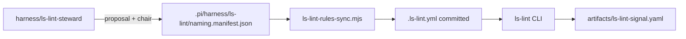

# Harness ls-lint integration (filename fitness function)

## Goal

Mirror the Sentrux stack for **filesystem naming**: required CLI, canonical manifest, generated config with preserved custom YAML, harness-verify drift checks, and steward-driven evolution. Complement Sentrux (code architecture) without merging the two domains.




## Reference pattern (copy from Sentrux)


| Concern                | Sentrux (existing)                                                                                 | ls-lint (new)                                     |
| ---------------------- | -------------------------------------------------------------------------------------------------- | ------------------------------------------------- |
| Canonical source       | `[.pi/harness/sentrux/architecture.manifest.json](.pi/harness/sentrux/architecture.manifest.json)` | `.pi/harness/ls-lint/naming.manifest.json`        |
| Generated artifact     | `.sentrux/rules.toml`                                                                              | `.ls-lint.yml` (repo root)                        |
| Sync script            | `[sentrux-rules-sync.mjs](.pi/scripts/sentrux-rules-sync.mjs)`                                     | `ls-lint-rules-sync.mjs`                          |
| Bootstrap              | `[harness-sentrux-bootstrap.mjs](.pi/scripts/harness-sentrux-bootstrap.mjs)`                       | `harness-ls-lint-bootstrap.mjs`                   |
| Root-resolving CLI     | `[harness-sentrux-cli.mjs](.pi/scripts/harness-sentrux-cli.mjs)`                                   | `harness-ls-lint-cli.mjs`                         |
| Pi extension + command | `[sentrux-rules-sync.ts](.pi/extensions/sentrux-rules-sync.ts)` → `/harness-sentrux-sync`          | `ls-lint-rules-sync.ts` → `/harness-ls-lint-sync` |
| Steward agent          | `[harness/sentrux-steward](.pi/agents/harness/sentrux-steward.md)`                                 | `harness/ls-lint-steward`                         |
| Run signal             | `[sentrux-signal.schema.json](.pi/harness/specs/sentrux-signal.schema.json)`                       | `ls-lint-signal.schema.json`                      |
| ADR                    | [0009](.pi/harness/docs/adrs/0009-sentrux-rules-lifecycle.md)                                      | **0052** `ls-lint-naming-lifecycle.md`            |


Managed block markers (same convention as Sentrux TOML):

```yaml
# --- harness:managed:start ---
ls: { ... }
ignore: [ ... ]
# --- harness:managed:end ---
```

Content outside the block is preserved on every sync.

---

## 1. Manifest schema and default template

Add `[.pi/harness/ls-lint/naming.manifest.json](.pi/harness/ls-lint/naming.manifest.json)` (`schema_version`, `project`, `rules`, `ignores`).

`**rules**` — structured list the sync script renders into `ls:` (not raw YAML blobs), e.g.:

- Global: `.md`, `.ts`, `.mjs`, `.json`, `.yaml` → `kebab-case` (with allowed exceptions via regex where needed)
- Path overrides: `.pi/harness/docs/adrs` → `regex:^\d{4}-[a-z0-9-]+$` for ADR filenames; `.pi/scripts` → kebab-case; `.agents/skills` → kebab-case dirs
- Directory names: `.dir: kebab-case` on key roots (`.pi`, `.agents`, `docs`, `scripts`)

`**ignores**` — always include: `node_modules`, `.git`, `graphify-out`, `vendor`, `dist`, `*.png`, lockfiles, etc.

Per your choice (**strict_fix_all**): the template targets **repo-wide kebab-case** for files/dirs; implementation includes a one-time audit (`ls-lint` + renames) so `harness-verify` and `harness-cli-verify` pass on `ultimate-pi` before merge.

Add JSON schema `[.pi/harness/specs/naming-manifest.schema.json](.pi/harness/specs/naming-manifest.schema.json)` and proposal schema `ls-lint-manifest-proposal.schema.json` (parallel to `[sentrux-manifest-proposal.schema.json](.pi/harness/specs/sentrux-manifest-proposal.schema.json)`).

---

## 2. Scripts (deterministic, no LLM)


| Script                          | Responsibility                                                                                                                                                         |
| ------------------------------- | ---------------------------------------------------------------------------------------------------------------------------------------------------------------------- |
| `ls-lint-rules-sync.mjs`        | Render managed block from manifest; hash-based `--check`; `--force` write; meta at `.ls-lint/.harness-naming-meta.json` (gitignored)                                   |
| `harness-ls-lint-bootstrap.mjs` | Seed manifest from package template; personalize `project`; invoke sync (same flags as Sentrux bootstrap)                                                              |
| `harness-ls-lint-cli.mjs`       | Find project root via `.ls-lint.yml` / manifest markers; run `ls-lint` with explicit workdir (mirror `[harness-sentrux-cli.mjs](.pi/scripts/harness-sentrux-cli.mjs)`) |


Register in `[package.json](package.json)`: `"harness:ls-lint-sync": "node .pi/scripts/ls-lint-rules-sync.mjs --force"`.

Unit tests: `[test/ls-lint-rules-sync.test.mjs](test/ls-lint-rules-sync.test.mjs)` (mirror `[test/sentrux-rules-sync.test.mjs](test/sentrux-rules-sync.test.mjs)`) — preserve custom YAML, `--check` drift, bootstrap seed.

---

## 3. Required CLI — `[harness-cli-verify.sh](.pi/scripts/harness-cli-verify.sh)`

Add `verify_ls_lint()` after `verify_sentrux()`:

- `npm install -g @ls-lint/ls-lint@2.3.1` (pin for reproducibility; align with [ls-lint docs](https://ls-lint.org/))
- Run `node "$UP_PKG/.pi/scripts/harness-ls-lint-bootstrap.mjs" --force` when missing config
- Smoke: `harness-ls-lint-cli.mjs` (or `ls-lint` at project root) must exit 0
- **Fail** the script on install or lint failure (required tool, same bar as `sentrux`)

Update `[harness-setup.md](.pi/prompts/harness-setup.md)` Step 2 (new **§2.9 ls-lint**) and Step 4 (**§4.3** bootstrap table, gitignore for meta only, committed `.ls-lint.yml`).

Extend `[harness-seed-project-contracts.mjs](.pi/scripts/harness-seed-project-contracts.mjs)` to seed `naming.manifest.json` into external projects (like Sentrux manifest today).

---

## 4. harness-verify contract

Update `[harness-verify.mjs](.pi/scripts/harness-verify.mjs)`:

- `REQUIRED_SCHEMAS`: `naming-manifest.schema.json`, `ls-lint-manifest-proposal.schema.json`, `ls-lint-signal.schema.json`
- `REQUIRED_EXTENSIONS`: `ls-lint-rules-sync.ts`
- `REQUIRED_ADRS`: `0052-ls-lint-naming-lifecycle.md`
- `checkLsLintRules()`: manifest present, `ls-lint-rules-sync.mjs --check`, `.ls-lint.yml` present
- Optional gate (mirror Sentrux): when `HARNESS_LS_LINT_REQUIRED=true`, require `artifacts/ls-lint-signal.yaml` or smoke stub under evals

Add `[.env.example](.env.example)`: `HARNESS_LS_LINT_REQUIRED="true"`.

---

## 5. Pi extension and skills

**Extension** `[.pi/extensions/ls-lint-rules-sync.ts](.pi/extensions/ls-lint-rules-sync.ts)`:

- `session_start`: warn if `--check` fails
- `agent_end`: auto `--force` sync when phase is `plan` or `merge`, or custom entry `harness-naming-changed`
- Register `/harness-ls-lint-sync`

**Skill** `[.agents/skills/harness-ls-lint-setup/SKILL.md](.agents/skills/harness-ls-lint-setup/SKILL.md)` — parallel to `[harness-sentrux-setup](.agents/skills/harness-sentrux-setup/SKILL.md)` (bootstrap / steward / sync / observation roles).

Optional thin **ls-lint** skill for ad-hoc “lint filenames” (can defer; harness-ls-lint-setup is enough for harness paths).

---

## 6. Steward evolution (intent, not observation)


| Piece         | Action                                                                                                                                                                    |
| ------------- | ------------------------------------------------------------------------------------------------------------------------------------------------------------------------- |
| Agent         | `[.pi/agents/harness/ls-lint-steward.md](.pi/agents/harness/ls-lint-steward.md)` — read-only; graphify + `ls-lint` output as evidence; `submit_ls_lint_manifest_proposal` |
| Prompt        | `.pi/prompts/harness-ls-lint-steward.md` — chair workflow (apply patch → bootstrap `--force` → `harness-naming-changed`)                                                  |
| Policy        | `[agents.policy.yaml](.pi/harness/agents.policy.yaml)` — register agent + submit tool                                                                                     |
| Harness tools | Extend debate/harness tools with `submit_ls_lint_manifest_proposal` (same pattern as Sentrux proposal tool)                                                               |


**When to spawn** (document in steward + plan prompt):

- Plan adds new top-level dirs or file-type conventions not covered by manifest globs
- Post-run `ls-lint` failures indicating missing path-scoped rules (before replan)
- User requests naming convention change

Never auto-sync manifest from directory trees; chair applies JSON Merge Patch (ADR 0052).

---

## 7. Plan / run / review workflow

Update `[.pi/harness/docs/practice-map.md](.pi/harness/docs/practice-map.md)`:


| Phase        | Addition                                                                                                        |
| ------------ | --------------------------------------------------------------------------------------------------------------- |
| **Plan 4e**  | Optional `harness/ls-lint-steward` when scope introduces new paths/extensions (parallel to Sentrux steward row) |
| **Run pre**  | `harness-ls-lint-cli.mjs` (baseline violation count in run notes)                                               |
| **Run post** | Re-run ls-lint; write `artifacts/ls-lint-signal.yaml`; session entry `harness-ls-lint-signal`                   |
| **Review 1** | Deterministic QC: `harness-ls-lint-cli.mjs` + verify drift; evaluator reads signal                              |


Concrete prompt edits:

- `[harness-plan.md](.pi/prompts/harness-plan.md)` — spawn criteria + `harness_artifact_ready` for `artifacts/ls-lint-manifest-proposal.yaml`
- `[harness-run.md](.pi/prompts/harness-run.md)` — pre/post ls-lint + signal YAML (simpler than Sentrux: `lint_pass`, `violation_count`, `status: pass|fail|skipped|not_installed`)
- `[harness-review.md](.pi/prompts/harness-review.md)` + `[.agents/skills/harness-review/SKILL.md](.agents/skills/harness-review/SKILL.md)` — include ls-lint in phase 1 and evaluator spawn context
- `[harness-steer.md](.pi/prompts/harness-steer.md)` — re-run ls-lint after repair (optional note)
- `[harness-governor/SKILL.md](.agents/skills/harness-governor/SKILL.md)` — intent vs observation split for naming manifest

Update `[observation-bus.ts](.pi/extensions/observation-bus.ts)`: kind/source `ls-lint` for `harness-ls-lint-signal`.

Update `[harness/reviewing/evaluator.md](.pi/agents/harness/reviewing/evaluator.md)` to cite `artifacts/ls-lint-signal.yaml`.

---

## 8. Strict fix-all pass (ultimate-pi)

Because you chose **strict repo-wide naming**:

1. Land manifest + sync + harness wiring.
2. Run `ls-lint` at repo root; collect violations.
3. Batch renames (git-aware) for files/dirs that violate kebab-case — prioritize `.pi/`, `.agents/`, `docs/`, `scripts/`, root configs; keep ADR numeric prefix via path-scoped regex rule rather than renaming ADR numbers.
4. Re-run until `ls-lint` and `harness-cli-verify` pass.
5. Commit generated `[.ls-lint.yml](.ls-lint.yml)` + any manifest tweaks from discovered edge cases.

Executor guidance (ADR 0051 alignment): new files created during `/harness-run` must use kebab-case paths; ls-lint post-check catches drift.

---

## 9. Documentation and ADR

- **ADR 0052** — `.pi/harness/docs/adrs/0052-ls-lint-naming-lifecycle.md` (mirror 0009 structure)
- Index entry in [adrs/README.md](.pi/harness/docs/adrs/README.md)
- `[.pi/scripts/README.md](.pi/scripts/README.md)` — script table rows
- `[.pi/harness/README.md](.pi/harness/README.md)` — `ls-lint/` directory
- `[CONTRIBUTING.md](CONTRIBUTING.md)` + `[README.md](README.md)` — mention ls-lint beside Sentrux
- `[.gitignore](.gitignore)` — `.ls-lint/.harness-naming-meta.json`; commit `.ls-lint.yml`

Post-implementation: `node "$UP_PKG/.pi/scripts/harness-verify.mjs"` and `GRAPHIFY_VIZ_NODE_LIMIT=200000 graphify update .`

---

## Out of scope (unless you want them in the same PR)

- GitHub Action wrapper (ls-lint provides one; document in CONTRIBUTING only)
- Merging ls-lint-steward into sentrux-steward (kept separate for clear RACI)
- Renaming `graphify-out/` or `vendor/` contents (ignored, not renamed)

