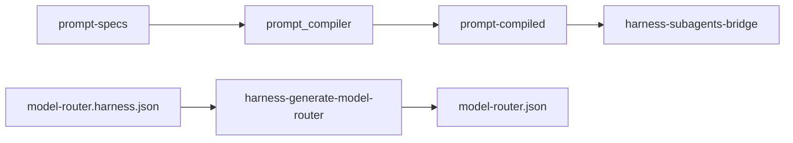

# Harness prompt renderer

## Goal (one sentence)

**Agent job** lives in semantic specs; **how it’s written** is compiled per **model family** (`promptProfile`); **router** only changes **thinking effort**, not model SKU or prompt voice each turn.

## Mental model (what users should feel)


| Choice                                      | What changes                | What stays the same                 |
| ------------------------------------------- | --------------------------- | ----------------------------------- |
| Pick **router/qwen** or **router/deepseek** | Model family + prompt voice | Instructions for the agent role     |
| Router **tier** (rules / pin / classifier)  | **Thinking** level only     | Same weights + same compiled prompt |
| **Sonnet → Opus** (later)                   | SKU / horsepower            | Same `anthropic` compiled file      |


Shared prompt **within a family works** (semantics identical; presentation per family). Qwen vs DeepSeek = two families, two renders — not one global prompt.

**v1 limitation:** Parent session still uses `[SYSTEM.md](.pi/SYSTEM.md)`. **v1 only injects compiled prompts for harness subagents** (bridge at spawn). Compiled parent SYSTEM = v2.

## Today → target


| Today                                                                                                                    | Target                                                      |
| ------------------------------------------------------------------------------------------------------------------------ | ----------------------------------------------------------- |
| Agent `.md` body = semantics + formatting mixed                                                                          | Spec + stub; compiled `systemPrompt` at spawn               |
| `[harness-generate-model-router.mjs](.pi/scripts/harness-generate-model-router.mjs)` swaps **different models per tier** | **Thinking-only:** same `provider/model` on high/medium/low |
| No package-root prompt assets                                                                                            | Ship `.pi/prompt-compiled/` in npm (`UP_PKG`)               |


## Architecture

```text
.pi/prompt-specs/     ──► prompt_compiler/ (dev) ──► .pi/prompt-compiled/agents/{agentId}/{promptProfile}.md
.pi/prompt-guides/
.pi/prompt-profiles/canonical-models.yaml   # SKU → prompt_profile, tier defaults

Runtime (subagents):  modelRef → canonicalId → promptProfile → resolveHarnessAsset(..., profile.md)
Router:               model-router.harness.json ──generate──► model-router.json (GENERATED)
```




## v1 allowlist

Only `**qwen3.6-plus**` and `**deepseek-v4-pro**`. Identity = **model id**, not provider (`deepseek/...` ≡ `opencode-go/...`).

`[canonical-models.yaml](.pi/prompt-profiles/canonical-models.yaml)`:

```yaml
models:
  qwen3.6-plus:
    match: [qwen3.6-plus, qwen3-6-plus]
    prompt_profile: qwen
    prefer_providers: [opencode-go, qwen]
    tier_thinking_default: { high: high, medium: medium, low: low }
  deepseek-v4-pro:
    match: [deepseek-v4-pro]
    prompt_profile: deepseek
    prefer_providers: [deepseek, opencode-go]
    tier_thinking_default: { high: high, medium: low, low: off }
```

`[canonical-model.ts](.pi/lib/canonical-model.ts)`: `canonicalModelId(ref)`, `resolveBestAvailableRef(registry, id)`.

**Compiled paths:** `agents/harness/{executor}/{promptProfile}.md` with fallback `generic.md` → stub. **v1 may ship only `generic.md`** until qwen/deepseek guides diverge.

## Router & config (simple surface, safe defaults)

### Users configure (friendly)

- `**/harness-setup` Step 3.5:** checkboxes — use Qwen, use DeepSeek, Qwen as classifier. No provider strings, no per-tier model fields.
- **Optional:** `[.pi/model-router.harness.json](.pi/model-router.harness.json)` for power users — JSON Schema validated.

**Setup copy:** *One model per mode; router only changes thinking. Prompt voice follows family (Qwen vs DeepSeek).*

### Users do not edit

- `**.pi/model-router.json`** — **GENERATED**; verify fails if stale or tiers use different models.
- `**.pi/prompt-compiled/`** — edit specs, run compiler.

### Source config (example)

```json
{
  "routingMode": "thinking-only",
  "defaultProfile": "qwen",
  "classifier": "qwen3.6-plus",
  "profiles": {
    "qwen": {
      "model": "qwen3.6-plus",
      "promptProfile": "qwen",
      "tierThinking": { "high": "high", "medium": "medium", "low": "low" }
    },
    "deepseek": {
      "model": "deepseek-v4-pro",
      "promptProfile": "deepseek",
      "tierThinking": { "high": "high", "medium": "low", "low": "off" }
    }
  }
}
```

Omit `tierThinking` → use `tier_thinking_default` from YAML.

### Generator behavior

`[harness-generate-model-router.mjs](.pi/scripts/harness-generate-model-router.mjs)`:

1. Validate source against `[model-router.harness.schema.json](.pi/harness/specs/model-router.harness.schema.json)` (`additionalProperties: false`, canonical ids only, **no** `model` under tiers in source).
2. Resolve canonical → authed `provider/model`.
3. Expand to vendor shape: **same `model` on high/medium/low**, per-tier `thinking` only (pi-model-router requires three tiers — we don’t fork it).
4. **Clamp** thinking via pi-ai `clampThinkingLevel` on resolved registry model; log if config ≠ clamped.
5. **Fail** on: unknown canonical, missing compiled profile, multi-model tiers, zero authed allowlisted models.

**Thinking levels:** harness JSON uses Pi levels only (`off`…`xhigh`). pi-ai translates to provider APIs — do not put provider-native names in harness config.

No default `rules` / `phaseBias` / `maxSessionBudget` in v1 template.

## Runtime (v1 scope)

### Subagent spawn — `[harness-subagents-bridge.ts](.pi/extensions/lib/harness-subagents-bridge.ts)`

1. Resolve concrete model (`[resolveConcreteSubagentModel](.pi/extensions/lib/harness-subagent-auth.ts)`) — unchanged.
2. `canonicalModelId` → `prompt_profile` from YAML.
3. Load `resolveHarnessAsset(moduleUrl, agentId,` ${promptProfile}.md`)` from **package root**.
4. Set `agent.systemPrompt` on copy passed to pi-subagents; **re-append `max_turns`** if frontmatter set.
5. Unsupported canonical → warn once + stub; never load wrong family’s file.

**Do not** inherit parent session `promptProfile` — subprocess model wins.

### Parent session

- Still `[SYSTEM.md](.pi/SYSTEM.md)` via `[custom-system-prompt.ts](.pi/extensions/custom-system-prompt.ts)`.
- Router mode: tier changes **thinking only**; `promptProfile` on router profile is for subagents + future v2 parent SYSTEM.

## Prompt compiler (dev-only)

- Layout: `.pi/prompt-specs/`, `.pi/prompt-guides/`, `.pi/prompt-profiles/registry.yaml`, `.pi/prompt-compiled/`.
- `[prompt_compiler/](prompt_compiler/)`: CocoIndex `render_prompt` → outputs + `manifest.json`.
- CLI: `prompt-compiler update` | `check`.
- **Lefthook:** regen on spec/guide change; `**harness-verify` + `release.sh`:** always `prompt-compiler check` (don’t rely on glob-only hook).
- **Not in npm `files`:** `prompt_compiler/` — consumers use committed outputs.

Agent stubs: `prompt_spec: harness/executor` in frontmatter; body = fallback if `HARNESS_PROMPT_RENDERER=0` or missing compile.

## Packaging

Add to `[package.json` `files](package.json)`: `prompt-specs`, `prompt-guides`, `prompt-profiles`, `prompt-compiled`. Document in `[.pi/PACKAGING.md](.pi/PACKAGING.md)`.

## Must get right (P0)

- Subagent prompt = **subprocess** canonical → **promptProfile**, not parent inherit.
- Router **thinking-only** (verify same model all tiers).
- Compile by **promptProfile**, not per SKU.
- **Generated** `model-router.json` + schema on source.
- `**max_turns`** preserved after prompt inject.
- Compiled reads via `**UP_PKG**`, not project cwd.

## Out of scope (v1)

- Compiled parent `SYSTEM.md` per profile
- `harness-prompt-profile.ts` extension (parent stickiness / widget) — subagents + router config enough for v1
- Project-local prompt overlay
- `harness-config-doctor`, `harness-router-sticky`, `/prompt-profile` command
- Fork pi-model-router
- Claude/GPT/Kimi allowlist

## Implementation order

1. **Foundation** — `canonical-models.yaml`, `canonical-model.ts`, router schema + generate + verify + setup Step 3.5.
2. **Prompt pipeline** — specs, `prompt_compiler`, commit `generic` (and profiles if needed), lefthook + release check.
3. **Runtime** — `harness-prompt-resolve.ts`, subagent bridge, packaging allowlist.
4. **Pilot & ship** — executor / evaluator / scout-graphify; remaining agents; ADR 0036; `graphify update .` after code changes.

## ADR 0036 (bullet list)

- Spec vs `promptProfile` vs canonical SKU vs router tier
- Subagent resolve from subprocess model
- Source vs generated router JSON
- Thinking-only + Pi-level thinking only in config
- v1 subagent-only compiled injection; parent SYSTEM deferred

## Tests (minimal)

- Generator: rejects multi-model tiers; accepts thinking-only expansion.
- Resolve: fallback `generic` → stub; correct profile for each canonical.
- Bridge: `max_turns` suffix; load path under `UP_PKG`.
- `prompt-compiler check` in harness-verify.

