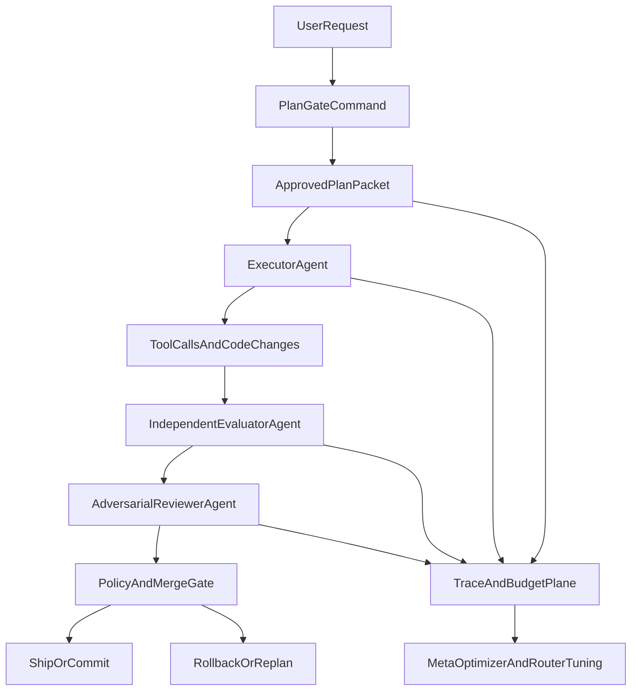

# Pi Harness Implementation Plan

## Outcome

Build a production-usable `pi.dev` harness from your synthesis that is:

- plan-gated before mutations,
- externally evaluated (not self-graded),
- instrumented with replayable run traces,
- model-adaptive without losing governance,
- delivered in 6 weeks with strict kill-switches.

## Architecture (MVB First)

## Locked Decisions (From Spec Review)

- `harness-auto` is user-invoked full pipeline for quick execution.
- Auto behavior after pass: **auto-commit + PR**.
- Adversarial review trigger: **always** (no risk gating bypass).
- Merge blocking authority: **severity-policy-engine**.
- Trace backend: **PostHog as source of truth** (external-only for run traces).
- Router tuning: **propose-and-approve** only (no blind writes).
- Tooling expansion policy: browser/sandbox **defer until evidence**.
- Plan ambiguity policy: **request clarification** rather than silently proceeding.
- Rollback contract: **revert-commit-ready artifact** for every pipeline run.
- Debate token budget profile: **aggressive**.
- Debate confidence weighting: **strong debate+evidence** (`claim_quality=0.20`, `reproducibility=0.40`, `agreement=0.40`).
- PR merge policy: **never auto-merge**; human merges explicitly.
- Policy block override: **single human approver** with mandatory justification.
- Rollback artifact format: **all three** (revert command, prepared revert branch, patch bundle).
- Pre-PR gate level: **strict**.
- PostHog trace policy: **full payloads**.

## What To Keep, Change, Remove In Existing Pi Repo

### Keep (already aligned)

- Model routing foundation in `[/home/aryaniyaps/ai-projects/ultimate-pi/.pi/model-router.json](/home/aryaniyaps/ai-projects/ultimate-pi/.pi/model-router.json)`.
- Subagent package wiring in `[/home/aryaniyaps/ai-projects/ultimate-pi/.pi/settings.json](/home/aryaniyaps/ai-projects/ultimate-pi/.pi/settings.json)`.
- MCP quality signal channel in `[/home/aryaniyaps/ai-projects/ultimate-pi/.pi/mcp.json](/home/aryaniyaps/ai-projects/ultimate-pi/.pi/mcp.json)`.
- Graphify-first architecture map flow in `[/home/aryaniyaps/ai-projects/ultimate-pi/.pi/SYSTEM.md](/home/aryaniyaps/ai-projects/ultimate-pi/.pi/SYSTEM.md)` (keep intent, tighten scope).

### Change (explicit)

- **System policy normalization** in `[/home/aryaniyaps/ai-projects/ultimate-pi/.pi/SYSTEM.md](/home/aryaniyaps/ai-projects/ultimate-pi/.pi/SYSTEM.md)`:
  - remove hard global default behavior policy,
  - separate voice/tone from harness safety policy,
  - replace stale pointers (`.pi/skills/firecrawl`, `docs/adr/`) with actual repo locations.
- **Bootstrap slimming** in `[/home/aryaniyaps/ai-projects/ultimate-pi/.pi/prompts/harness-setup.md](/home/aryaniyaps/ai-projects/ultimate-pi/.pi/prompts/harness-setup.md)`:
  - split into `core-mvb` vs `optional-tools`,
  - keep only evidence-linked required tools in default path,
  - move tool sprawl to optional profile.
- **Agent routing policy upgrade** in `[/home/aryaniyaps/ai-projects/ultimate-pi/.pi/skills/agent-router/SKILL.md](/home/aryaniyaps/ai-projects/ultimate-pi/.pi/skills/agent-router/SKILL.md)`:
  - add “debate/review only above complexity threshold”,
  - require structured handoff schema for multi-agent runs,
  - add max-hop/deadlock prevention.

### Remove / Deprecate

- Duplicate `graphify` skill definitions across `.pi` and `.agents`; keep one source of truth and deprecate the other.
- Any implied “tool expansion first” path in harness setup; deprecate by default and gate behind benchmark failure evidence.
- Legacy references to directories not present (`docs/adr/`, `.pi/harness/`* if not yet created) until scaffolded by this implementation.

## New Pi Commands (Prompts) To Add

Create prompt commands under `[.pi/prompts](/home/aryaniyaps/ai-projects/ultimate-pi/.pi/prompts)`:

- `harness-plan.md` → enforce read-only plan packet (scope, assumptions, blast radius, test plan, rollback).
- `harness-run.md` → execute approved plan with strict policy + budget context.
- `harness-auto.md` → single-command fast lane for quick tasks; executes plan→run→review→critic→eval pipeline automatically under strict guardrails.
- `harness-review.md` → independent evaluator command (separate session mandate).
- `harness-critic.md` → adversarial reviewer command (attack assumptions, find regressions).
- `harness-eval.md` → run benchmark suite and emit structured verdicts.
- `harness-trace.md` → retrieve/inspect run artifacts for replay.
- `harness-router-tune.md` → update routing profile based on eval outcomes.
- `harness-incident.md` → create incident object + rollback decision trail.

### `harness-auto` command contract (technical)

- Input: task statement + optional flags (`--quick`, `--risk low|med|high`, `--budget`, `--no-adversary` for explicitly low-risk only).
- Pipeline behavior:
  - always compiles a minimal plan packet first,
  - executes with `ExecutorAgent`,
  - runs independent evaluator by default,
  - runs adversarial reviewer when risk is `med|high` or diff size exceeds threshold,
  - blocks commit/merge on failed policy gates.
- Hard guards:
  - never bypasses `policy-gate.ts` or `budget-guard.ts`,
  - auto-falls back to manual `harness-plan` path when ambiguity/risk is high,
  - emits full trace bundle ID on completion.

## New Agents To Add

Add under `[.pi/agents](/home/aryaniyaps/ai-projects/ultimate-pi/.pi/agents)`:

- `harness/planner.md` (plan packet compiler).
- `harness/executor.md` (implementation agent constrained by approved plan).
- `harness/evaluator.md` (independent quality evaluator).
- `harness/adversary.md` (separate-session red-team reviewer).
- `harness/trace-librarian.md` (trace/query/report agent).
- `harness/meta-optimizer.md` (periodic router/prompt/policy tuner from traces).
- `harness/tie-breaker.md` (optional arbitration agent used only when debate remains unresolved within budget).

## Extensions To Add / Modify

Under `[.pi/extensions](/home/aryaniyaps/ai-projects/ultimate-pi/.pi/extensions)`:

- Add `policy-gate.ts` (plan-before-mutate + phase enforcement).
- Add `budget-guard.ts` (runtime hard-stop budget enforcement).
- Add `trace-recorder.ts` (run IDs, spans, artifact pointers, evaluator outcomes).
- Add `review-integrity.ts` (prevent evaluator/self-review leakage, enforce session isolation).
- Add `test-diff-integrity.ts` (detect assertion-removal / skip inflation / fake green).
- Add `debate-orchestrator.ts` (round-robin debate controller, consensus scoring, and token budget enforcement).
- Keep `custom-header.ts`, `custom-footer.ts`, `soundboard.ts`, `dotenv-loader.ts` but mark as non-critical UI/ergonomics layer.

### Debate transport extension strategy

- Decision: build a **custom headless debate bus** extension (no UI components) for adversarial rounds.
- Reference model: protocol and message semantics inspired by `pi-messenger` transport patterns only.
- Explicit non-goal: do not adopt `pi-messenger` / `pi-intercom` UI surfaces.
- Implementation: `debate-orchestrator.ts` + internal transport module with explicit message envelopes and round accounting.
- Requirement: expose per-message token usage and per-round totals for strict cap enforcement.

## CLI Tools and Skills (Core vs Optional)

### Core (MVB required)

- `graphify` (structural context + architecture map)
- `firecrawl` CLI (web search/scrape/crawl for external evidence and docs capture)
- `@tintinweb/pi-subagents` (agent orchestration)
- `@yeliu84/pi-model-router` (adaptive model routing)
- `context-mode` (context control plane)
- `sentrux` MCP (architectural signal)
- `pi-vcc` (compaction)
- test runner + lint/typecheck already in repo toolchain

### Optional (defer unless evidence demands)

- `agent-browser`, expanded Firecrawl flows, extra semantic search stacks, additional MCP servers.

### Skill structure update

- Normalize canonical skills location and precedence (`.pi/skills` primary).
- Add `harness-governor` skill (policy contract + gates).
- Add `harness-eval` skill (standard eval protocol).
- Add `harness-adversary` skill (red-team protocol).
- Add `harness-debate` skill (structured adversarial back-and-forth with consensus and budget rules).

## Technical Implementation Details (Required Spec Depth)

### Run artifact schemas

- `PlanPacket`:
  - `plan_id`, `task_id`, `scope`, `assumptions`, `risk_level`, `acceptance_checks`, `rollback_plan`.
- `RunTrace`:
  - `run_id`, `plan_id`, `agent_id`, `phase`, `model`, `thinking_level`, `tool_spans[]`, `artifact_refs[]`, `cost`.
- `EvalVerdict`:
  - `run_id`, `status`, `failed_checks[]`, `regression_flags[]`, `confidence`, `recommended_action`.
- `AdversaryReport`:
  - `run_id`, `severity`, `findings[]`, `repro_steps[]`, `block_merge`.
- `IncidentRecord`:
  - `incident_id`, `trigger`, `blast_radius`, `mitigation`, `rollback_ref`, `postmortem_required`.

### Extension-level enforcement points

- `policy-gate.ts`:
  - state machine phases: `plan -> execute -> evaluate -> adversary -> merge`.
  - rejects mutating tools unless phase is `execute`.
- `budget-guard.ts`:
  - pre-dispatch budget checks by run and phase.
  - emits `budget_exhausted` structured event and triggers degrade path.
- `trace-recorder.ts`:
  - append-only run events with correlation IDs (`run_id`, `plan_id`, `agent_id`, `tool_call_id`).
  - writes compact trace index + full payload references.
- `review-integrity.ts`:
  - verifies evaluator/adversary session isolation from executor context.
  - blocks if evaluator uses executor-private scratch context.
- `test-diff-integrity.ts`:
  - detects suspicious test edits (assertion removals, skip inflation, disabled suites).
  - elevates risk level and forces adversarial review.
- `debate-orchestrator.ts`:
  - enforces debate loop contracts across evaluator/adversary/tie-breaker participants.
  - tracks per-round token budget + max rounds + global debate cap.
  - emits consensus packets to policy engine for final merge decision.

### File layout to scaffold

- `.pi/harness/specs/` → plan/eval schema JSON definitions.
- `.pi/harness/runs/` → trace indices and run metadata.
- `.pi/harness/incidents/` → incident and rollback records.
- `.pi/harness/debates/` → debate transcripts, round metrics, and consensus packets.
- `.pi/prompts/harness-auto.md` → quick-path orchestration prompt.
- `.pi/agents/harness/` → planner/executor/evaluator/adversary/trace/meta definitions.

### Router feedback loop details

- `harness-router-tune` only proposes changes to `.pi/model-router.json`; never writes directly without approval gate.
- Requires benchmark evidence:
  - minimum sample count threshold,
  - pre/post success-rate delta,
  - cost-per-task delta,
  - regression guard status.

## Adversarial Debate Protocol (Critical)

### Debate topology

- Participants:
  - `EvaluatorAgent` (quality/correctness claims),
  - `AdversaryAgent` (attack/refute claims),
  - optional `TieBreakerAgent` (activated only if unresolved at final round).
- Exchange model:
  - structured claim/rebuttal rounds, not free-form long chats.
  - each round must produce a machine-readable `RoundResult`.

### Budget contract (per-round + global cap)

- `round_token_cap`: hard maximum tokens per agent response in a round.
- `max_rounds`: hard limit on back-and-forth loops.
- `debate_global_cap`: total tokens across all rounds and participants.
- Default aggressive profile:
  - `max_rounds=6`
  - `round_token_cap=2500` per agent per round
  - `debate_global_cap=35000`
- Behavior on budget exhaustion:
  - stop debate,
  - emit `BudgetExhausted` consensus packet,
  - policy engine decides fail-safe outcome (default: block merge or require human override).

### Confidence and scoring model (locked)

- Consensus confidence uses **weighted evidence**:
  - `claim_quality_weight=0.20` (argument validity and specificity),
  - `reproducibility_weight=0.40` (verifiable repro/test evidence),
  - `agreement_weight=0.40` (cross-agent convergence after rebuttal).
- Confidence output: normalized `0.0 - 1.0` score per category and overall.
- Low-confidence unresolved outcomes escalate to `human_required`.

### Consensus packet schema

- `ConsensusPacket` fields:
  - `run_id`, `debate_id`, `round_count`, `budget_used`,
  - `severity_scores` by category (`correctness`, `security`, `architecture`, `test_integrity`),
  - `evidence_refs[]` (trace IDs / artifacts),
  - `policy_decision` (`pass`, `conditional_pass`, `block`, `human_required`),
  - `rationale`.

### Severity-policy-engine decision rule

- Merge blocked automatically when:
  - `security >= 0.70` or `correctness >= 0.70`,
  - `architecture >= 0.80` or `test_integrity >= 0.80`,
  - unresolved high-severity contradiction remains after max rounds,
  - budget exhaustion occurs before minimum evidence confidence.
- Conditional pass allowed only when all blocking severities are below thresholds and required remediations are attached.
- Override rule: one human approver may override a block only with explicit justification captured in incident/trace artifacts.

### Strict gate policy before PR creation

- `harness-auto` can open PR only when all are true:
  - plan gate passed,
  - execution completed,
  - evaluator passed,
  - adversarial debate completed with consensus packet,
  - severity-policy-engine outcome is `pass` or `conditional_pass`,
  - benchmark delta checks passed,
  - rollback artifacts (command + branch + patch bundle) generated.

### PR merge policy

- `harness-auto` may auto-open PR but **must never auto-merge**.
- Final merge is always human action.

### PostHog trace payload policy

- Source of truth remains external PostHog.
- Store full payload traces (prompts, tool I/O, debate exchanges, verdict packets) to maximize replayability and forensics.
- Add warning in governance docs: full payload mode may include sensitive content and must be protected by access controls and retention policy.

## 6-Week Delivery Sequence

- **Week 1:** scaffold commands, planner/executor/evaluator/adversary agents, plan gate, trace schema, debate protocol schema, kill-switch flags.
- **Week 2:** implement evaluator + adversarial debate pipeline (back-and-forth rounds + consensus packet) and merge gating.
- **Week 3:** integrate trace recorder + budget guard + session isolation checks.
- **Week 4:** connect model-router tuning loop from evaluation outcomes.
- **Week 5:** harden incidents/rollback and benchmark A/B runs against baseline harness.
- **Week 6:** canary rollout with abort thresholds; freeze for MVB release.

## Adversarial Controls and Kill-Switches

- `ORCH_MODE=single_agent_safe` (disable fanout).
- `REVIEW_MODE=advisory_only` (non-blocking reviewer fallback).
- `VERO_LEVEL=error_only` (reduce trace load under pressure).
- `PROMPT_RENDER_MODE=canonical_only` (disable provider-specific rendering during regressions).
- `MUTATING_TOOLS_DISABLED=true` (emergency read-only mode).
- `BUDGET_HARD_STOP=true` (pre-dispatch budget enforcement).

## Acceptance Criteria

- Every merged run has: plan packet, independent evaluation, adversarial result, trace record, and budget ledger.
- Reviewer is session-isolated from executor context.
- Debate is multi-round with enforced per-round caps, max rounds, and global cap.
- Debate outputs machine-readable `ConsensusPacket` consumed by severity-policy-engine.
- Router updates are evidence-backed (benchmark delta + trace references).
- P0 rollback path works in one command.
- No tool/extension sprawl added without measured KPI gap.

