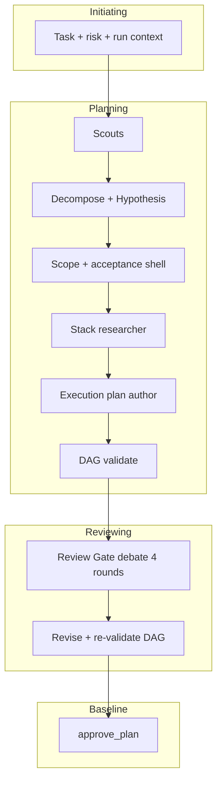
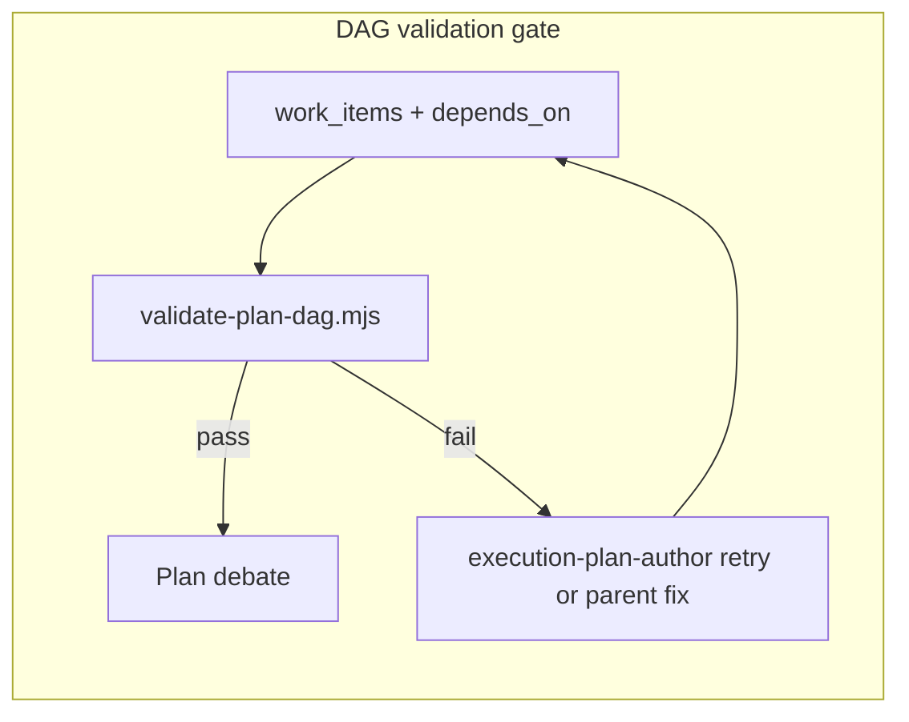

# Plan-phase adversarial debate for harness-plan

## Goal

After Darwin (scouts → decompose → hypothesis), build a **comprehensive PM-style execution plan** (explicit phases, work breakdown, dependency DAG with deterministic validation), then run **plan debate**, then `approve_plan`.

Today’s approved plan is ~100 lines because [`PlanPacket`](.pi/harness/specs/plan-packet.schema.json) only stores a short `scope` string + bullet `acceptance_checks` — not a phased WBS. This change adds a required **`execution_plan`** block (graphify: **ExecutionPlan Data Contract**, **ADR-020 YAML Task DAG**, **WBS** communities in [`graphify-out/GRAPH_REPORT.md`](graphify-out/GRAPH_REPORT.md)).

**Agent roster (graphify SSOT — previous names are not retained):**

| Slug | Graphify anchor | When | Output |
|------|-----------------|------|--------|
| **`stack-researcher`** | Stack / library evidence | Phase 4a (once) | `PlanStackBrief` |
| **`execution-plan-author`** | **ExecutionPlan Data Contract** (generator) | Phase 4b | `PlanExecutionPlanBrief` |
| *(script)* **`validate-plan-dag`** | **Validation Checks** (deterministic) | Phase 4c | `PlanDagValidationReport` |
| **`hypothesis-validator`** | Generator–evaluator (hypothesis leg) | Debate R1 only (blind) | `PlanHypothesisEval` |
| **`plan-evaluator`** | **Validation Checks** (structured pass/fail) | Debate every round | `PlanValidationTurn` |
| **`plan-adversary`** | Adversarial verification (L4 / harness) | Debate every round | `PlanAdversaryBrief` (existing schema) |
| **`sprint-contract-auditor`** | **ADR-020** Sprint Contract + Done Criteria Types + Keep Quality Left | Debate R4 (+ spot-check R2) | `PlanSprintAuditTurn` |
| **`review-integrator`** | **Review Gate** (round → bus) | After each round’s spawns | `PlanReviewRoundDraft` |

**Removed (do not ship):** `plan-optimist`, `plan-critic`, `plan-synthesizer`, `stack-scout`, `execution-planner`, standalone pre-debate `hypothesis-eval`, single-shot pre-debate `plan-adversary` (ADR 0033 pattern).

`research_brief.eval` comes **only** from debate-round `hypothesis-validator` (typically R1 blind), not a pre-debate spawn.

**User choices:**

- Plan debate runs at **full depth even with `--quick`** (`--quick` still skips semantic scout and post-run adversary only).
- Stack research agents get **Context7 (`ctx7`)** plus harness web tools, per [context7-cli](.agents/skills/context7-cli/SKILL.md) and [`.pi/SYSTEM.md`](.pi/SYSTEM.md) (library docs → `ctx7` only; comparisons / greenfield landscape → `web_search` / `web_fetch`).
- **All plan-phase on-disk artifacts are YAML** (not JSON) — fewer tokens, easier diffs, matches graphify **ADR-020 YAML Task DAG**. JSON Schema files stay `.schema.json` and validate **parsed YAML**.

---

## YAML artifacts policy (plan-phase)

**Rule:** Agents and harness tools **read/write YAML** for structured run artifacts. Do not ask subagents to emit `.json` plan files.

### Why YAML

| Benefit | Detail |
|---------|--------|
| Tokens | Less punctuation than JSON (no `{}`, `""`, trailing commas); parent passes file paths instead of inlined blobs |
| Human + agent | Readable in `plan-review.md` context; matches ADR-020 execution plan examples |
| Diffs | Cleaner PRs on `plan-packet.yaml` |

### What stays JSON / JSONL

| Keep as-is | Reason |
|------------|--------|
| `*.schema.json` under `.pi/harness/specs/` | AJV / JSON Schema tooling |
| `events.jsonl`, debate bus `.jsonl` | Append-only telemetry |
| `trace-<phase>.json`, `trace.json` | Existing trace-recorder contract (v1); optional YAML later |
| Bus round **wire** payload | Orchestrator may still accept JSON on stdin; parent loads `review-round-N.yaml` → converts at boundary |

### Canonical run layout (per `run_id`)

```
.pi/harness/runs/<run_id>/
  run-context.yaml              # replaces run-context.json (ADR 0031 amend)
  plan-packet.yaml              # canonical PlanPacket (only format)
  research-brief.yaml           # decomposition, hypothesis, eval, stack, debate
  plan-dag-validation.yaml      # PlanDagValidationReport output
  artifacts/
    decomposition.yaml
    hypothesis.yaml
    stack.yaml
    execution-plan-draft.yaml   # PlanExecutionPlanBrief before merge
    hypothesis-validation-r{N}.yaml  # PlanHypothesisEval (R1 required; R4 optional)
    validation-turn-r{N}.yaml    # PlanValidationTurn
    adversary-brief-r{N}.yaml     # PlanAdversaryBrief
    sprint-audit-r{N}.yaml        # PlanSprintAuditTurn (R4)
    review-round-r{N}.yaml        # PlanReviewRoundDraft → bus
  plan-review.md                # human view (unchanged)
```

### Tooling changes

- **`create_plan` / `approve_plan`:** accept and write **`plan-packet.yaml`**; `research_brief` path → **`research-brief.yaml`**
- **`validate-plan-dag.mjs`:** `node validate-plan-dag.mjs --packet .pi/harness/runs/<id>/plan-packet.yaml`
- **`harness-run-context`:** `[HarnessActivePlan]` points to `plan-packet.yaml`; policy-gate allowlist updated
- **Agent prompts:** “Write **valid YAML only** to the path given; no markdown fences; use 2-space indent.”
- **Parse pipeline:** `readYaml → validate(ajv, schema) → object` in shared helper (e.g. `.pi/extensions/lib/harness-yaml.ts`)
- **Strict YAML ingest:** strip leading ` ```yaml ` fences if present; reject multi-document streams; surface line/column on parse error in parent UI
- **Atomic writes:** write to `*.yaml.tmp` then rename (avoid half-written packet on crash)
- **No legacy JSON reads** — harness is in testing; do not implement `plan-packet.json` / `run-context.json` fallbacks. Replace all canonical paths and fixtures with `.yaml` only (breaking change OK).

### Schema IDs

Keep `$id` URLs ending in `.schema.json`; add `contentMediaType: application/yaml` or document in ADR-0035 that instance files are YAML. No requirement to rename schema files to `.yaml`.

---

## Current state (gaps)

| Piece | Status |
|-------|--------|
| [`harness-plan.md`](.pi/prompts/harness-plan.md) | Standalone Phase 5 `hypothesis-eval` then approval — **to be removed**; eval moves into debate only |
| ADR 0033/0034 | Document `plan-adversary` — **agent file never shipped** |
| [`plan-adversary-brief.schema.json`](.pi/harness/specs/plan-adversary-brief.schema.json) | **Primary output** of `plan-adversary` debate agent (reuse schema, extend if needed) |
| Debate bus | Wired for post-execute; parent prompts do **not** call `/harness-debate-*` |
| `finalizeConsensus()` | Hardcodes `execution_completed: true`, `plan_gate_passed: true` — wrong for plan-phase |
| Plan size | `plan-review.md` ~100 lines — no phases, milestones, or task DAG; executor only sees flat scope |
| Graphify corpus | **ADR-020** (`decisions/adr-020.md`): Task DAG, Sprint Contract, Checkpoints, Done Criteria Types — in graph, **missing on disk** |
| Graphify corpus | **Structured Planning** (`modules/structured-planning.md`): ExecutionPlan Data Contract, Validation Checks — in graph, **missing on disk** |

```mermaid
flowchart TB
  subgraph today [Today harness-plan]
    P1[Scouts] --> P2[Decompose + Hypothesis]
    P2 --> P3[Draft PlanPacket]
    P3 --> P4[hypothesis-eval standalone]
    P4 --> P5[approve_plan]
  end
  subgraph target [Target harness-plan]
    T1[Scouts] --> T2[Decompose + Hypothesis]
    T2 --> T3[Draft scope + acceptance_checks]
    T3 --> T4[stack-researcher ctx7+web]
    T4 --> T5[execution-plan-author]
    T5 --> T6[validate-plan-dag MUST PASS]
    T6 --> T7[Review Gate debate bus]
    T7 --> T8[Revise packet + research_brief]
    T8 --> T9[approve_plan]
  end
```



---

## Architecture

### Graphify-informed PM operating model (implementation must read corpus)

**Principle:** The harness-plan pipeline is a **planning process group** (PMBOK), not a single LLM paragraph. Graphify communities **22, 75, 150, 348, 559, 329, 14, 86** encode how strong eng/PM teams work; agents and [`harness-plan.md`](.pi/prompts/harness-plan.md) must encode those behaviors explicitly.

#### Corpus map (graphify → harness behavior)

| Source (graphify node / community) | What top teams do | Harness encoding |
|-----------------------------------|-------------------|------------------|
| **Berkun — Making Things Happen** (comm 150) | Vision before detail; **milestone goals + exit criteria** tie specs to delivery; **WBS** divides execution; late/vague specs kill schedules; **shorter milestones** improve accuracy; fight schedule optimism | `execution_plan.phases[].exit_criteria`; executive `scope` as vision; debate Round 1 = spec quality |
| **Kerzner / PMBOK scheduling** (comm 22) | **Create WBS → Define/Sequence Activities → Develop Schedule**; **critical path**; **PERT/CPM** for dependencies; **schedule baseline**; recovery when milestones missed | `depends_on` DAG + `critical_path_work_item_ids`; `validate-plan-dag.mjs`; phase ordering rules |
| **PMBOK WBS / risk** (comm 22, 75) | **WBS dictionary**; **risk register**; cost/schedule control via explicit baselines | `wbs_dictionary[]`, `risk_register[]` on `execution_plan` |
| **Structured Planning** (comm 559) | **ExecutionPlan Data Contract**; **Validation Checks** before execute; **Review Gate** | `execution_plan` schema; DAG validator; `approve_plan` gate |
| **ADR-020** (comm 348) | **YAML task DAG**; **Sprint Contract**; **Checkpoints**; **Done Criteria Types** | Typed `done_criteria`; `sprint_contract`; phase checkpoints |
| **Harness — Sprint Contracts** (`sources/anthropic2026-harness-design.md`, multi-agent arch) | **Agree on "done" before work** | `sprint_contract` + per-work-item `done_criteria` required before approval |
| **Harness — Keep Quality Left** (Fowler / first principles) | Quality checks **in the plan early**, not only post-hoc | Work items for test/lint/verify in **early phases**; critic attacks “quality only at end” |
| **Team Topologies / modularity** (comm 14) | Boundaries match **cognitive load**; minimize coupling across work streams | `parallel_safe` flag; file-conflict detection in DAG validator; critic flags god-file / cross-cutting edits |
| **Harness Implementation Plan** (comm 86) | **Build Phases**, **Verification Criteria**, **Risk Surface**, test-first / spin-off research tickets | `execution-plan-author` template; optional `research` work_item type for spikes |
| **Generator–evaluator** (harness control) | Generator produces; evaluator scores; adversary breaks | **execution-plan-author** (generate) → **validate-plan-dag** → **plan-evaluator** + **plan-adversary** (evaluate) + **hypothesis-validator** (hypothesis leg) |
| **Review Gate** (structured-planning) | Human/agent gate before baseline | **review-integrator** → `/harness-debate-round` → parent **approve_plan** |
| **Fournier — doubling rule** (graph node) | Quick estimates: double and add buffer | Optional `estimate_hours` with `doubling_rule_applied: true` flag on work items (informational, not schedule promises) |

**Pre-implementation graphify commands** (agents invoked via parent should assume parent ran these once per task):

```bash
graphify query "Milestone goals exit criteria WBS work breakdown structure"
graphify query "critical path PERT CPM sequence activities develop schedule"
graphify query "Sprint Contracts Agree on Done Before Work Keep Quality Left"
graphify explain "ExecutionPlan Data Contract"
graphify explain "ADR-020: YAML Task DAG and Sprint Contract Format"
```

**Corpus gap:** `decisions/adr-020.md`, `modules/structured-planning.md`, and several `concepts/*.md` nodes exist in the graph but not on disk. **Restore under `./raw/`** before implementation so prompts can `@`-reference them and `graphify update .` stays linked.

#### Planning process the parent orchestrator runs (PMBOK-style)

The parent is the **planning PM**, not a summarizer. Explicit phases in [`harness-plan.md`](.pi/prompts/harness-plan.md):

| Step | PM activity (corpus) | Subagent / tool |
|------|----------------------|-----------------|
| 1 | **Initiate** — parse task, risk, budget | Parent + `[HarnessRunContext]` |
| 2 | **Discover** — map codebase | scout-graphify, scout-structure, scout-semantic |
| 3 | **Analyze** — problem decomposition + hypothesis | decompose, hypothesis |
| 4 | **Define scope** — vision + acceptance criteria (Berkun: specs before schedule) | Parent draft shell + `ask_user` on fork |
| 5 | **Plan stack** — technology options with evidence | `stack-researcher` (ctx7 + web) |
| 6 | **Author ExecutionPlan** — WBS, risk, sprint contract shell | `execution-plan-author` |
| 7 | **Validation Checks** — DAG, critical path, conflicts | `validate-plan-dag.mjs` (**hard gate**) |
| 8 | **Review Gate** — multi-round debate | evaluator → adversary → sprint-contract-auditor (R4) → review-integrator |
| 9 | **Integrate** — merge patches, re-validate DAG | Phase 5b |
| 10 | **Baseline** — lock plan | `approve_plan` + `create_plan` |



---

### Comprehensive `execution_plan` (PM-grade deliverable)

Extend [`plan-packet.schema.json`](.pi/harness/specs/plan-packet.schema.json) — bump `contract_version` to **`1.1.0`**, add required **`execution_plan`** (keep top-level `scope` as executive summary; detail lives in `execution_plan`).

New schema: **`plan-execution-plan.schema.json`** (and **`plan-dag-validation-report.schema.json`**).

```yaml
# Canonical on-disk shape — lives in plan-packet.yaml (validated by plan-packet.schema.json)
execution_plan:
  schema_version: "1.0.0"
  phases:
    - phase_id: "P1"
      name: "Foundation"
      objective: "…"
      entry_criteria: ["…"]
      exit_criteria: ["…"]          # phase checkpoints (ADR-020)
      milestone: "…"
      work_item_ids: ["W1", "W2"]
  work_items:
    - work_item_id: "W1"
      phase_id: "P1"
      title: "…"
      description: "…"
      depends_on: []                  # task DAG edges
      files: ["path/to/file.ts"]
      parallel_safe: false
      done_criteria:
        type: "command" | "test" | "lint" | "manual" | "artifact"
        spec: "npm test -- …"        # typed done criteria (ADR-020)
      acceptance_check_ids: ["AC-1"] # stable ids; parent assigns AC-n when drafting shell (see edge cases)
  sprint_contract:
    in_scope: ["…"]
    out_of_scope: ["…"]
    definition_of_done: "…"
    assumptions: ["…"]              # Berkun: explicit assumptions before commitment
    external_dependencies: ["…"]    # Kerzner: deps outside team control
  wbs_dictionary:                     # PMBOK: one row per work_item_id
    - work_item_id: "W1"
      deliverable: "…"
      owner_role: "executor" | "human" | "research"
      inputs: ["…"]
      outputs: ["…"]
  risk_register:                    # min 3 for med/high risk_level
    - risk_id: "R1"
      description: "…"
      likelihood: "low" | "med" | "high"
      impact: "low" | "med" | "high"
      mitigation: "…"
      linked_work_item_ids: ["W3"]
  schedule_metadata:
    critical_path_work_item_ids: ["W1", "W4", "W9"]  # longest depends_on chain
    parallel_groups: [["W2","W3"], ["W5","W6"]]      # same phase, no cross-deps
    schedule_baseline_note: "ordering only; no calendar dates in v1"
  dag_validation:
    status: "pass" | "fail"
    topological_order: ["W1", "W2", …]
    cycles: []
    conflicts: []                     # file / phase / resource conflicts
```

**Keep Quality Left rule (prompt-enforced):** For `risk_level` ≥ `med`, ≥1 work item in the **first** phase must have `done_criteria.type` ∈ `{test, lint, command}` verifying repo health (not only final-phase E2E). **`sprint-contract-auditor` round 4** must flag `quality_left_violations[]` when all verification work items sit in the final phase only.

#### Minimum comprehensiveness (enforce in prompt + `create_plan` validation)

| `risk_level` | Min phases | Min work items | Min acceptance_checks |
|--------------|------------|----------------|------------------------|
| `low` | 2 | 5 | 3 |
| `med` | 3 | 8 | 5 |
| `high` | 4 | 12 | 8 |

Each **phase** must have: `objective`, `entry_criteria`, `exit_criteria` (≥1 each), linked work items.  
Each **work_item** must have: `depends_on` (may be empty), `files` (≥1 for code tasks), typed `done_criteria`, link to ≥1 acceptance check.  
**`wbs_dictionary`:** one entry per work item. **`risk_register`:** ≥3 entries when `risk_level` is `med` or `high`. **`schedule_metadata.critical_path_work_item_ids`:** non-empty when ≥3 work items.

`scope` field: ≤15-line executive summary pointing to `execution_plan` — not a substitute for WBS.

#### Deterministic DAG validation (Phase 4b — gate)

New script: [`.pi/scripts/validate-plan-dag.mjs`](.pi/scripts/validate-plan-dag.mjs) (also callable from `harness-verify` / `create_plan`).

Checks (fail closed):

1. **Cycle detection** — DFS on `work_items[].depends_on`; any cycle → `status: fail`
2. **Reference integrity** — every `depends_on` id exists; every `work_item.phase_id` exists in `phases`
3. **Topological order** — emit `topological_order`; required for executor handoff doc
4. **File conflict detection** — two work items that modify overlapping `files` must have a dependency path (ordered) or different phases with sequential phase ordering
5. **Phase ordering** — no work item in phase P2 depending on a work item in a later phase unless cross-phase `depends_on` explicitly allows (validate phase_index monotonicity)
6. **Checkpoint coverage** — every work item id appears in exactly one phase; phase `exit_criteria` non-empty
7. **Orphan acceptance checks** — every `acceptance_checks[]` entry referenced by ≥1 work item
8. **Duplicate IDs** — unique `work_item_id`, `phase_id`, `risk_id`; `acceptance_check_ids` on work items use stable ids `AC-1`…`AC-n` matching indexed `acceptance_checks[]` or explicit `id` field if schema adds one
9. **Critical path recompute** — script recomputes longest `depends_on` chain; **fail** if author’s `critical_path_work_item_ids` ≠ computed (prevents hand-wavy paths)
10. **Minimums vs risk** — enforce phase/work_item/acceptance_checks counts from table when `risk_level` set
11. **Empty phases** — every `phase_id` in `phases` has ≥1 work item in `work_items`
12. **Done criteria runnable** — for `type: command|test|lint`, `spec` non-empty; `manual` requires human gate note in WBS dictionary
13. **File path sanity** — warn (not fail) if `files[]` paths do not exist on disk unless `owner_role: research` or work item title contains `scaffold`

Output: **`plan-dag-validation.yaml`** merged into `plan-packet.yaml` `execution_plan.dag_validation` and rendered in `plan-review.md`.

Parent **must not** open Review Gate or call `approve_plan` if `dag_validation.status !== "pass"` (fix plan or re-run `execution-plan-author` once).



#### plan-review.md rendering (target: comprehensive, not ~100 lines)

Replace thin `formatPlanPacketLines` block with structured sections in [`plan-review.ts`](.pi/extensions/lib/plan-approval/plan-review.ts):

1. **Executive summary** — `scope` (vision), `risk_level`, stack recommendation one-liner
2. **Research** — decomposition, hypothesis, eval (from debate), stack options table
3. **Sprint contract** — in/out of scope, definition of done, assumptions, external dependencies
4. **Execution plan — phases** — table per phase (objective, entry/exit, milestones, work items)
5. **Work breakdown + WBS dictionary** — work item table + deliverable/inputs/outputs per id
6. **Risk register** — table with mitigations linked to work items
7. **Dependency DAG** — mermaid `flowchart TD` from `depends_on` (topological layers)
8. **Critical path** — highlighted chain from `schedule_metadata.critical_path_work_item_ids`
9. **Parallel groups** — which work items may run concurrently
10. **DAG validation report** — pass/fail, cycles, conflicts
11. **Plan debate** — round summaries + consensus + hypothesis eval scores
12. **Plan packet YAML** — link/path to `plan-packet.yaml` (not inlined in markdown)

Debate agents and executor read **`execution_plan`**, not only `scope`.

---

### Planning agents — graphify SSOT roster (read-only)

Register under [`.pi/agents/harness/planning/`](.pi/agents/harness/planning/). Names follow **Structured Planning** + **Generator–Evaluator** + **ADR-020** graph nodes — not legacy optimist/critic/CEO/eng.

#### Agent migration (old → new)

| Deprecated | Replacement | Notes |
|------------|-------------|-------|
| `stack-scout` | **`stack-researcher`** | Same protocol; rename file + manifest |
| `execution-planner` | **`execution-plan-author`** | Generator role per ExecutionPlan Data Contract |
| `hypothesis-eval` | **`hypothesis-validator`** | Debate-only; output schema stays `PlanHypothesisEval` |
| `plan-optimist` | **removed** | Mitigations live in `plan-evaluator` `mitigations[]` |
| `plan-critic` | **`plan-adversary`** | Uses `plan-adversary-brief.schema.json` |
| `plan-synthesizer` | **`review-integrator`** | Review Gate → bus envelope |
| ADR 0033 single-shot `plan-adversary` | **multi-round `plan-adversary`** | One agent, debate-only |
| *(new)* | **`plan-evaluator`** | Validation Checks rubric |
| *(new)* | **`sprint-contract-auditor`** | ADR-020 + Keep Quality Left |

Post-execute debate **unchanged**: `harness/adversary` + bus `EvaluatorAgent`/`AdversaryAgent` for **code**, distinct prompts from plan-phase agents.

---

#### `execution-plan-author` — prompt skeleton (`.pi/agents/harness/planning/execution-plan-author.md`)

**Mission:** Produce a **complete ExecutionPlan** a senior EM would sign off before sprint start — not a bullet list.

**Inputs (parent provides in spawn prompt):** task, `PlanDecompositionBrief`, `PlanHypothesisBrief`, draft `PlanPacket` (`scope`, `acceptance_checks`), `PlanStackBrief`, scout summaries, repo paths from structure scout.

**Mandatory workflow:**

1. **Vision check** — `scope` ≤15 lines; if missing testable outcomes, rewrite scope bullets before WBS.
2. **Phase design (Berkun milestones)** — Each phase: `objective`, `entry_criteria`, `exit_criteria` (≥1 measurable), `milestone` label, `work_item_ids`.
3. **WBS (PMBOK Create WBS)** — Every acceptance check maps to ≥1 `work_item`; no orphan ACs. Work items are **deliverable-sized** (roughly 0.5–2 executor sessions), not “implement feature”.
4. **Sequence (PMBOK Sequence Activities)** — `depends_on` forms a DAG; mark `parallel_safe: true` only when files disjoint and no hidden ordering.
5. **Critical path** — Compute longest chain; set `schedule_metadata.critical_path_work_item_ids`.
6. **WBS dictionary** — One entry per work item: deliverable, inputs, outputs, `owner_role`.
7. **Risk register** — Min 3 risks for `med`/`high`; each with mitigation + `linked_work_item_ids`.
8. **Sprint contract** — `in_scope`, `out_of_scope`, `definition_of_done`, `assumptions`, `external_dependencies`.
9. **Quality left** — First phase includes verify/lint/test work items when `risk_level` ≥ `med`.
10. **Done criteria (ADR-020)** — Every work item: typed `done_criteria` (`command` | `test` | `lint` | `manual` | `artifact`) with runnable `spec` where applicable.

**Must not:** Invent calendar dates; skip phases; collapse entire project into one work item; leave `depends_on` implicit.

**Output:** Write **`artifacts/execution-plan-draft.yaml`** (`PlanExecutionPlanBrief`); parent merges into `plan-packet.yaml`.

---

#### `stack-researcher` — prompt skeleton

**Mission:** Evidence-backed stack recommendation; **extend current stack** is always one ranked option for brownfield tasks.

**Protocol:** See stack-researcher protocol below (ctx7 first for APIs, web for comparisons).

**Output:** Write **`artifacts/stack.yaml`** (`PlanStackBrief`); parent copies into `research-brief.yaml`.

---

#### `plan-evaluator` — prompt skeleton + Validation Checks rubric

**Persona:** Neutral **evaluator** (graphify Generator–Evaluator). Scores the ExecutionPlan against **Validation Checks** — not an advocate.

**Per-round obligations (parent passes `debate_round_focus`):**

| Focus | Checks (pass/fail + evidence) |
|-------|------------------------------|
| `spec` | AC testability; scope↔hypothesis; assumptions in sprint_contract |
| `wbs` | WBS dictionary complete; phases have exit_criteria; no orphan ACs |
| `schedule` | DAG valid; critical_path plausible; parallel_safe justified |
| `quality` | Keep Quality Left; done_criteria typed; early verify work items |

**Output:** Write **`artifacts/validation-turn-r{N}.yaml`** (`PlanValidationTurn`).

**Must not:** Cheerlead; skip failed checks; approve when `dag_validation.status === "fail"`.

---

#### `plan-adversary` — prompt skeleton

**Persona:** **Adversarial verification** (harness L4 gap). Tries to break the plan with reproducible counterexamples.

**Per-round:** Target **failed/warn** checks from the same round’s `plan-evaluator` output first, then independent attacks.

**Output:** Write **`artifacts/adversary-brief-r{N}.yaml`** (`PlanAdversaryBrief` schema). Use `sg` + optional `ctx7 docs`.

**Must not:** Block without evidence; strategy detours; duplicate evaluator pass/fail without new evidence.

---

#### `sprint-contract-auditor` — prompt skeleton

**Persona:** **ADR-020** specialist — Sprint Contract, Done Criteria Types, Checkpoints, Keep Quality Left.

**When:** Required **round 4**; optional spot-check in round 2 if `done_criteria` sparse.

**Output:** Write **`artifacts/sprint-audit-r{N}.yaml`** (`PlanSprintAuditTurn`).

---

#### `review-integrator` — prompt skeleton

**Mission:** **Review Gate** — merge evaluator + adversary + sprint audit (+ hypothesis-validator on R1) into bus payload.

**Output:** Write **`artifacts/review-round-r{N}.yaml`** (`PlanReviewRoundDraft`):

- `round_summary`, `validation_summary`, `adversary_summary`
- `disputes[]` between evaluator checks and adversary findings
- `recommended_packet_patches[]` (JSON Pointer paths still valid on parsed object)
- `review_gate_ready: boolean`

Parent runs **`buildPlanReviewRoundEnvelope(review-round-r{N}.yaml)`** → bus JSON for `/harness-debate-round` (single conversion boundary).

**Bus `participants[]` per round:** `[PlanEvaluatorAgent, PlanAdversaryAgent, HypothesisValidatorAgent?, SprintContractAuditorAgent?, StackResearchAgent]` — `StackResearchAgent` claims loaded from **`artifacts/stack.yaml`** (no live spawn).

---

#### Review Gate debate — four-round choreography

Parent uses [`harness-debate-plan`](.pi/skills/harness-debate-plan/SKILL.md). **Do not** skip rounds when `--quick`.

**Default spawn order each round:** `plan-evaluator` → `plan-adversary` → *(round-specific)* → `review-integrator`.

| Round | `debate_round_focus` | Extra spawns | Graphify intent |
|-------|---------------------|--------------|-----------------|
| **1** | `spec` | `hypothesis-validator` (blind) **before** evaluator | Spec before schedule; blind hypothesis leg |
| **2** | `wbs` | optional `sprint-contract-auditor` if done_criteria thin | Validation Checks on WBS |
| **3** | `schedule` | — | CPM / critical path / dependencies |
| **4** | `quality` | `sprint-contract-auditor` **required**; optional second `hypothesis-validator` | Sprint Contract + Keep Quality Left |

**Between rounds:** `/harness-debate-round` with `review-integrator` output. Adversary proves DAG defect → Phase 5b + `validate-plan-dag.mjs`.

**Review Gate prerequisites:** `round_count >= 4`; last `review_gate_ready: true`; `dag_validation.status === "pass"`; `research_brief.eval` from R1 `hypothesis-validator`; consensus `policy_decision` ∈ `{pass, conditional_pass}`.

**Phase 5b:** Apply `recommended_packet_patches` via RFC6902-style merge on parsed object (validate each patch against schema before write); re-validate DAG; **at most one** partial re-debate (round 5) if >30% of `work_item_id`s changed — never loop unbounded.

---

#### `hypothesis-validator` in debate (not standalone)

- **Only** in Phase 5 debate — never before `/harness-debate-open`.
- **Round 1:** blind — task + `PlanHypothesisBrief` only.
- **Round 4 (optional):** non-blind re-score after plan mutations.
- Bus label: `HypothesisValidatorAgent` (deprecate `HypothesisEvalAgent` in plan-phase telemetry).
- **Output file:** `artifacts/hypothesis-validation-r{N}.yaml` (R1 blind); parent merges into **`research-brief.yaml`** → `eval` from R1 (or last pass); audit in `debate.hypothesis_validations[]`.
- If R1 `revision_recommended` or `relevance.passes === false` → one `hypothesis` re-spawn between R1 and R2.

Ship [`hypothesis-validator.md`](.pi/agents/harness/planning/hypothesis-validator.md); **delete** `hypothesis-eval.md` and manifest entry (no redirect shim).

#### `stack-researcher` protocol

1. **Libraries / frameworks / SDKs** (signatures, config, compatibility):
   - `ctx7 library <name> <query>` → `ctx7 docs <libraryId> <query>`
   - Use `--research` on docs when the first pass is thin
   - Cite library IDs and doc snippets in `evidence_refs`
2. **Landscape / comparisons / “what do people use in 2026”**:
   - `web_search` then `web_fetch` on selected URLs (`.web/` artifacts)
3. **Repo-bound tasks:** always include **“extend current stack”** as one ranked option with honest tradeoffs vs alternatives
4. **Greenfield / ambiguous stack:** ≥ **3 distinct options** with explicit pros/cons/risks

**Shared debate context (all agents):** full `PlanPacket.execution_plan`, `PlanStackBrief`, `PlanDagValidationReport`, decomposition/hypothesis summaries, prior round `PlanReviewRoundDraft`.

**Evaluator vs adversary:** evaluator emits pass/fail **Validation Checks**; adversary must engage failed/warn checks first, then independent attacks. Both cite `work_item_id` / `phase_id`. Adversary finding that implies DAG error → parent re-runs `validate-plan-dag`.

**`PlanStackBrief`** (schema unchanged):

- `problem_framing`, `constraints[]`
- `options[]`: `name`, `category`, `fit_summary`, `tradeoffs` { `pros`, `cons` }, `risks`, `evidence_refs[]` (ctx7 library IDs, `.web/` paths, repo paths), `recommendation_rank`
- `recommended_primary`, `rationale`, `open_questions[]`

**New schemas (replace generic `PlanDebateTurn`):**

- **`PlanValidationTurn`** — `checks[]`, `mitigations[]`, `overall_ready` (`plan-evaluator`)
- **`PlanAdversaryBrief`** — existing schema (`plan-adversary`)
- **`PlanSprintAuditTurn`** — sprint/done-criteria/checkpoint gaps (`sprint-contract-auditor`)
- **`PlanReviewRoundDraft`** — integrator output for Review Gate (`review-integrator`)

### Tool policy ([`harness-subagent-policy.ts`](.pi/extensions/lib/harness-subagents/harness-subagent-policy.ts))

- **`stack-researcher`:** allow `bash` only when argv matches safe `ctx7 (library|docs|whoami)` patterns; allow `web_search` / `web_fetch`
- **`plan-evaluator` / `plan-adversary` / `sprint-contract-auditor` / `review-integrator` / `hypothesis-validator`:** read-only; `plan-adversary` + `execution-plan-author` may use `sg`; optional narrow `ctx7 docs` on evaluator/adversary
- Align with [`harness-web-guard.ts`](.pi/extensions/harness-web-guard.ts): do not `web_fetch` URLs that should be `ctx7 docs`

Spawn prompts must tell agents to **read context7-cli skill** before first `ctx7` call.

### Debate bus extensions

1. **Participant enum** in [`round-result.schema.json`](.pi/harness/specs/round-result.schema.json) and [`debate-orchestrator.ts`](.pi/extensions/debate-orchestrator.ts):
   - **Plan phase** (new): `PlanEvaluatorAgent`, `PlanAdversaryAgent`, `HypothesisValidatorAgent`, `SprintContractAuditorAgent`, `ReviewIntegratorAgent`, `StackResearchAgent` (brief-only, no spawn)
   - **Post-execute** (unchanged): `EvaluatorAgent`, `AdversaryAgent`, `TieBreakerAgent` — different prompts under `harness/adversary`, not planning agents
   - **Do not add:** `PlanOptimistAgent`, `PlanCriticAgent`, `TechStackAgent`, `HypothesisEvalAgent` (plan phase)
   - `debate_phase: "plan" | "post_execute"` selects which participant set is valid

2. **Plan budget profile** in `round-result.schema.json` (`budget_profile.plan`): `max_rounds=4`, `round_token_cap=2000`, `debate_global_cap=12000`. **`harness-debate-open`** must read caps from schema profile when `debate_id` starts with `plan-` (do not hardcode `aggressive` caps).

3. **Phase-aware consensus** in `finalizeConsensus()`:
   - `debate_phase: "plan" | "post_execute"` from open payload or `plan-` debate id prefix
   - **Plan phase** `strict_gate_prerequisites`: `execution_completed: false`, `plan_gate_passed: false`, `adversarial_debate_completed: round_count >= 4`, `evaluator_passed: true` (derived from last round `review_gate_ready`), `severity_policy_ok: decision !== "block"`
   - **Post-execute** keeps current prerequisites
   - Plan-phase `policy_decision: block` → parent **must not** `approve_plan`; `human_required` → force `ask_user` before approval
4. **Participant validation** in `acceptRound()`: reject rounds whose `participants[]` includes post-execute-only agents when `debate_phase=plan`, and vice versa
5. **Single active plan debate** per `run_id` — opening `plan-<run_id>` while another plan debate open → reject or auto-close prior with logged entry

4. **Helper:** `buildPlanReviewRoundEnvelope()` in `.pi/extensions/lib/harness-yaml.ts` — read `review-round-r{N}.yaml` → validate → bus round JSON for `/harness-debate-round`

---

## Parent orchestration ([`harness-plan.md`](.pi/prompts/harness-plan.md))

**Delete current Phase 5 (Hypothesis eval)** entirely. Rewrite prompt to open with **“You are the planning PM for this harness run”** and embed the graphify process table above (initiate → baseline).

### `harness-plan.md` — required sections (prompt rewrite checklist)

1. **Role & non-goals** — Planning PM for a **coding harness**; produce an **execution baseline** (`PlanPacket` + `plan-review.md`), not strategy theater. No CEO/product personas.
2. **Graphify-first** — Before scouts on unfamiliar domains: `graphify query` for WBS/DAG/sprint-contract patterns; cite god nodes in `research_brief` when relevant.
3. **Minimum deliverable** — Link to `execution_plan` minimums by `risk_level`; forbid `approve_plan` without passing DAG + debate.
4. **Phase script** — Numbered phases matching table below; each phase lists allowed `subagent_type` and forbidden actions.
5. **Spawn prompt templates** — Pass: `debate_round_focus`, round `N`, **output_yaml_path** (under `artifacts/`), read paths (`plan-packet.yaml`, `research-brief.yaml`, prior `review-round-r*.yaml`). Never inline full packet in spawn prompt.
6. **Debate assembly** — Point to `harness-debate-plan` skill for `buildPlanReviewRoundEnvelope()` and plan-phase `participants[]` per round.
7. **Failure modes** — DAG fail → one `execution-plan-author` retry; `review_gate_ready: false` → Phase 5b + optional single re-round; hypothesis `revision_recommended` → one `hypothesis` re-spawn between R1/R2 only.
8. **`--quick`** — Still runs **full** `stack-researcher`, `execution-plan-author`, DAG validate, and **4 Review Gate rounds**; only skips semantic scout and post-run `harness/adversary`.

### Phase map (target)

| Phase | Action |
|-------|--------|
| 1 | Parallel scouts → write briefs under `artifacts/` as YAML where applicable |
| 2–3 | Decompose + hypothesis → `artifacts/decomposition.yaml`, `artifacts/hypothesis.yaml` |
| 4 | Parent draft `PlanPacket` shell (`scope`, `acceptance_checks`, ids); material fork → `ask_user` |
| 4a | `stack-researcher` → `research_brief.stack` |
| 4b | `execution-plan-author` → fill `execution_plan` |
| 4c | `node .pi/scripts/validate-plan-dag.mjs` on draft packet — **must pass** |
| 5 | Review Gate debate (evaluator → adversary → integrator; R1/R4 extras) |
| 5b | Parent revise packet + `research_brief` from debate + re-validate DAG if structure changed |
| 6 | `approve_plan` + `create_plan` (reject if DAG fail or `execution_plan` below minimums) |

### Allowed `subagent_type`

Phases 1–3: scouts, decompose, hypothesis.

Phases 4a–4b: `stack-researcher`, `execution-plan-author`.

Phase 5 Review Gate **only**:

- `harness/planning/hypothesis-validator` (R1 + optional R4)
- `harness/planning/plan-evaluator`
- `harness/planning/plan-adversary`
- `harness/planning/sprint-contract-auditor` (R2 optional, R4 required)
- `harness/planning/review-integrator`

**Policy guard:** reject spawn of `hypothesis-validator` or `plan-adversary` before `/harness-debate-open`; reject deprecated slugs (`plan-optimist`, `plan-critic`, `hypothesis-eval`, `stack-scout`, `execution-planner`).

### Phase 4a–4c (before debate)

1. **`stack-researcher`** (background) → `research_brief.stack`
2. **`execution-plan-author`** (background) → **`PlanExecutionPlanBrief`** → merge into `plan_packet.execution_plan`
3. **`validate-plan-dag`** — on fail, one `execution-plan-author` retry, else `plan_status: needs_clarification`

### Phase 5 flow (Review Gate)

1. **`/harness-debate-open plan-<run_id>`** — `budget_profile: "plan"`, `debate_phase: "plan"`, attach `execution_plan` + `dag_validation`.
2. **Four rounds** — `debate_round_focus`: `spec` → `wbs` → `schedule` → `quality`.
3. **Per round:** `plan-evaluator` → `plan-adversary` → extras → `review-integrator` (see choreography table).
4. **Bus submit:** `review-integrator` → `PlanReviewRoundDraft` → `/harness-debate-round` with plan-phase `participants[]` (evaluator, adversary, stack brief, optional hypothesis/sprint auditor).
5. **After R1:** if `revision_recommended`, one `hypothesis` re-spawn before R2.
6. **`/harness-debate-consensus`** — if `policy_decision` is `block` or `human_required`, stop; do not approve

7. **Phase 5b — Revise draft:**
   - Apply `recommended_packet_patches` to **`plan-packet.yaml`** (parse → patch → validate → write)
   - Update **`research-brief.yaml`** from `artifacts/*.yaml` — **`eval` from debate, not pre-debate**
   - Re-run `validate-plan-dag.mjs` if structure changed

8. One poll pass per round batch (see spawn budget below).

### Spawn budget (edge: cap explosion)

Current [`harness-plan.md`](.pi/prompts/harness-plan.md) caps **12 total spawns** / **8 concurrent**. Full plan debate needs ~**15–18** spawns (scouts 2–3 + decompose + hypothesis + stack + author + up to 4×(evaluator+adversary+integrator) + optional sprint-auditor + hypothesis-validator×2).

**Mitigation (pick all):**

1. Bump plan-phase caps in prompt + `harness-subagent-policy`: `max_spawns_per_plan_invocation: 24`, `max_concurrent: 10` when `phase=plan`.
2. **Batch debate spawns per round** in one parent turn (4 parallel: evaluator, adversary, integrator, extras) — still 3 polls, not 12 sequential waits.
3. **`--quick` debate shortcut (optional flag):** 2 rounds (`spec`+`wbs` merged, `quality` merged) — only if user passes `--quick-debate`; default remains 4 rounds. User chose full debate with `--quick` scouts — document that `--quick` affects scouts only unless they add `--quick-debate` later.

### Phase 6 — Approval

`approve_plan` with `research_brief` including eval section sourced from debate. Remove caps tied to “max 2 hypothesis-eval spawns” (old Phase 5); keep max 2 `approve_plan` rounds.

---

## Supporting file changes

| Area | Files |
|------|--------|
| Prompts | `harness-plan.md`, `harness-auto.md` |
| Skills | `harness-plan/SKILL.md` (PM process + spawn templates), new `harness-debate-plan/SKILL.md` (4-round choreography + envelope builder + graphify rubric refs) |
| Corpus | Restore `./raw/decisions/adr-020.md`, `./raw/modules/structured-planning.md` from wiki/graph labels |
| Schemas | `plan-execution-plan`, `plan-dag-validation-report`, `plan-stack-brief`, `plan-validation-turn`, `plan-sprint-audit-turn`, `plan-review-round-draft`; bump `plan-packet` 1.1.0; extend `plan-adversary-brief` if needed |
| Agents | `stack-researcher`, `execution-plan-author`, `hypothesis-validator`, `plan-evaluator`, `plan-adversary`, `sprint-contract-auditor`, `review-integrator` under `.pi/agents/harness/planning/` |
| Scripts | `validate-plan-dag.mjs` (YAML in); `harness-yaml.ts` (parse + AJV); `create_plan` / `approve_plan` write YAML |
| Extension | `debate-orchestrator.ts`, `buildPlanReviewRoundEnvelope`; `harness-run-context` — **replace** all `plan-packet.json` / `run-context.json` strings with `.yaml` (no fallback branches) |
| Fixtures | `harness/evals/smoke/*.fixture.json` → `.yaml` or update paths inside to `plan-packet.yaml` |
| Executor | [`executor.md`](.pi/agents/harness/executor.md) — execute by **phase order** + `topological_order`; respect `sprint_contract.out_of_scope` |
| Policy | `harness-subagent-policy.ts` — per-agent allowlists; deprecated slug denylist |
| ADR | **0035** Review Gate + YAML artifacts + agent roster; **0036** (or amend 0031) canonical `plan-packet.yaml` / `research-brief.yaml`; supersede 0034 |
| Tests | debate plan-phase, plan-review markdown, harness-plan-phase-policy; **`smoke-harness-plan.mjs` last in npm test** |

---

## plan-review.md UX

See **Comprehensive `execution_plan`** above: phases table, WBS table, mermaid dependency DAG, phase timeline, DAG validation report, stack options, debate rounds, self-eval from debate.

No CEO/product framing.

---

## Adversarial review — edge cases and mitigations

Structured pass over the plan (treat as pre-mortem). Each row: **risk** → **detection** → **mitigation** (must be implemented or tested in `e2e-smoke-harness-plan` / unit tests).

### Pipeline ordering and dependencies

| Risk | Detection | Mitigation |
|------|-----------|------------|
| `execution-plan-author` runs before `stack-researcher` finishes | Missing `artifacts/stack.yaml` when author spawns | **Strict order:** 4a completes (poll) before 4b; author prompt requires `stack.yaml` path |
| Parent merges stale `execution-plan-draft.yaml` after failed retry | DAG still fails after “retry” | On retry, delete/rename prior draft; merge only latest draft; re-run validator |
| Phase 4 shell missing `acceptance_checks` ids | Validator orphan-check fails late | Parent assigns `AC-1…AC-n` before 4b; validator fails fast with clear message |
| `ask_user` on fork skipped when paths materially diverge | Wrong stack locked in | Prompt: if `stack.open_questions` non-empty **or** fork material → `ask_user` before 4b |
| Scouts partial (`plan_status: partial`) but author assumes complete map | Plan references missing modules | Author must list scout gaps in `assumptions`; evaluator flags unmapped `files[]` |

### YAML and schema

| Risk | Detection | Mitigation |
|------|-----------|------------|
| Agent wraps YAML in markdown fences | `readYaml` throws | Strip fences in `harness-yaml.ts`; agent prompt forbids fences |
| Invalid YAML after Phase 5b patch | AJV fail on `create_plan` | Validate after every merge; reject patch set if invalid |
| `contract_version` 1.1.0 breaks old runs mid-flight | `create_plan` schema error | Only new runs post-deploy; `revise` mode upgrades packet in parent with defaults for missing `execution_plan` |
| Duplicate keys in YAML | Parser may silently override | Use `yaml` library with `uniqueKeys: true` or post-parse duplicate scan |
| Huge plan-review.md (>100k) | Slow UI | Cap mermaid nodes (e.g. 40 work items); collapse WBS to table only above limit |

### DAG and execution_plan

| Risk | Detection | Mitigation |
|------|-----------|------------|
| Author invents wrong critical path | Check #9 mismatch | Validator recomputes; fail closed |
| `parallel_safe: true` with overlapping files | Check #4 conflict | Fail or force dependency edge |
| Cross-phase `depends_on` backward in phase index | Check #5 | Fail with phase pair in `conflicts[]` |
| Doc-only task has no `files[]` | Validator false fail | Allow empty `files` when `owner_role: human` or tag `non_code: true` on work item |
| Planned files do not exist yet | Noise in validation | Warn-only unless path clearly wrong (outside repo) |
| Single giant work item (“implement feature”) | Min work_item count fail | Enforce minimums; author prompt forbids |

### Debate and bus

| Risk | Detection | Mitigation |
|------|-----------|------------|
| **Blind R1 leak** — validator sees `plan-packet.yaml` via path list | Eval not blind | R1 spawn prompt: **only** `task` + `artifacts/hypothesis.yaml`; policy guard forbids `plan-packet.yaml` in R1 validator prompt |
| Evaluator runs before hypothesis-validator in R1 | Order wrong in table | Enforce spawn order in harness-plan.md: validator **after** hypothesis-validator in R1 |
| `review_gate_ready: false` but parent approves | Bad baseline | `approve_plan` tool checks `research_brief.debate.review_gate_ready` + consensus decision |
| Budget exhausted at round 3 | `budget_exhausted` in jsonl | Plan profile: parent may submit partial round with `consensus_delta` note; consensus returns `human_required`; **no approve** |
| Wrong `debate_id` (not `plan-<run_id>`) | Caps/consensus wrong | Open command requires `plan-<run_id>`; smoke asserts prefix |
| Second plan debate without closing first | Duplicate jsonl | Single active plan debate per run (see bus extensions) |
| `StackResearchAgent` double-counts tokens | Budget skew | Synthetic agent: `token_usage: 0` for stack claims in envelope builder |
| Integrator omits failed evaluator checks | False `review_gate_ready` | Integrator rule: `review_gate_ready` only if all `severity: high` adversary findings addressed or evaluator check failed without mitigation |
| Round 5+ re-debate infinite loop | Runaway cost | Hard cap: max **5** bus rounds for plan phase |

### Agents and tools

| Risk | Detection | Mitigation |
|------|-----------|------------|
| ctx7 missing in CI / sandbox | stack-researcher bash fail | Fixture smoke uses canned `stack.yaml`; live smoke skips ctx7 with `HARNESS_SMOKE_OFFLINE=1` + fixture stack |
| `web_search` blocked | Empty stack brief | stack-researcher: brownfield may use repo-only + graphify; fail with `needs_clarification` if greenfield and no web |
| Subagent spawns deprecated slug | Silent wrong agent | Policy denylist + manifest grep test |
| `plan-adversary` before debate open | Pre-debate adversary | Policy guard (already planned) |
| execution-plan-author uses `write` on packet | Policy violation | Author only writes `artifacts/execution-plan-draft.yaml` |
| JSON in scout/decompose output | Parse fail | Migrate scouts to YAML outputs in artifacts (same strict parse) |

### Approval, revise, and harness-auto

| Risk | Detection | Mitigation |
|------|-----------|------------|
| `harness-auto` skips debate | Missing phases | Update `harness-auto.md` to mirror plan phases or call `/harness-plan` subprocess |
| Revise mode skips debate when scope unchanged | Stale execution_plan | Revise: debate required if `execution_plan` or `acceptance_checks` changed; skip only if diff empty |
| `approve_plan` without `research_brief.eval` | Missing blind eval | Schema require `research_brief.eval` non-null before approve |
| User approves despite `policy_decision: block` | Bad merge | UI shows consensus; approve_plan rejects block |
| `/harness-plan-commit` writes JSON path | Wrong extension | All commit paths → `.yaml` |

### Concurrency and session

| Risk | Detection | Mitigation |
|------|-----------|------------|
| Two sessions same `run_id` | Corrupt yaml | `owner_pi_session_id` check (existing); atomic writes |
| Parent inlines full packet in every spawn | Token blow-up | Path-only prompts (already required) |
| Background scout still running when debate starts | Stale context | Poll scouts before phase 4; no debate until phase 1–3 done |

### Smoke and CI

| Risk | Detection | Mitigation |
|------|-----------|------------|
| `--live` flaky in CI | Nondeterministic CI | CI runs **`--fixture` only**; `--live` documented as manual pre-release |
| Fixture debate doesn’t test participant enum | False green | Fixture rounds include plan-phase participants; assert rejected wrong enum |
| Cycle-detection untested | Bad DAG ships | Negative fixture `plan-packet-cycle.yaml` must fail validator |

### Product / scope clarifications (resolved in plan)

| Issue | Resolution |
|-------|------------|
| User wanted full debate with `--quick` | `--quick` = skip semantic scout only; debate always 4 rounds unless future `--quick-debate` added (documented under spawn budget) |
| “Critic” referenced after removal | Use `plan-adversary` / `sprint-contract-auditor` only |
| Step 9 missing in PM table | Added Integrate / Phase 5b |
| Phase 5 flow duplicate numbering | Renumbered 5b as step 7 |

### Smoke additions (from this review)

Extend `smoke-harness-plan.mjs --fixture` to cover:

1. `validate-plan-dag` **pass** fixture + **cycle fail** fixture  
2. `buildPlanReviewRoundEnvelope` with invalid participant for plan phase → reject  
3. Blind R1 policy: validator spawn context must not include `plan-packet` path (unit test on prompt template)  
4. `readYaml` fence stripping + duplicate key rejection  
5. Merge patches then re-validate DAG  

---

## Out of scope

- Post-run `/harness-auto` debate bus wiring (still `harness/adversary` single-shot unless follow-up)
- Persisting full debate transcript inside `plan-packet.yaml` (lives in debate bus jsonl + `research-brief.yaml` debate section)
- Migrating `trace.json` / `events.jsonl` to YAML (plan-phase YAML only in v1)
- Calendar scheduling / resource leveling algorithms (ordering-only `schedule_metadata` in v1)
- CEO/product/design **personas** (PM **practices** are in scope via execution_plan + debate rubrics)
- **`--quick-debate`** (2-round shortcut) unless user requests later — documented but not v1

---

## Definition of done (implementation succeeds only if)

**Mandatory gate:** todo `e2e-smoke-harness-plan` passes — unit tests alone are insufficient.

Smoke script (add `.pi/scripts/smoke-harness-plan.mjs`; run **last** in `npm test` after `harness-verify.mjs`):

| Mode | Command | Purpose |
|------|---------|---------|
| **Fixture** | `node .pi/scripts/smoke-harness-plan.mjs --fixture` | Deterministic: YAML fixtures + debate bus 4 rounds + DAG validate (CI, no LLM) |
| **Live** | `node .pi/scripts/smoke-harness-plan.mjs --live "<task>"` | Full `/harness-plan` in Pi (manual or agent); required before calling implementation done |

1. Mint run context → invoke plan pipeline (or scripted agent spawns mirroring `harness-plan.md` phases).
2. Assert artifacts exist: `plan-packet.yaml`, `research-brief.yaml`, `artifacts/stack.yaml`, `artifacts/review-round-r{1..4}.yaml`, `plan-dag-validation` pass embedded in packet.
3. Assert debate bus: `debate_id` prefix `plan-`, ≥4 rounds in jsonl, participants include `PlanEvaluatorAgent` + `PlanAdversaryAgent`.
4. Assert `plan-review.md` contains phases table, WBS, mermaid DAG, validation report, debate summary.
5. Assert `approve_plan` / `create_plan` succeed on the smoke packet.
6. Exit non-zero on any failure; CI wires this job after harness unit tests.

Manual fallback: documented steps in `harness-debate-plan` skill if automation is flaky on first pass.

---

## Verification (unit + integration)

1. `plan-packet.yaml` validates against `plan-packet.schema.json` and includes `execution_plan` meeting risk minimums
2. `validate-plan-dag.mjs --packet plan-packet.yaml` returns pass; cycle fixture fails with `cycles[]` in `plan-dag-validation.yaml`
3. `plan-review.md` renders mermaid DAG + phase tables (visually >> legacy ~100-line scope-only plan)
4. Debate jsonl ≥4 rounds; `plan-adversary` references `work_item_id`; bus shows `PlanEvaluatorAgent`/`PlanAdversaryAgent` (not optimist/critic); no pre-debate `hypothesis-validator`
5. `create_plan` rejects packet when DAG fail or below minimums
6. Agent prompts cite graphify anchors (`Validation Checks`, `Review Gate`, `ExecutionPlan Data Contract`, `Sprint Contract`); deprecated slugs absent from manifest
7. No code path reads `plan-packet.json` or `run-context.json` (grep CI check)
8. Tests + restore `raw/decisions/adr-020.md` + `raw/modules/structured-planning.md` + `graphify update .`
