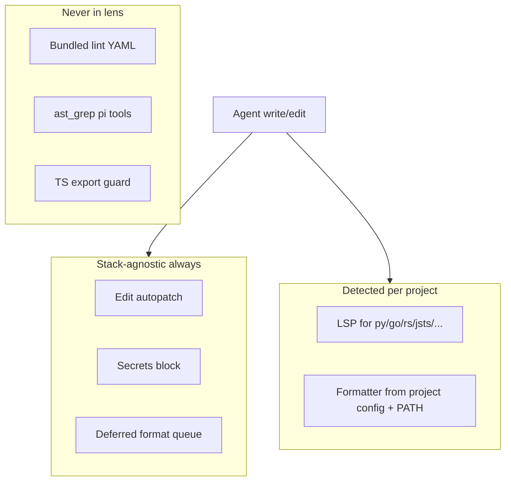

# Harness-native lens (greenfield rewrite)

## Your decisions (locked in)

1. **Keep deferred formatting** — queue on `tool_result`, run at `agent_end` (default). `--immediate-format` and `--no-autoformat` remain.
2. **No upstream sync** — greenfield harness-owned extension; drop `UPSTREAM_PIN.md` and pi-lens attribution as a living fork.
3. **Remove lens ast-grep pi tools + bundled YAML** — shell `sg` is the only search surface.
4. **Keep LSP auto-install** for detected project languages (installer LSP entries only).
5. **External / multi-stack projects** — lens must not assume ultimate-pi’s JS/TS stack; detect project languages and delegate (see below).

## External projects & multi-stack (Python, Go, Rust, …)

ultimate-pi is the harness package; **target projects can be anything**. Lens behavior must be **detect → delegate → no-op gracefully**, never **ship harness defaults as project policy**.

### Design principles

| Principle | Meaning |
|-----------|---------|
| **Detect, don’t assume** | Session bootstrap scans the project tree (markers + extension counts), not harness repo layout |
| **No JS/TS gate logic** | No export guard, no TS-only ast-grep scans, no bundled biome/ruff config shipped inside lens |
| **PATH-first formatters** | Format only when *project* declares a formatter (`pyproject.toml`+ruff, `go.mod`+gofmt, `Cargo.toml`+rustfmt, `biome.json`, `.prettierrc`, …) |
| **LSP per detected kind** | Pre-install / spawn only servers matching detected kinds (see `file-kinds.ts` + `lsp/server.ts`) |
| **Graceful degradation** | Missing LSP or formatter on PATH → skip with debug log, never block the agent |
| **Secrets stay universal** | Regex secrets scanner is stack-agnostic — keep as hard block |

### What runs per stack (after rewrite)



### Session bootstrap (replace deleted `runtime-session.ts`)

Add **`clients/project-profile.ts`** (~120 lines):

- Walk project root (respect `.gitignore` / harness ignore patterns via existing `file-utils`)
- Count files per [`FileKind`](.pi/extensions/lib/harness-lens/clients/file-kinds.ts) (`python`, `go`, `rust`, `jsts`, …)
- Read marker files: `go.mod`, `pyproject.toml`, `Cargo.toml`, `package.json`, etc.
- Output: `{ present: Record<FileKind, boolean>, detectedKinds: FileKind[] }`
- **`session_start`**: pre-install **at most 2–3 LSP defaults** for top detected kinds (e.g. pyright for python, gopls for go, typescript-language-server for jsts) — not the full 40-server catalog
- **Do not** pre-install biome/ruff globally from lens; harness-setup may install biome for the harness itself, but a Go-only external repo should never trigger biome

### Formatter policy by stack (Phase 3 detail)

| Stack signals | Formatter (PATH only) | Config required |
|---------------|----------------------|-----------------|
| `biome.json` / `biome.jsonc` | `biome` | yes |
| `pyproject.toml` / `ruff.toml` + ruff config | `ruff format` | yes |
| `.prettierrc*` / `prettier.config.*` | `prettier` | yes |
| `go.mod` | `gofmt` or `goimports` (prefer `gofumpt` if on PATH) | yes (`go.mod`) |
| `Cargo.toml` | `rustfmt` | yes |
| Ruby + `.rubocop.yml` | `rubocop` | yes |

If no config: **skip format** (deferred queue still runs but no-ops per file). No fallback to global biome for a Go project.

### LSP mapping (already in ported `lsp/server.ts`)

Leverage existing server IDs — spawn on file touch, not at session start for all:

- Python → `python` (pyright) or project override in `.pi/harness/.lens/lsp.json`
- Go → `go` (gopls)
- Rust → `rust` (rust-analyzer)
- JS/TS → `typescript`
- Java, Kotlin, Ruby, … → matching entries in `LSP_SERVERS`

**Monorepo:** use existing root-detection in `lsp/server.ts` (per-file language root); do not add harness-specific monorepo logic.

### Anti-patterns for external projects (explicitly forbidden)

- Shipping `config/biome/` or `config/ruff/` inside harness-lens (delete in Phase 4)
- Defaulting `--immediate-format` or forcing biome when no project config
- Session guidance that mentions only TypeScript/JavaScript
- Re-adding `.sg/rules/` as a setup template (Sentrux + project linters live in *their* repo)

### Expanded smoke matrix (Phase 6)

| Project fixture | Expected lens behavior |
|-----------------|------------------------|
| Go module (`go.mod`, `.go` files) | gopls optional install/touch; gofmt only if configured; no biome |
| Python (`pyproject.toml`, `.py`) | pyright touch; ruff format only if ruff configured; secrets still block |
| Rust (`Cargo.toml`) | rust-analyzer touch; rustfmt if configured |
| JS/TS (`package.json`) | tsserver touch; biome/prettier only with project config |
| Polyglot monorepo | Each file gets correct LSP root; no single-language export guard |
| Empty / docs-only repo | No LSP preinstall; lens still loads; no errors |

### harness-setup vs external project

- **Setup** installs global `sg` (+ optional `biome` for harness dev) on the *machine*
- **Lens** on an external Go project uses `sg` + Sentrux + gopls — does not require biome on that project
- Document in ADR 0045: *“Harness setup tools ≠ lens assumptions about target repo stack”*

## Adversarial review — issues the trim-only plan missed

### P0 — Three competing quality stories

| Surface | Problem | Fix |
|---------|---------|-----|
| Sentrux gate | Correct owner for ship | Keep authoritative |
| `.sg/rules/` in harness-setup AGENTS template (L556) | Third lint/gate system | **Remove** — sg is search-only |
| [`ast-grep/SKILL.md`](.pi/skills/ast-grep/SKILL.md) | Lists `ast_grep_search`/`replace` tools | Rewrite **sg CLI only** |

### P0 — Duplicate CLI installs

`/harness-setup` installs global `biome` + `sg`. Lens installer can shadow-install into `.pi/harness/.lens/tools/`.

**Edge case:** format-on-write uses lens biome; CI uses global biome → silent drift.

**Fix:** Installer catalog = **LSP servers only**. Formatters invoke `biome`/`ruff`/`prettier` from PATH when project config exists.

### P1 — Formatter stack still ships language policy

[`formatters.ts`](.pi/extensions/lib/harness-lens/clients/formatters.ts) has lazy `gem install rubocop` etc. **Remove lazy installs.** Format only when `biome.json` / `ruff.toml` / `.prettierrc` present.

**Deferred format mitigates** partial-write fights: agent finishes turn, then one format pass at `agent_end`.

### P1 — Features to delete (not keep)

| Item | Why |
|------|-----|
| Duplicate export guard | JS/TS-only; ast-grep session scan |
| `rules-scanner` session injection | Duplicates AGENTS.md loading |
| `AgentBehaviorClient` blind-write | Contradicts trimmed docs |
| `todo`/`go`/`rust` session scans | No gate consumes them |
| 351 YAML rules + tree-sitter | Zero runtime callers |

### P2 — Two commit blockers

`--lens-guard` (interactive secrets) vs Sentrux (ship gate). Document: lens = session safety; Sentrux = promotion.

### P2 — PostHog event names still say `pi-lens/*`

After rewrite, narrow to secrets/LSP/format or rename to `harness-lens/*` in bridge.

---

## Why greenfield beats further trimming

- No upstream sync → no value in preserving 450-file pi-lens layout
- ~70% of tree was dead; LSP subtree is the only large port
- Owned contract fits **~15 modules + `clients/lsp/` + slim installer edits**
- Eliminates accidental re-import of rules on upstream cherry-pick

---

## Target contract

```
harness-lens.ts          PostHog bridge + env paths + import ./lib/harness-lens/index.js
lib/harness-lens/
  index.ts               Extension entry (~400 lines)
  clients/
    secrets-scanner.ts
    pipeline.ts            secrets + LSP sync; defer format flag
    runtime-tool-result.ts queue deferred format
    runtime-agent-end.ts   run deferred format
    runtime-coordinator.ts deferred queue + git guard
    edit-autopatch.ts
    indent-retarget.ts
    git-guard.ts
    format-service.ts + formatters.ts (PATH-only, project-config-gated)
    project-profile.ts     detect FileKinds for session LSP preinstall
    lens-events.ts         PostHog emit helpers
    file-kinds.ts file-utils.ts path-utils.ts safe-spawn.ts latency-logger.ts
    widget-state.ts        footer counters only
    lsp/                   keep (delegate to language servers)
    installer/index.ts     LSP-only entries (strip ast-grep, biome, ruff, prettier)
  tools/lsp-diagnostics.ts lsp-navigation.ts
```

**Flags (unchanged semantics):**

- `--no-lens`, `--no-lsp`, `--no-autoformat`, `--immediate-format`, `--lens-guard`

---

## Single-responsibility matrix

| Concern | Owner |
|---------|-------|
| Recon | graphify, ccc |
| Structural search | shell `sg` |
| Architecture gate | Sentrux |
| Edit autopatch + secrets + deferred format + LSP | harness-lens |

---

## Implementation phases

### Phase 0 — Recover current tree (BLOCKER)

**Partial migration already ran** (shell in plan session):

- `lib/lens` → `lib/harness-lens` (rename done)
- `rules/`, ast-grep tools, many clients deleted
- Critical files re-fetched from upstream pin **once** (installer, secrets, format, runtime-*)
- **`edit-autopatch.ts` missing** — must add (100 lines, harness-owned)
- [`harness-lens.ts`](.pi/extensions/harness-lens.ts) still imports `./lib/lens/index.js` — **broken**
- [`custom-footer.ts`](.pi/extensions/custom-footer.ts) still imports `./lib/lens/clients/lsp/`

**Recovery checklist:**

1. Add `clients/edit-autopatch.ts`
2. Rewrite `harness-lens/index.ts` (new minimal entry)
3. Update `harness-lens.ts` → `./lib/harness-lens/index.js`
4. Update `custom-footer.ts` → `./lib/harness-lens/clients/lsp/index.js`
5. Update `package.json` `files`: `lib/harness-lens` not `lib/lens`
6. Update `harness-verify.mjs` paths; remove UPSTREAM_PIN check

### Phase 1 — New `index.ts` (greenfield)

Register only:

- Flags
- `lsp_diagnostics`, `lsp_navigation` tools
- `session_start`: LSP config init + **project-profile scan** + LSP preinstall for **detected kinds only** (cap 2–3)
- `tool_call`: edit autopatch, git-guard on bash commit/push
- `tool_result`: slim `handleToolResult` (no agentBehavior)
- `agent_end`: `handleAgentEnd` deferred format
- `turn_start`: coordinator `beginTurn`

**Do not register:** ast_grep tools, duplicate export guard, rules-scanner injection.

### Phase 2 — Slim installer (LSP-only)

In [`installer/index.ts`](.pi/extensions/lib/harness-lens/clients/installer/index.ts), remove catalog IDs:

- `ast-grep`, `@ast-grep/napi`, `biome`, `ruff`, `prettier`

Keep: `typescript-language-server`, `pyright`, and other LSP entries used by `lsp/server.ts`.

`SgRunner` / ast-grep client: **delete entirely** (no export guard).

### Phase 3 — Slim formatters (stack-aware, config-gated)

- Remove `tryLazyInstallFormatterTool` (gem/rustup)
- `getFormattersForFile`: map [`FileKind`](.pi/extensions/lib/harness-lens/clients/file-kinds.ts) → formatter **only when project config exists** (table above)
- Use PATH binaries only; never shadow-install formatters from lens installer
- **Delete** bundled [`config/biome/`](.pi/extensions/lib/harness-lens/config/biome) and [`config/ruff/`](.pi/extensions/lib/harness-lens/config/ruff) — external projects bring their own config
- Restore slim **`language-profile.ts`** or replace import in `runtime-tool-result.ts` with `project-profile.ts` helper (deleted file currently breaks tool_result)

### Phase 4 — Prune dead clients

Delete if unreferenced after new index:

`amain-types.ts`, `feature-hints.ts`, `file-role.ts`, `generated-artifacts.ts`, `project-metadata.ts`, `project-scan-policy.ts`, `source-groups.ts`, `startup-scan.ts`, `state-matrix.ts`, `subprocess-client.ts`, `symbol-types.ts`, `ts-service.ts`, `type-safety-client.ts`, `typescript-client.ts`, `sanitize.ts`, `scan-utils.ts`, `package-root.ts`, `config/biome`, `config/ruff`

### Phase 5 — Docs + ADR + verify

- **ADR 0045** — harness-lens minimal contract + **external-project / multi-stack** section (detect-delegate-noop)
- **harness-setup.md** — lens = edit safety + deferred format + LSP; clarify setup `biome`/`sg` are machine tools, not assumptions about target repo stack; remove `.sg/rules/` from AGENTS template
- **ast-grep skill** — `sg` + Bash only; LSP row points to lens tools
- **THIRD_PARTY_NOTICES** — remove pi-lens section (or one line: "formerly derived, now harness-native")
- **harness-verify** — assert no `lib/lens`, no `rules/`, no `ast_grep_search` in index

### Phase 6 — Smoke matrix

| Case | Expected |
|------|----------|
| `/harness-setup` | one `sg` on PATH; biome optional for harness dev |
| External Go repo | gopls touch; no biome; deferred format skips without fmt config |
| External Python repo | pyright touch; ruff only if `pyproject.toml`/ruff config |
| Write with secrets | lens blocks (any stack) |
| Write/edit | deferred format queued; runs at `agent_end` |
| `--immediate-format` | format in pipeline (still config-gated) |
| `sg -p --lang go` | works without lens pi tools |
| `/harness-review` | Sentrux independent (language plugins per stack) |

---

## Risk notes

- **Partial migration:** repo may be broken until Phase 0 completes — prioritize import path fixes
- **One-time upstream fetch:** installer restored from pin commit for LSP only; not ongoing sync
- **LSP subtree size:** ~1.3k lines retained; acceptable as multi-stack delegation layer
- **Over-installing LSPs:** cap session preinstall to detected kinds; avoid installing tsserver on Go-only repos
- **No lens unit tests:** add harness-verify grep/compile checks + manual matrix above

---

## Out of scope

- Changing Sentrux manifest/gate semantics
- Removing LSP pi tools (still valuable vs sg)

---

## Next step

**Switch to Agent mode** and run Phase 0–6. Plan mode cannot edit `.ts` files; a partial shell migration left the extension in a broken import state until Phase 0 is completed.
