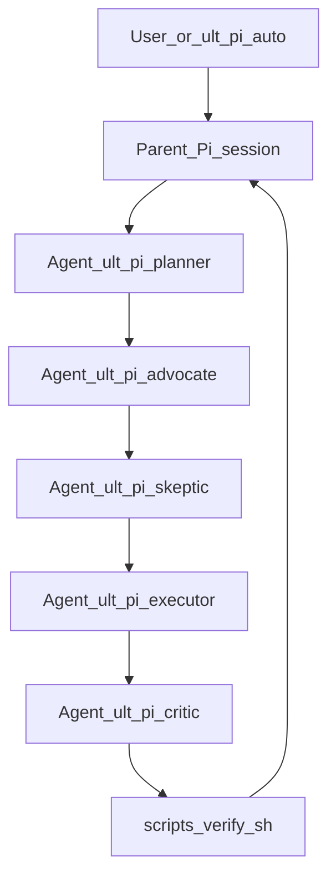

# Ultimate Pi — AI coding harness completion

## What exists today (inspection summary)

- **Pi extensions** ([package.json](package.json)): `./.pi/extensions`, `./.pi/providers` only — today that means [custom-header.ts](.pi/extensions/custom-header.ts), [custom-footer.ts](.pi/extensions/custom-footer.ts), and the Cursor SDK provider. **No** verify-gate, session-log, or blast-radius permission layer.
- `**scripts/verify.sh`**: **Missing** — there is no `[scripts/](scripts/)` tree and no `verify.sh` in the repo today. Phase B **adds** `[scripts/verify.sh](scripts/verify.sh)` (and the `scripts/` directory) as a **net-new** file; the CLI matrix below is the spec for that script, not documentation of an existing implementation.
- **Subagents**: [.pi/settings.json](.pi/settings.json) already lists `npm:@tintinweb/pi-subagents`. [.pi/agents/](.pi/agents/) has `rethink.md` and the `pi-pi/*` expert team plus [agent-router](.pi/skills/agent-router/SKILL.md) (orchestration guidance). **No** dedicated planner / executor / critic trio from the harness guide Phase 7.
- **AGENTS.md**: **Missing** at repo root (harness-setup only embeds a *minimal* stub in a prompt — not shipped as a file).
- **Skills layout**: [package.json](package.json) `pi.skills` currently lists **only** `./.agents/skills`. The repo also has a partial tree under [.pi/skills/](.pi/skills/) (e.g. `graphify/`, `ast-grep/`, `agent-router/`). **Plan:** consolidate **everything** into [.pi/skills/](.pi/skills/) as the single canonical tree; retire or symlink `.agents/skills` (see Phase E0).
- **System prompt**: [.pi/SYSTEM.md](.pi/SYSTEM.md) is rich (graphify-first, web policy) but does not encode the full **intent protocol**, **HARNESS_POLICY** linkage, or **mandatory multi-agent + debate** flow.
- **Sub-agent package identity (canonical for this repo):** Harness work assumes `**npm:@tintinweb/pi-subagents`** only — the extension listed in [.pi/settings.json](.pi/settings.json) (`"npm:@tintinweb/pi-subagents"`), published from [tintinweb/pi-subagents](https://github.com/tintinweb/pi-subagents). **Do not** conflate this with other npm packages, unscoped names, or generic docs that say “pi-subagents” without the `**@tintinweb/`** scope; feature support and API surface for the harness must be verified against **that** package’s README/changelog (local capture: [raw/github_com_tintinweb_pi-subagents.md](raw/github_com_tintinweb_pi-subagents.md)).
- **@tintinweb/pi-subagents — capabilities we rely on:** Claude Code–style `**Agent`** tool plus `**get_subagent_result`**, `**steer_subagent`**; foreground vs background agents; **parallel** background runs (concurrency limits, grouped notifications); **custom agent types** from `.pi/agents/**/*.md` + YAML frontmatter (model, thinking, tool restrictions, denylist); **session resume**; **mid-run steering**; optional **scheduling**, **git worktree isolation**, **skill preload** from `.pi/skills/`, event bus / RPC hooks — all per upstream README (same capture file).
- **@tintinweb/pi-subagents — not in scope (harness fills the gap):** There is **no built-in adversarial “debate room”** or multi-party deliberation primitive. **In-session** counterpoints use **orchestration** (sequential `Agent()` with transcripts, or `steer_subagent`) plus `**ult-pi-debate`** and `.pi/agents/ult-pi/*` — not a feature flag inside the extension. **True mesh back-and-forth** is **not** delegated here; it is **required** via `**npm:pi-messenger`** (**Phase G1**).
- `**npm:pi-messenger` (required — Phase G1 mesh debate):** Separate extension [nicobailon/pi-messenger](https://github.com/nicobailon/pi-messenger) (`pi install npm:pi-messenger`). **Not** listed in [.pi/settings.json](.pi/settings.json) today — **implementation must add it** to the project Pi package list alongside **@tintinweb/pi-subagents**. It implements a **file-based agent mesh** (registry, inboxes under `~/.pi/agent/messenger/` and project `.pi/messenger/`), `**pi_messenger`** actions (`join`, `send`, `broadcast`, …), and **Crew** (separate product surface — **out of scope** for `ult-pi-auto` unless explicitly scoped). Per README, **incoming messages wake recipients** as **steering** turns (`triggerTurn: true`, `deliverAs: "steer"`) — **native turn-taking between distinct Pi sessions**. **Harness requirement:** Phase **G1 ships with v1** — mesh protocol (`join`, peer naming, `send`/`broadcast` rounds, merge) documented in `**ult-pi-debate`**, `**ult-pi-auto`**, and bootstrap docs; coexistence + config (`.pi/pi-messenger.json` / `~/.pi/agent/pi-messenger.json`) documented. Caveat: mesh peers are typically multiple joined sessions/terminals, orthogonal to in-proc `**Agent()**`; both layers are **required** for the full harness debate story.

**Note on your PDF** (`pi-cli-tool-stack.md.pdf`): it is not available inside the Linux workspace path used here. Implementation will follow [pi-harness-guide.md](file:///mnt/c/Users/aryan/Downloads/pi-harness-guide.md) plus this plan; if the PDF adds extra constraints, paste or drop it under the repo and we align in a follow-up.

---

## Pi abstraction mapping (validated against upstream Pi docs)

**Sources:** [@earendil-works/pi-coding-agent README](.pi/npm/node_modules/@earendil-works/pi-coding-agent/README.md); [docs/prompt-templates.md](.pi/npm/node_modules/@earendil-works/pi-coding-agent/docs/prompt-templates.md); [docs/skills.md](.pi/npm/node_modules/@earendil-works/pi-coding-agent/docs/skills.md); [docs/extensions.md](.pi/npm/node_modules/@earendil-works/pi-coding-agent/docs/extensions.md).

### AGENTS.md / CLAUDE.md (context files)

Pi concatenates these from cwd upward; they are always in context. **Plan:** short stable rules only — intent block, YOLO thresholds, “read `docs/INDEX.md` before bulk file reads”, multi-agent default, pointer to `HARNESS_POLICY.md`. Long checklists live in **skills**, not AGENTS.

### `.pi/SYSTEM.md`

Replaces the default system prompt for the project. **Plan:** keep voice + graphify/web policy; at most one short pointer to AGENTS — no duplicate long harness text.

### Prompt templates (`.pi/prompts/*.md`)

Per [prompt-templates.md](.pi/npm/node_modules/@earendil-works/pi-coding-agent/docs/prompt-templates.md): templates **expand** into the editor; slash command is `/` + filename without `.md`. Optional frontmatter: `description`, `argument-hint`; body: `$ARGUMENTS`, `$1`, etc. **Loading rules:** discovery in a `prompts/` directory is **non-recursive** — keep `ult-pi-*.md` **flat** in [.pi/prompts/](.pi/prompts/) (already listed in [package.json](package.json) `pi.prompts`). Subdirectories need explicit `pi.prompts` paths.

**Plan:** `ult-pi-task.md` → `/ult-pi-task`; `ult-pi-auto.md` → `/ult-pi-auto`; harness bootstrap → `ult-pi-harness-setup.md` → `/ult-pi-harness-setup`. User-initiated flows only.

### Skills (`*/SKILL.md`)

Per [skills.md](.pi/npm/node_modules/@earendil-works/pi-coding-agent/docs/skills.md): progressive disclosure; invoke with `/skill:name` where `name` is the YAML `name:` field, not the folder name. **This repo (after migration):** all project skills live under [.pi/skills/](.pi/skills/) only; [package.json](package.json) `pi.skills` is `["./.pi/skills"]`. Under `.pi/skills/`, root `*.md` files may also be discovered as individual skills (Pi behavior); this package uses directory-per-skill layout.

**Plan:** New harness skills `ult-pi-planning`, `ult-pi-debate`, `ult-pi-postmortem`, `ult-pi-premortem`, optional `ult-pi-invariants` — each as `.pi/skills/ult-pi-<name>/SKILL.md` with matching `name: ult-pi-...`. Do not change integration `name:` values (e.g. `graphify`) when normalizing folder names.

### Extensions (`.pi/extensions/*.ts`)

Per [extensions.md](.pi/npm/node_modules/@earendil-works/pi-coding-agent/docs/extensions.md): `tool_call` handlers may return `{ block: true, reason }`; `before_agent_start` may return `{ message }` and/or `{ systemPrompt }`; `agent_end` receives `event.messages` for the current user prompt. README philosophy: core has **no permission popups** — gates are **extension-built** (examples: `permission-gate.ts`, `protected-paths.ts`).

**Plan:** verify-gate uses `before_agent_start` + `agent_end` + `event.messages`. YOLO permissions use `tool_call` (block off-limits writes; rare `ctx.ui.confirm` for irreversible actions). Session log on `agent_end`. **Imports:** use the same `ExtensionAPI` package as [custom-header.ts](.pi/extensions/custom-header.ts) (`@mariozechner/pi-coding-agent` in this repo).

### Subagents (`@tintinweb/pi-subagents`)

Default Pi core has **no sub-agents**. This project adds them via `**npm:@tintinweb/pi-subagents`** (see [.pi/settings.json](.pi/settings.json)) — not any other similarly named package.

**Plan:** `.pi/agents/ult-pi/*.md` agent types consumed by `**Agent({ subagent_type: "ult-pi/..." })`** from **@tintinweb/pi-subagents**; **in-session** debate steps use orchestration (`Agent()` / `steer_subagent`) per `ult-pi-debate`. **Mesh back-and-forth** is **additionally required** via `**npm:pi-messenger`** (**Phase G1**) — see following section.

### `pi-messenger` (`npm:pi-messenger`) — **required** mesh transport (Phase G1)

**Different product from @tintinweb/pi-subagents:** [pi-messenger](https://github.com/nicobailon/pi-messenger) is a **coordination + messaging** extension (file-backed mesh, `/messenger` overlay; **Crew** is a separate orchestrator — **not** part of default `ult-pi-auto` unless explicitly scoped). It is **not** a drop-in replacement for `Agent()` subagents.

**Why the harness requires it:** Peers use `pi_messenger({ action: "send", ... })` / `broadcast`; recipients **wake on a new turn** with **steering** delivery (per upstream README). That supplies **native async turn-taking between joined Pi sessions** — the **mandatory** answer to “back and forth” at the **mesh** layer, since **@tintinweb/pi-subagents** does not provide it.

**Limits / risks:** (1) **Operational model** — mesh debate assumes **joined** agents (often **multiple terminals**); document clearly in AGENTS / `ult-pi-harness-setup`. (2) **Crew** vs `**ult-pi-auto`** — keep Crew **out** of the one-shot pipeline to avoid duplicate planners and runaway tokens. (3) **Coexistence** with **@tintinweb/pi-subagents** — validate in Phase G1 spike (peer identity, hooks).

**Phase G1 deliverables (v1-blocking):** Add `**npm:pi-messenger`** to Pi packages; `**ult-pi-debate`** must specify **mesh protocol** (`join`, naming, `send`/`broadcast` rounds, merge); `**ult-pi-auto`** must invoke or gate on that protocol where debate is required; bootstrap + README list install and config paths.

### Third-party permission npm

Any “permission system” still surfaces as **extension `tool_call`** (or thin wrapper). **Plan:** [pi-permission-system](https://github.com/MasuRii/pi-permission-system) is **optional**; prefer a small `permissions.ts` if the package does not map cleanly.

### Clarifications

- `**/ult-auto` vs `ult-pi-auto.md`:** Filename stem defines the command; use `ult-pi-auto.md` for `/ult-pi-auto`. For `/ult-auto`, add `registerCommand` or a second stub template.
- **“Run review step” in `ult-pi-auto`:** Means explicitly `/ult-pi-review` (expand template) or paste template body — prompts are not auto-injected like AGENTS unless an extension adds them.

---

## Design decisions (locked to your notes)

| Requirement                 | Approach                                                                                                                                                                                                                                                                                           |
| --------------------------- | -------------------------------------------------------------------------------------------------------------------------------------------------------------------------------------------------------------------------------------------------------------------------------------------------- |
| **YOLO permissions**        | Pi-native: `tool_call` block + rare `ctx.ui.confirm`; optional pi-permission-system if it composes; else minimal `permissions.ts`.                                                                                                                                                                 |
| **Skills location**         | **Single tree:** [.pi/skills/](.pi/skills/). [package.json](package.json) `pi.skills`: `["./.pi/skills"]` only. Migrate from `.agents/skills` per Phase E0; optional symlink for compat (see E0).                                                                                                  |
| **ult-pi- skills (narrow)** | `name: ult-pi-*` only for harness workflow skills; not graphify/firecrawl/integrations.                                                                                                                                                                                                            |
| **ult-pi- harness prompts** | Flat `.pi/prompts/ult-pi-*.md`; rename `harness-setup.md` → `ult-pi-harness-setup.md`; `/ult-auto` only via alias or second file.                                                                                                                                                                  |
| **Multi-agent**             | `.pi/agents/ult-pi/{planner,executor,critic}.md` + extend [agent-router](.pi/skills/agent-router/SKILL.md); agent discovery via `**npm:@tintinweb/pi-subagents`**.                                                                                                                                 |
| **Debate**                  | **Two layers (both required for v1):** (1) `**ult-pi-debate`** + advocate/skeptic via `**Agent()`** / `**steer_subagent`** (**@tintinweb/pi-subagents**). (2) **Phase G1 — mesh** via `**npm:pi-messenger`** (`join`, `send`/`broadcast` rounds between **joined** sessions) — see § pi-messenger. |
| **One-shot pipeline**       | [ult-pi-auto.md](.pi/prompts/ult-pi-auto.md): planning/debate skills, **@tintinweb/pi-subagents** `Agent` rounds, **required G1** `**pi_messenger`** mesh protocol, `scripts/verify.sh`, `/ult-pi-review`, optional `/skill:ult-pi-postmortem`; slash `/ult-pi-auto`.                              |

---

## CLI and MCP tool matrix (non-ambiguous placement)

Canonical **definition of done** commands today: [package.json](package.json) `scripts` — `lint` (Biome), `check:ts` (tsc on `.pi/extensions/dotenv-loader.ts`), `test` (node native test runner), optional `test:integration`. **This section fixes where every external CLI/MCP is invoked** so implementation does not scatter tools randomly.

### `scripts/verify.sh` (blocking gate — must emit `=== HARNESS VERIFY`)

**Status today:** this path does not exist yet (see “What exists today”). The following table is the **intended** behavior once Phase B lands.

| Tool / command                  | Tiers                           | Behavior                                                                                                                                                                                                                             |
| ------------------------------- | ------------------------------- | ------------------------------------------------------------------------------------------------------------------------------------------------------------------------------------------------------------------------------------ |
| `npm run lint` (Biome)          | trivial, bounded, risky         | **Always run** when `package.json` exists.                                                                                                                                                                                           |
| `npm run check:ts` (TypeScript) | trivial, bounded, risky         | **Always run** (current script targets `.pi/extensions/dotenv-loader.ts`; if HARNESS_POLICY later widens scope, update script + this row together).                                                                                  |
| `npm test`                      | trivial, bounded, risky         | **Always run** (`node --experimental-strip-types --test`).                                                                                                                                                                           |
| `npm run test:integration`      | bounded, risky only             | **Run if** `package.json` contains the script (it does); on trivial tier **skip** with `[SKIP] integration` line (do not fail).                                                                                                      |
| `sentrux check .` (CLI)         | bounded, risky only             | **Run if** `sentrux` is on `PATH`; if missing, `[SKIP] sentrux` (exit 0). Trivial tier: skip. Do **not** require `sentrux gate` in CI unless a baseline file is committed and documented — prefer `sentrux check .` for portability. |
| `sg scan` (ast-grep / `sg`)     | bounded, risky only             | **Run if** `sg` is on `PATH` **and** project has `sgconfig.yml` (or `.sg/` rules); else `[SKIP] sg scan`. Never use raw `grep` for code in verify — if `sg` missing, skip, do not substitute grep.                                   |
| `graphify`                      | **Not** in verify.sh by default | Graph build is **slow / optional** for “done”; keep `graphify update .` as a **post-merge / workspace rule** and as an explicit final step in `ult-pi-auto.md` / agent instructions — not a hard verify failure.                     |

**Not in verify.sh:** `firecrawl`, `ctx7`, `ck`, `gh`, `agent-browser`, `python3` graphify install, `**pi_messenger`** / `**npm:pi-messenger`** — runtime coordination tools; not part of the deterministic verify gate (still **required** in product via Phase G1).

### Pi extensions (TypeScript)

| Concern                        | Tooling                              | Notes                                                                                |
| ------------------------------ | ------------------------------------ | ------------------------------------------------------------------------------------ |
| Verify reminder / done warning | None (pure Pi `agent_end` text scan) | May **grep** transcript strings for `=== HARNESS VERIFY` only — not codebase search. |
| YOLO permissions               | Path/heuristic checks in `tool_call` | No external CLI; optional future hook to sentrux **MCP** is out of scope for v1.     |

### MCP servers (from [CONTRIBUTING.md](CONTRIBUTING.md) / [.pi/mcp.json](.pi/mcp.json) when present)

| MCP / server                      | Used in                                                                                                                                                                                                        | Not used in                                                                                           |
| --------------------------------- | -------------------------------------------------------------------------------------------------------------------------------------------------------------------------------------------------------------- | ----------------------------------------------------------------------------------------------------- |
| **Sentrux MCP** (`sentrux --mcp`) | **Interactive agent turns** — `scan`, `check_rules`, `session_start` / `session_end`, etc., per CONTRIBUTING. Optional line in `ult-pi-review` prompt: “if Sentrux MCP available, call scan on changed paths”. | **verify.sh** — shell gate uses `sentrux` CLI, not MCP, so CI and headless `bash` stay deterministic. |
| **context-mode** (if configured)  | Agent `read`/`bash` compression per user lean-ctx rules                                                                                                                                                        | verify.sh                                                                                             |
| **PostHog** (`@posthog/pi`)       | Telemetry extension                                                                                                                                                                                            | verify.sh                                                                                             |

### Skills (by existing skill `name:` — not `ult-pi-`* renames for integrations)

| Skill / area      | On-disk path (canonical)                                               | CLI / stack                                       |
| ----------------- | ---------------------------------------------------------------------- | ------------------------------------------------- |
| graphify          | `.pi/skills/graphify/` (or `ult-pi-graphify/` until folder normalized) | `graphify` / `graphifyy`, Python; `graphify-out/` |
| ast-grep          | `.pi/skills/ult-pi-ast-grep/` (or `ast-grep/`)                         | `sg`, `sg scan`                                   |
| ck-search         | `.pi/skills/ck-search/`                                                | `ck`                                              |
| context7-cli      | `.pi/skills/context7-cli/`                                             | `ctx7`                                            |
| firecrawl*        | `.pi/skills/firecrawl*/`                                               | `firecrawl` CLI                                   |
| wiki-autoresearch | `.pi/skills/wiki-autoresearch/`                                        | firecrawl + graphify per skill                    |

### Prompts / AGENTS / SYSTEM

| Asset                                                            | CLI mention                                                                                                                                                                            |
| ---------------------------------------------------------------- | -------------------------------------------------------------------------------------------------------------------------------------------------------------------------------------- |
| `[.pi/SYSTEM.md](.pi/SYSTEM.md)`                                 | Already owns graphify-first, firecrawl, ctx7, `sg`, `ck` order — **do not duplicate** full matrix; add one line: “Definition of done = `scripts/verify.sh`”.                           |
| `[AGENTS.md](AGENTS.md)`                                         | List **exact verify commands**: `npm run lint`, `npm run check:ts`, `npm test`, and “optional: `scripts/verify.sh <tier>`”.                                                            |
| `[ult-pi-review.md](.pi/prompts/ult-pi-review.md)`               | Checklist item: “verify output contains `=== HARNESS VERIFY`”; optional Sentrux MCP if available.                                                                                      |
| `[ult-pi-harness-setup.md](.pi/prompts/ult-pi-harness-setup.md)` | Keeps **install / presence checks** for `firecrawl`, `ctx7`, `agent-browser`, `ck`, `biome`, `sg`, `gh`, `sentrux`, graphify, `**npm:pi-messenger`** — **bootstrap only**, not verify. |

### `ult-pi-auto` pipeline order (tool-related steps)

1. Read context (`HARNESS_POLICY`, `docs/INDEX.md`) — no CLI.
2. Planning / in-session debate (`Agent` subagents per **@tintinweb/pi-subagents**) **and** **Phase G1** `**pi_messenger`** mesh rounds (`join`, `send`/`broadcast`) — no CLI until executor runs code.
3. `bash scripts/verify.sh <tier>` — runs **only** the tools in the verify table above.
4. `graphify update .` — **after** successful verify (or document as parallel non-blocking); matches workspace graphify rule.

---

## Implementation phases (files and responsibilities)

### Phase A — Policy and root context

1. Add **[HARNESS_POLICY.md](HARNESS_POLICY.md)** at repo root: blast-radius tiers, off-limits paths, and **pointer to the CLI matrix** (same commands as `verify.sh` — single source of truth: link or duplicate the npm/sentrux/sg rows).
2. Add **[AGENTS.md](AGENTS.md)** implementing intent protocol, scope discipline, escalation rules **tuned for YOLO**; include the **same verify commands** as the CLI matrix (or “run `scripts/verify.sh <tier>`”). Ask human only for **irreversible** tier, **first-time risky** touch of off-limits paths, or explicit ambiguity — not for routine edits.
3. Add **docs scaffold**: `docs/INDEX.md` (navigation per harness Phase 5), `docs/incidents/log.md` (append-only), `docs/invariants/.gitkeep` or first `docs/invariants/core.md` if you want invariant cards before module-specific files.

### Phase B — Verify gate and definition of done

1. **Create** `[scripts/](scripts/)` if missing, then add **[scripts/verify.sh](scripts/verify.sh)** (new file, executable): implement **exactly** the tier rules in **CLI and MCP tool matrix** above (bracketed sections, `=== HARNESS VERIFY`, `=== RESULT: PASS/FAIL ===`, graceful `[SKIP]` lines). Nothing to migrate or rename — there is no prior `verify.sh` in-repo.
2. Add **[.pi/extensions/verify-gate.ts](.pi/extensions/verify-gate.ts)** using the same `ExtensionAPI` import as [custom-header.ts](.pi/extensions/custom-header.ts). Per Pi docs: `before_agent_start` returns `{ message }` and/or chained `systemPrompt` for verify reminder; `agent_end` inspects `event.messages` to warn if completion is claimed without verify evidence.

### Phase C — YOLO permissions

1. Add dependency on **pi-permission-system** (exact package name from upstream README) under [.pi/npm/package.json](.pi/npm/package.json) if installed there, or document `pi install` line in README and [ult-pi-harness-setup.md](.pi/prompts/ult-pi-harness-setup.md) after rename.
2. Add **[.pi/extensions/permissions.ts](.pi/extensions/permissions.ts)** using `pi.on("tool_call", …)` with `{ block: true, reason }` for off-limits paths and dangerous bash; use `ctx.ui.confirm` only for irreversible actions. Optional: compose pi-permission-system if it fits this model.

### Phase D — Session logging

1. Add **[.pi/extensions/session-log.ts](.pi/extensions/session-log.ts)**: on `agent_end`, use `event.messages`; append JSONL to `.pi/session-log.jsonl`; optional warning to `docs/incidents/log.md` when tier risky+ and no verify evidence.

### Phase E0 — Consolidate all project skills under `.pi/skills` (safe migration)

1. **Inventory:** List `.agents/skills/`* and `.pi/skills/*` (if any). For each pair with the same logical skill (e.g. graphify), **prefer the richer or more recently edited** `SKILL.md` + assets; delete or merge the duplicate after diff.
2. **Move (not copy-then-delete blindly):** `git mv` (or `mv` if not tracked) every skill directory from `.agents/skills/<name>/` → `.pi/skills/<name>/`. Preserve `SKILL.md`, nested scripts, and any referenced assets. If `.pi/skills/<name>/` already exists, resolve conflict in step 1 before moving.
3. **package.json:** Set `pi.skills` to `["./.pi/skills"]` only — remove `./.agents/skills` from the array so Pi loads a single tree.
4. **Compatibility (optional):** Replace `.agents/skills` with a **symlink** `.agents/skills` → `../.pi/skills` (relative from `.agents/`) so external docs or muscle memory still resolve; **or** delete `.agents/skills` after grep confirms no references. Prefer symlink if anything outside repo still points at `.agents/skills`.
5. **Repo references:** Grep-update [AGENTS.md](AGENTS.md), [.pi/SYSTEM.md](.pi/SYSTEM.md), [.cursor/rules](.cursor/rules), README, and any skill cross-links that mention `.agents/skills` → `.pi/skills`.
6. **Cursor rules:** If [.cursor/rules](.cursor/rules) or project docs list skill paths under `.agents/skills`, point them at `.pi/skills` (or “project skills under `.pi/skills`”).

### Phase E — Harness-only skills (`ult-pi-`*) on top of consolidated tree

1. **After E0:** all integration skills live under [.pi/skills/](.pi/skills/) with their existing YAML `name:` (e.g. `graphify`, `ck-search`).
2. Add **new** concise harness skills only (each under ~100 lines per harness guide); frontmatter `name:` must start with `ult-pi-`:
  - `ult-pi-planning` — WBS + acceptance tests + blast radius per leaf.
  - `ult-pi-postmortem` — incident log format.
  - `ult-pi-premortem` — pre-flight “what could go wrong” + mitigations before large changes.
  - `ult-pi-debate` — round structure + when to run (risky/bounded+).
  - Optional: `ult-pi-invariants` — short card pointing at `docs/invariants/`* (not per-module walls of text).
  **Explicit non-goals:** do **not** rename `graphify`, `firecrawl`, `ast-grep`, `ck-search`, or other integration skills to `ult-pi-`*. Optional cleanup: rename **folder** `ult-pi-graphify` → `graphify` later for consistency (cosmetic; out of scope unless touched for another reason).

### Phase F — Harness prompt templates (`ult-pi-*.md`)

1. Add short harness Phase 6 templates with **prefixed filenames** (slash = `/` + stem per Pi; e.g. `/ult-pi-task`):
  - [.pi/prompts/ult-pi-task.md](.pi/prompts/ult-pi-task.md) — intent gate + human confirm when required by tier.
  - [.pi/prompts/ult-pi-review.md](.pi/prompts/ult-pi-review.md) — harness checklist (intent, verify, invariants, postmortem flag).
  - [.pi/prompts/ult-pi-postmortem.md](.pi/prompts/ult-pi-postmortem.md) — append to `docs/incidents/log.md`.
  - Optional: [.pi/prompts/ult-pi-premortem.md](.pi/prompts/ult-pi-premortem.md) — quick entry for pre-flight risk (pairs with `ult-pi-premortem` skill if both exist).
2. Add **[.pi/prompts/ult-pi-auto.md](.pi/prompts/ult-pi-auto.md)** — **one-shot pipeline** (`/ult-pi-auto`): same chain as the design table; explicit `Agent({ subagent_type: "ult-pi/planner", ... })` etc.; **minimum two in-session debate rounds** before executor on non-trivial tasks; **required** **Phase G1** `**pi_messenger`** mesh steps (`join`, peer naming, `send`/`broadcast` protocol, merge) per `**ult-pi-debate`**.
3. **Rename** [.pi/prompts/harness-setup.md](.pi/prompts/harness-setup.md) → **ult-pi-harness-setup.md** and update every in-repo reference (`README`, CONTRIBUTING, skills, rules) from `/harness-setup` to `/ult-pi-harness-setup`. Leave **non-harness** prompts (e.g. `wiki-autoresearch.md`) **unprefixed**.

### Phase G — Multi-agent + debate agents (**@tintinweb/pi-subagents**)

1. Add under [.pi/agents/ult-pi/](.pi/agents/ult-pi/) (new team folder) — **discovered as `ult-pi/planner`, etc. by @tintinweb/pi-subagents** (same mechanism as existing `.pi/agents/pi-pi/*`):
  - `planner.md`, `executor.md`, `critic.md` per harness guide (tool restrictions: planner/critic deny `write`/`edit` where possible).
  - `advocate.md`, `skeptic.md` for debate-only rounds (strong denylists).
2. Update [.pi/skills/agent-router/SKILL.md](.pi/skills/agent-router/SKILL.md) to document `ult-pi/*` agent types and the **debate pipeline** for **@tintinweb/pi-subagents** (`Agent`, optional `steer_subagent`, background vs foreground) — keep skill name `agent-router` (no `ult-pi-` prefix; router utility, not a harness gate skill).

### Phase G1 — `npm:pi-messenger` mesh / cross-session debate (**required**)

1. **Add package:** Include `**npm:pi-messenger`** in the project Pi package list (e.g. [.pi/settings.json](.pi/settings.json) `packages`); verify `join` from two sessions and that `send`/`broadcast` delivers **steer** turns per [pi-messenger README](https://github.com/nicobailon/pi-messenger/blob/main/README.md). Record whether **@tintinweb/pi-subagents** subagents appear as **distinct mesh peers** or only top-level sessions (drives operator docs for “two terminals” vs other layouts).
2. **Skill + prompts:** `**ult-pi-debate`** must document **mesh protocol** (prerequisites, peer naming, N rounds of `send`/`broadcast`, merge). `**ult-pi-auto`** must include the mesh debate steps where debate is mandatory. **Do not** fold **Crew** `plan`/`work` into `**ult-pi-auto`** unless explicitly scoped later (token + duplication risk).
3. **Bootstrap:** Update [ult-pi-harness-setup](.pi/prompts/ult-pi-harness-setup.md) and [README.md](README.md) with `pi install npm:pi-messenger`, config locations (`.pi/pi-messenger.json` / `~/.pi/agent/pi-messenger.json`), and how **mesh (G1)** composes with **in-session `Agent()`** (G).

### Phase H — Wire docs and bootstrap

1. Update [.pi/prompts/ult-pi-harness-setup.md](.pi/prompts/ult-pi-harness-setup.md) Step 4.3 to **require** real `AGENTS.md` + `HARNESS_POLICY.md` + verify script + Pi packages list including `**npm:@tintinweb/pi-subagents`** and `**npm:pi-messenger`** (Phase G1).
2. Update [README.md](README.md): document `/ult-pi-auto`, `/ult-pi-harness-setup`, other `ult-pi-*` harness prompts, YOLO policy, multi-agent + debate via `**npm:@tintinweb/pi-subagents`**, **required** `**npm:pi-messenger`** mesh debate (**Phase G1**), and `pi install` packages including permission extension.
3. After code edits in-session: run `graphify update .` per workspace rule.

---

## Architecture (orchestration) — mermaid

---

## Risk notes

- **Extension API drift**: Implement verify-gate and session-log against the **same** `@mariozechner/pi-coding-agent` version as [package.json devDependencies](package.json) (currently `0.73.0`); align imports with [custom-header.ts](.pi/extensions/custom-header.ts). Upstream README references `@earendil-works/pi-coding-agent`; this repo uses the mariozechner fork — keep one package for types.
- **Permission package API**: Read MasuRii’s README during implementation; if it conflicts with “YOLO”, fall back to `tool_call`-only `permissions.ts` per Pi docs.
- **Skill naming**: Per decision, **no** `ult-pi-` rename for graphify/firecrawl/tool skills. Only new harness-top-level skills use the `ult-pi-` prefix.
- **Harness prompt renames**: `harness-setup.md` → `ult-pi-harness-setup.md` changes the slash command to `/ult-pi-harness-setup` ([prompt-templates.md](.pi/npm/node_modules/@earendil-works/pi-coding-agent/docs/prompt-templates.md)). Update all docs. Optional: `registerCommand("ult-auto", …)` for `/ult-auto` alias without a second `.md` file.
- **pi-messenger + pi-subagents (Phase G1):** `**npm:pi-messenger`** is **required** alongside `**npm:@tintinweb/pi-subagents`**; the G1 spike is part of v1 delivery (peer identity, hooks). Keep Crew out of default `**ult-pi-auto`** unless explicitly scoped — avoids duplicate orchestration and token blowups.

